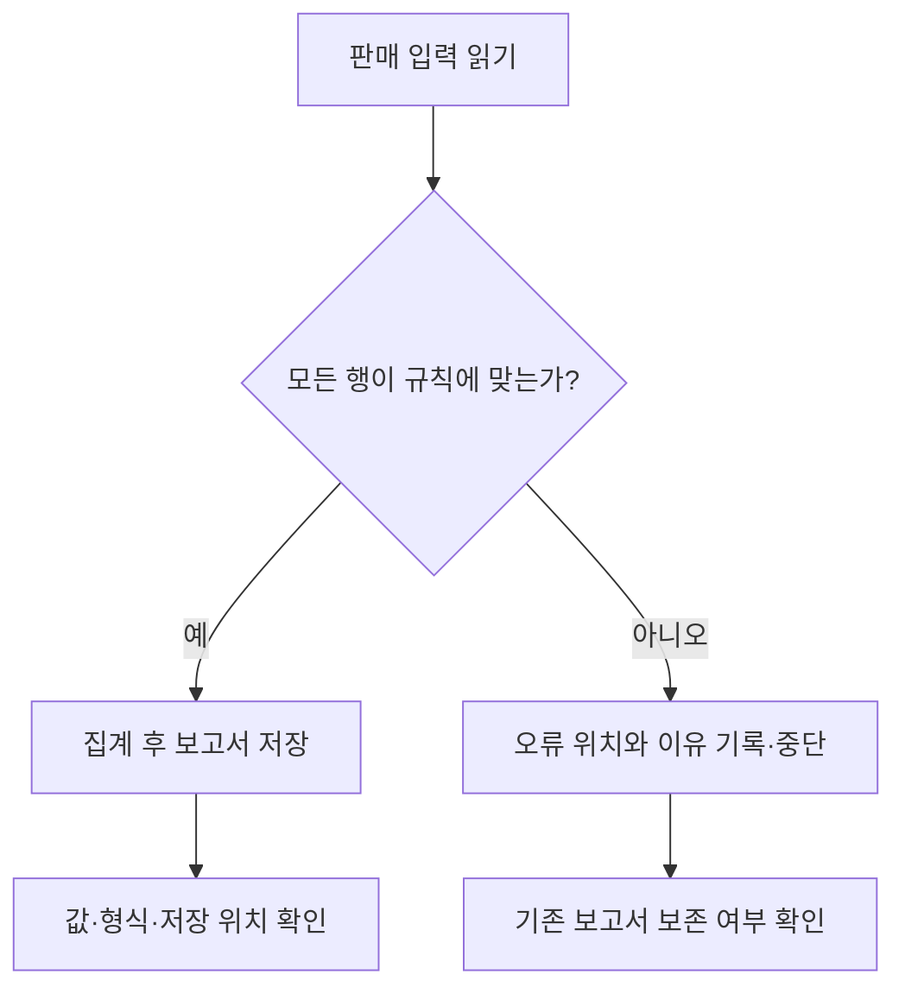
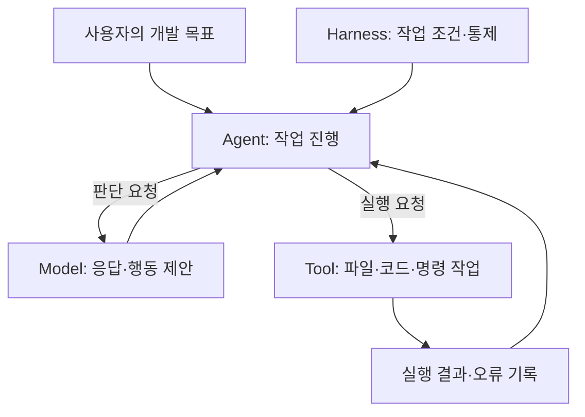
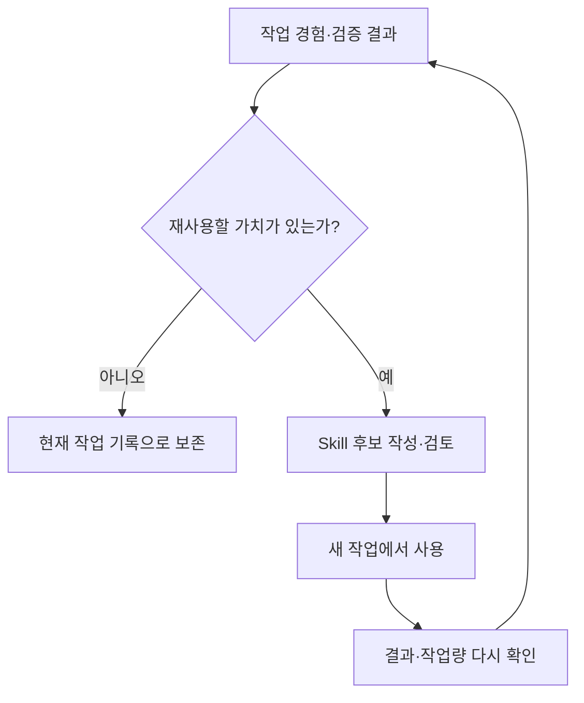

# 1교시. AI Native 개발과 Harness Engineering

**AI Native 소프트웨어 개발: Harness Engineering — 학습 가이드북**

## 1) 이번 교시에서 해결할 문제

> **AI는 “완료했습니다”라고 답했습니다. 이제 이 프로그램을 업무에 써도 될까요?**

당신은 매일 들어오는 판매 CSV(주문을 행과 열로 담은 텍스트 파일)를 읽어 매출 보고서를 만드는 프로그램을 AI에게 맡겼습니다. 아래는 수업을 위해 구성한 가상 상황입니다. 실제 Hermes의 실행 결과가 아니며, 아직 프로그램을 실행할 필요는 없습니다.

**당신의 요청**

> 판매 CSV를 읽어서 매출 보고서를 만드는 Python 프로그램을 만들어 주세요.

**AI의 답변**

> 프로그램을 작성하고 실행했습니다. 총매출은 156,000원입니다. 보고서는 `outputs/report.md`에 저장했습니다. 작업을 완료했습니다.

그럴듯한 금액과 저장 위치까지 제시됐습니다. 그런데 이 답변만으로 다음을 알 수 있을까요?

- 모든 입력을 빠짐없이 처리했는가?
- 잘못된 데이터는 어떻게 처리했는가?
- 보고서가 지정한 위치에 실제로 저장됐는가?
- 내일 다른 파일을 넣어도 올바르게 동작하는가?

**지금은 “사용해도 된다”, “아직 판단할 수 없다” 중 하나를 고르고 이유를 한 문장으로 생각해 보세요.** 정답을 먼저 맞히는 것이 목적은 아닙니다. 아래 실습을 마치면 같은 질문에 확인 기준을 들어 답하게 됩니다.

## 2) 학습목표와 완료 상태

이번 교시에서는 다음 세 가지를 할 수 있게 됩니다.

1. AI의 완료 답변에서 확인된 사실과 추가로 확인할 내용을 구분합니다.
2. 개발에 필요한 정보·규칙·실행 범위·검증을 정하고, 이것이 Harness와 어떻게 연결되는지 설명합니다.
3. 응답을 만드는 모델, 도구로 작업을 진행하는 Agent, 작업 조건을 정하는 Harness의 역할을 구분하고 Hermes를 사용하는 이유를 설명합니다.

**완료 산출물:** `01_harness_hypothesis.md` 한 파일. 도입 사례의 판단, 개발 조건 3개, 확인 방법, 자신이 예상하는 변화를 기록합니다. 문서 길이나 용어 암기보다 **“무엇을 정하고 어떻게 확인할 것인가”**가 중요합니다.

`.md`는 제목·목록·표를 텍스트로 적는 Markdown 문서입니다. 이번에는 메모장으로 작성하고 바탕 화면에 저장합니다. `outputs/report.md`는 도입 사례 속 AI가 보고서를 저장했다고 말한 경로입니다. 내 PC에 지금 만들어야 할 폴더는 아닙니다.

## 3) 시작 전 확인

Windows 메모장과 이 가이드북을 준비합니다. 필요한 입력·상황·양식을 모두 본문에 제공하므로 별도 파일이나 웹 문서를 열지 않아도 진행할 수 있습니다. 출처 링크는 근거 확인용입니다.

이번 교시에서는 설치, 명령 실행, 모델 호출을 하지 않습니다. OpenRouter는 여러 모델을 연결해 사용하는 서비스입니다. 사전 안내에 따라 계정과 모델 사용 요금인 크레딧을 준비하며, 프로그램이 계정을 사용할 때 제시하는 비밀값인 **API Key는 3교시에서 생성하고 Hermes에 등록**합니다.

먼저 메모장에서 새 문서를 열고 다음 양식을 옮겨 적거나 복사합니다. 아래 실습을 진행하면서 한 항목씩 채웁니다. 각 단계의 **할 일**을 수행한 뒤, 같은 메모장 문서의 해당 항목을 채웁니다.

```markdown
# 1교시. AI의 완료 답변을 어떻게 판단할까?

## 1. 처음 판단
업무에 사용해도 되는가:
그렇게 생각한 이유:

## 2. 사례에서 발견한 점
세 행의 수량×단가 합계:
합계만으로 확인할 수 없는 것:
오류 행을 만났을 때 적용할 규칙:

## 3. 내가 정할 개발 조건
1. 조건:
   확인 방법:
2. 조건:
   확인 방법:
3. 조건:
   확인 방법:

## 4. 역할과 도구 선택
Model의 역할:
Agent의 역할:
Harness의 역할:
이 과정에서 Hermes를 사용하는 이유:

## 5. 개선 가설
같은 모델에서도 ______을 제공하면 ______이 달라질 것으로 예상한다.
이를 확인하기 위해 ______을 살펴보겠다.

## 6. 다시 답하기
AI가 완료했다고 했을 때 내가 확인할 근거:
현재 확인한 것과 아직 실행하지 않은 것:
```

### 이번에 사용하는 파일과 도구

| 사용하는 것 | 담긴 내용과 목적 | 이번에 할 일 |
|---|---|---|
| 가이드북 `.md` 또는 `_preview.html` | 사례, 실습 순서, 기록 예시. HTML은 브라우저로 읽는 버전 | 한쪽을 열어 실습 진행 |
| `01_harness_hypothesis.md` | 내가 정한 조건과 확인 방법 | 메모장에서 한 항목씩 작성하고 바탕 화면에 저장 |
| 사례 속 `outputs/report.md` | AI가 만들었다고 주장하는 보고서 | 실제 저장 여부를 확인해야 하는 이유 생각하기 |

이번에는 사례를 읽고 판단 기준을 적으므로 `.ps1` 스크립트나 `course-tools`의 Python 프로그램을 사용하지 않습니다. 스크립트는 여러 명령을 파일에 담아 순서대로 실행하는 도구이며, 2교시부터 환경 준비와 점검에 사용합니다.

**준비 확인:** 양식이 보이면 다음으로 진행합니다. 프로젝트 폴더가 아직 없어도 괜찮습니다. 마지막 단계에서 바탕 화면에 저장합니다.

## 4) 실습에 필요한 최소 개념

오늘 다룰 CSV는 표를 텍스트로 저장하는 파일 형식입니다. 한 행에는 주문 한 건이 있고, 수량과 단가를 곱하면 그 행의 매출을 구할 수 있습니다.

또 하나 기억할 점은 **보고서 한 번 만들기와 보고서를 만드는 프로그램 개발하기가 다르다**는 것입니다. 우리가 만들려는 것은 다른 입력에도 정해진 규칙에 따라 동작하는 프로그램입니다. 따라서 이번 합계뿐 아니라 오류 처리, 저장 위치, 재실행 결과도 확인해야 합니다.

새 용어를 미리 모두 외울 필요는 없습니다. 먼저 사례에서 필요한 조건을 찾고, 그 조건에 이름을 붙이겠습니다.

## 5) 이번 교시의 진행 흐름

| 순서 | 할 일 | 기록할 내용 |
|---|---|---|
| 1 | 완료 답변을 입력과 대조 | 계산으로 확인한 것과 아직 모르는 것 |
| 2 | 처리 규칙과 확인 방법 결정 | 개발 조건 3개 |
| 3 | 방금 한 일을 개념과 연결 | Model·Agent·Harness의 역할 |
| 4 | Hermes 선택 이유와 주요 기능 이해 | 이 과정에서 사용하는 이유 |
| 5 | 경험의 재사용과 과정 운영 이해 | 같은 모델에서 기대하는 변화 |
| 6 | 도입 질문에 다시 답하고 저장 | 확인 근거가 담긴 한 장의 기록 |

## 6) 단계별 실습

### 단계 1. 금액이 맞으면 프로그램도 맞을까?

처음 사례의 입력을 확인해 보겠습니다. 아래는 설명을 위한 세 행입니다. 기존 실습 데이터 전체를 대체하는 파일이 아닙니다.

| 주문 | 제품 | 수량 | 단가 |
|---|---|---:|---:|
| T-01 | Keyboard | 2 | 45,000원 |
| T-02 | Mouse | 3 | 22,000원 |
| T-03 | USB-C Hub | 0 | 78,000원 |

**할 일:** 각 행의 수량과 단가를 곱하고 세 값을 더합니다. 메모장의 “세 행의 수량×단가 합계”에 적습니다.

**계산 확인:** 90,000 + 66,000 + 0 = **156,000원**입니다. AI가 말한 값과 같습니다.

그런데 수량 0인 행을 프로그램이 어떻게 처리했는지는 알 수 없습니다. 정상 값으로 받아 0원을 더했을 수도 있고, 행을 제외했을 수도 있습니다. 두 경우 모두 같은 합계가 나옵니다. 답변에 적힌 계산이 실제 프로그램에서 나온 것인지도 실행 기록 없이는 확인되지 않습니다.

여기서 바로 “AI가 잘못했다”고 결론내리지는 않습니다. 처음 요청에는 수량 0을 허용하는지 정하지 않았습니다. **합계의 일치와 업무 규칙의 충족은 별도로 확인해야 합니다.**

**기록:** “합계만으로 확인할 수 없는 것”에 한 가지를 적습니다. 예: “수량 0인 행을 어떤 규칙으로 처리했는지 모른다.” 계산이 달랐다면 행별 곱셈을 한 번 확인한 뒤 위 값을 사용해 다음 단계로 진행해도 됩니다.

### 단계 2. AI가 추측할 결정을 우리가 정한다

수량 0을 처리하는 방식은 업무에 따라 다를 수 있습니다. 0원으로 반영할 수도 있고, 오류로 돌려보낼 수도 있습니다. 중요한 것은 프로그램이 임의로 선택하게 두지 않고 업무에 맞는 규칙을 정하는 것입니다.

**이번 사례에는 다음 규칙을 적용합니다.**

> 수량과 단가는 1 이상의 정수여야 합니다. 입력이 규칙을 어기면 오류 위치와 이유를 알리고 중단합니다. 새 보고서를 만들거나 기존 정상 보고서를 덮어쓰지 않습니다.

이 규칙을 적용하면 T-03은 오류입니다. 따라서 156,000원짜리 새 보고서를 만들었다는 사실은 성공의 근거가 되지 않습니다. 기대하는 행동은 **T-03의 수량 오류를 알리고, 기존 보고서를 보존하는 것**입니다.



그림의 두 갈래는 프로그램이 따라야 할 동작입니다. 정상 입력의 계산과 오류 입력의 중단 모두 확인해야 합니다.

**할 일:** 메모장에 오류 처리 규칙을 자신의 문장으로 적습니다. 이어서 아래에서 서로 다른 개발 조건 3개를 골라 “조건”과 “확인 방법”을 채웁니다.

| 개발 중 정해야 할 것 | 제공할 조건의 예 | 나중에 확인할 증거 |
|---|---|---|
| 어떤 입력을 사용할까? | 지정한 판매 CSV와 열의 의미 제공 | 실제 읽은 파일과 적용한 열 |
| 오류가 있으면 어떻게 할까? | 오류 행을 알리고 중단 | 오류 위치·이유·종료 결과 |
| 어디에 저장할까? | `outputs/` 안의 지정 파일에 저장 | 실제 생성 파일과 변경 위치 |
| 기존 결과는 어떻게 보호할까? | 입력 검사에 실패하면 기존 결과 유지 | 실패 전후 보고서 내용 비교 |
| 언제 완료라고 할까? | 정상·오류·재실행 검사를 확인한 뒤 완료 | 검사별 예상 값과 실제 값 |

**작성 예:** “조건: 오류 입력이면 기존 보고서를 바꾸지 않는다. 확인 방법: 실행 전후 보고서 내용을 비교한다.”

답이 예시와 똑같을 필요는 없습니다. “정확하게 한다”처럼 확인하기 어려운 문장이라면, 무엇을 보고 판단할지 한 가지를 덧붙이면 됩니다. 지금은 조건을 설계하는 단계이며 실제 검사 통과를 기록하지 않습니다.

### 단계 3. 방금 설계한 것이 Harness와 어떻게 연결될까?

방금 여러분은 AI가 개발할 때 필요한 정보, 따라야 할 규칙, 결과를 확인하는 방법을 정했습니다. 이런 조건을 실제 작업에 연결하는 것이 이 과정에서 다루는 **Harness Engineering**입니다.

**Harness는 Agent가 일하는 데 필요한 정보·규칙·실행 통제·검증·복구 절차를 묶은 구조**입니다. 프롬프트는 AI에게 보내는 요청문으로, Harness의 일부가 될 수 있습니다. 여기에 프롬프트 밖의 도구 설정, 파일 접근 범위, 검사 프로그램, 작업 기록도 포함됩니다.

예를 들어 “지정 폴더 밖에 쓰지 마세요”는 행동 지침입니다. 실제로 접근을 막으려면 도구와 실행 환경도 그에 맞게 설정해야 합니다. Docker를 사용한다는 이유만으로 모든 도구가 같은 범위에 제한된다고 가정해서는 안 됩니다. 이 차이는 실행 경계와 도구를 다루는 교시에서 직접 확인합니다.

**Model·Agent·Harness는 다음처럼 구분합니다.**

| 구분 | 맡는 일 | 이번 과정의 예 |
|---|---|---|
| Model | 주어진 정보를 바탕으로 응답과 행동 후보를 생성 | GLM 5.3 Flash |
| Agent | 모델을 호출하고 도구 결과를 받아 다음 작업을 진행 | Hermes Agent |
| Tool | 파일 읽기·코드 수정·명령 실행 같은 개별 동작 수행 | 파일 도구, 터미널 도구 |
| Harness | Agent가 작업할 조건과 통제·검증 절차 제공 | 작업 배경 정보(Context), 요구 규칙을 적은 명세, 권한, 검사와 복구 절차 |



모델은 코드를 제안할 수 있지만, 제안한 코드가 저장되고 실행되는 데에는 Agent와 도구가 필요합니다. Agent는 실행 결과를 다시 받아 작업을 이어갑니다. 그림은 역할을 구분한 것이며, 실제 제품에서는 이 기능들이 함께 구현돼 있습니다.

이 과정에서 **AI Native 소프트웨어 개발**은 AI가 코드 작성·수정·실행에 참여하도록 개발 절차를 설계하는 것을 뜻합니다. 사람은 업무 목표와 허용 범위, 완료 기준을 정하고 결과를 판단합니다. 검사 명령 실행 등은 AI에게 맡길 수 있지만, AI의 완료 답변만을 검사 증거로 대신하지는 않습니다.

**할 일:** 메모장의 세 역할을 한 문장씩 채웁니다. “파일을 읽으라고 제안하는 것”, “실제로 읽고 결과를 받아 작업을 이어가는 것”, “읽을 범위와 확인 기준을 정하는 것”을 구분할 수 있으면 충분합니다.

### 단계 4. 다른 Agent도 있는데 왜 Hermes를 사용할까?

Hermes Agent는 Nous Research가 공개한 AI Agent입니다. 파일과 도구를 사용해 작업을 수행하며, 경험에서 Skill을 만들고 개선하는 **Self-Improving Agent**를 주요 특징으로 소개합니다. 여기서 Skill은 다음 작업에도 사용할 수 있게 정리한 절차와 지식입니다. [Hermes 공식 소개](https://hermes-agent.nousresearch.com/docs/)

OpenClaw도 Agent 실행, 도구, 기억할 정보를 보관하는 Memory, Skill을 제공합니다. 따라서 Hermes만 Harness Engineering을 배울 수 있는 도구는 아닙니다. OpenClaw의 공식 구조는 연결을 중계하는 Gateway를 중심으로 메시징 채널·클라이언트·기기를 연결합니다. Hermes는 경험 기반 Skill 생성과 개선을 강조합니다. 이것은 기능의 우열을 매긴 비교가 아닙니다. [OpenClaw 구조](https://docs.openclaw.ai/concepts/architecture), [OpenClaw Skills](https://docs.openclaw.ai/tools/skills)

**이번 과정에서는 다음 교육 목적에 맞춰 Hermes를 선택합니다.**

| 선택 이유 | 수업에서 경험할 내용 |
|---|---|
| 실제 개발 작업을 진행할 수 있음 | 코드 생성뿐 아니라 파일 변경·명령 실행·오류 결과 관찰 |
| 같은 Agent와 모델에서 작업 조건을 조정할 수 있음 | 제공하는 정보·규칙·검사 절차에 따른 차이 관찰 |
| 경험의 재사용을 연결하기 좋음 | 검증·복구 절차를 Skill로 정리하고 다시 적용 |
| Docker와 Hermes 웹 대시보드로 실습 환경 통일 | 브라우저의 같은 화면 흐름으로 대화·도구 실행 확인 |

이는 이번 교육 설계의 선택 근거입니다. Hermes가 다른 Agent보다 항상 빠르거나 정확하다는 주장, 다른 Agent에 위 기능이 없다는 주장이 아닙니다.

Hermes의 실제 실행 구조에는 모델 호출, 도구 실행, 대화 이력 유지 등이 포함됩니다. Skill은 필요할 때 불러올 수 있으며, 경험이나 자료로 만드는 `/learn`과 저장·수정을 위한 `skill_manage`를 제공합니다. [Hermes Agent 실행 구조](https://hermes-agent.nousresearch.com/docs/developer-guide/agent-loop), [Hermes Skills](https://hermes-agent.nousresearch.com/docs/user-guide/features/skills)

**수업에서 사용할 기능은 아래 순서로 배웁니다. 지금 명령을 실행하거나 화면을 찾을 필요는 없습니다.**

| 기능 | 쉬운 설명 | 배우는 교시 |
|---|---|---|
| 프로젝트·세션 | 프로젝트는 함께 작업할 파일의 묶음, 세션은 요청과 응답이 이어지는 한 대화 | 3 |
| 모델·추론 설정 | 작업에 사용할 모델과 지원되는 추론 설정 선택 | 3 |
| 실행 backend·도구·승인 | backend는 명령이 실행될 장소를 뜻함. 도구의 작업 범위와 사람의 승인 절차를 함께 확인 | 4, 8 |
| Context·persistent Memory | Context는 현재 판단에 제공한 정보, persistent Memory는 다음 대화에도 남는 기억 | 5 |
| 도구 결과와 작업 기록 | 무엇을 실행했고 무엇이 실패했는지 확인 | 3부터 관찰, 9~10에서 체계화 |
| Skill·학습과 저장 | 절차를 생성·검토·수정하고 다음 작업에 재사용 | 11 |

명세와 계획, 검사 기준은 학생이 설계하여 Hermes가 읽고 따르게 하는 작업 자료입니다. 파일 이름만 만들었다고 통제가 자동으로 생기는 것은 아닙니다. 적용 여부는 실행 결과로 확인합니다.

**할 일:** “이 과정에서 Hermes를 사용하는 이유”를 한 문장으로 적습니다. 예: “개발을 수행한 기록에서 검증된 절차를 찾아 다음 작업에 재사용하는 흐름을 경험할 수 있기 때문이다.”

### 단계 5. 한 번 해결한 경험을 다음 작업에도 쓸 수 있을까?

다음 상황을 생각해 보세요.

> 오류 입력이 기존 보고서를 덮어쓰는 문제를 발견했습니다. 저장 전에 입력을 검사하도록 코드를 수정했고, 정상·오류 입력과 기존 결과 보존을 모두 확인했습니다. 며칠 뒤 다른 보고서 프로그램을 만들게 됐습니다.

이때 저장할 것은 “지난번 총매출은 156,000원”이라는 답이 아닙니다. **“입력을 먼저 검사하고, 검사에 실패하면 기존 결과를 보존하며, 수정 후 두 경우를 모두 다시 확인한다”**는 절차가 재사용에 도움이 될 수 있습니다.

| 구분 | 전달하는 내용의 예 |
|---|---|
| Context | 이번에 읽을 파일, 현재 코드, 지금 적용할 명세 |
| persistent Memory | 다음 세션에도 참고할 사실이나 사용자의 선호 |
| Skill | 특정 작업을 수행할 절차, 주의점, 검증 방법 |

Memory나 Skill을 읽으면 그 내용이 현재 Context에 들어올 수 있습니다. 서로 완전히 분리된 정보 저장소라는 뜻은 아닙니다. Hermes의 영구 Memory는 새 세션에도 전달될 수 있으므로 새 대화를 열었다고 모든 조건이 초기화되는 것은 아닙니다. [Hermes Memory](https://hermes-agent.nousresearch.com/docs/user-guide/features/memory)



새 작업의 결과를 다시 확인하고 절차를 수정하는 순환을 **Closed Learning Loop**라고 합니다. 위 그림은 수업에서 경험할 절차이며 모든 단계가 자동으로 수행된다는 뜻은 아닙니다. 저장 승인을 사용하는 경우에는 무엇을 어디에 저장하는지 확인한 뒤 승인합니다.

이때 개선하는 대상은 모델 밖의 정보와 절차입니다. **모델의 가중치를 학습하거나 파인튜닝하는 실습은 하지 않습니다.** 현재 코드 한 번 수정, Skill 저장, 다음 작업의 성능 향상도 각각 다른 사실입니다.

Skill을 사용했어도 결과가 같거나 비용이 늘 수 있습니다. 성공 여부뿐 아니라 검사 누락, 재시도, 작업량도 살펴봅니다. 개선을 확인하지 못했다면 그대로 기록합니다.

**할 일:** 메모장의 “개선 가설”을 채웁니다. 예: “같은 모델에서도 결과 보존 검사 절차를 제공하면 검사 누락이 줄 것으로 예상한다. 이를 확인하기 위해 실제 검사 기록을 살펴보겠다.” 지금 적은 것은 예상이며 실측 결과가 아닙니다.

### 단계 6. 서로 다른 결과로도 같은 내용을 배울 수 있다

이 과정은 같은 판매 보고서 개발 상황을 여러 관점에서 다룹니다. **2교시의 실행 환경과 3교시의 모델 연결·Baseline 보존을 먼저 마칩니다.** 4~6교시는 준비 명령으로 해당 교시의 공통 파일을 마련하고 이전 작업을 보관합니다. 따라서 앞선 Agent의 답변이 예시와 같아야 하는 것은 아닙니다. 다음 교시를 시작할 때는 그 가이드의 준비 조건을 확인합니다. 특히 7교시는 6교시의 구체화된 명세와 인수조건 기록을 이어받습니다.

**이 과정은 총 11교시입니다. Day 1은 1교시부터 6교시까지, Day 2는 7교시부터 11교시까지 진행합니다.**

| 일차·교시 | 경험할 내용 |
|---|---|
| Day 1 · 1 | 완료 답변을 판단할 조건 찾기 |
| Day 1 · 2~3 | 실행 환경 확인, Hermes 연결, 최초 결과 보존 |
| Day 1 · 4~6 | 실행 경계 → 정보 제공 → 명세와 인수조건 |
| Day 2 · 7 | 명세를 계획으로 나누고 승인한 입력 검사 구현 |
| Day 2 · 8~11 | 도구 사용 범위 설정, 계산·출력 구현, 검증·복구와 경험 재사용 |

Day 1을 마칠 때는 6교시의 구체화된 `SPEC.md`와 인수조건을 적은 `spec_review.md`를 보관합니다. Day 2의 7교시는 이 자료를 이어받아 계획을 세우는 것으로 시작합니다. 인수조건은 프로그램을 완료했다고 판단할 때 확인할 기준입니다.

실습에는 **GLM 5.3 Flash**를 사용합니다. 같은 Agent와 모델을 사용하면서 작업에 필요한 정보·규칙·검사·복구 절차를 차례로 적용합니다. 어떤 작업 조건을 제공했고 실제 결과에서 무엇이 달라졌는지 살펴봅니다. 모델 선택과 연결은 3교시에서 안내합니다.

학생마다 코드 구성, 설명, 실행 횟수는 달라도 됩니다. 반면 같은 입력의 계산값, 오류 처리 규칙, 허용된 실행 범위 등은 공통 기준으로 확인합니다. 잘 동작했다면 무엇으로 확인했는지 기록하고, 실패했다면 어떤 기준을 충족하지 못했는지 기록합니다.

**3교시 Baseline은 최초 실행 상태와 결과를 보존한 기록입니다.** Hermes 자체에 이미 Agent 실행 구조와 도구 관리가 있으므로 “Harness가 전혀 없는 상태”라고 부르지 않습니다. 수업에서 추가할 작업별 정보·규칙·검증 절차를 적용하기 전 상태를 관찰하는 것입니다.

비교 실험은 다음 원칙으로 구분합니다.

| 실습 | 맞춰야 할 조건 | 해석할 때 주의할 점 |
|---|---|---|
| Harness 적용 전후 | 같은 Agent·모델·요청·입력·시작 파일에서 해당 조건만 변경 | 다른 교시의 제공 코드가 달라진 효과와 섞지 않음 |
| 11교시 Skill 유무 | 같은 시작 코드와 나머지 Harness, 목표 Skill만 변경 | A에서 수정한 코드를 B가 물려받지 않음 |

비교에 영향을 주는 Memory·Skill·세션 상태도 함께 통제합니다. 다른 시작 자료로 진행한 결과를 3교시 기록과 단순히 비교해 개선 효과로 계산하지 않습니다. 조건을 맞춘 한 번의 차이도 관찰 결과이며, 항상 개선된다는 증거는 아닙니다.

### 단계 7. 처음 질문에 다시 답하고 저장한다

처음에는 AI가 “프로그램을 실행했고 보고서를 저장했다”고 답했습니다. 이제 같은 상황에서 무엇을 확인하겠습니까?

**할 일:** 메모장의 “다시 답하기”에 다음 세 가지를 적습니다.

1. 실제 입력과 계산에 관해 확인할 근거 한 가지
2. 오류 처리 또는 작업 범위에 관해 확인할 근거 한 가지
3. 오늘 확인한 것과 아직 실행하지 않은 것의 구분

**작성 예**

> 완료 답변만으로 업무 투입을 결정하지 않겠다. 지정한 입력으로 계산했는지, 정상·오류 입력의 검사가 통과했는지, 기존 결과와 작업 범위가 보호됐는지 확인하겠다. 오늘은 가상 사례의 계산과 처리 규칙을 검토했으며, Hermes를 실행하거나 실제 프로그램을 검증한 것은 아니다.

다른 근거를 적어도 괜찮습니다. “AI를 믿지 않는다”보다 **어떤 증거가 있으면 판단할 수 있는지**를 구체적으로 적는 것이 중요합니다.

**저장 순서 — Windows 메모장**

1. 메모장에서 **다른 이름으로 저장**을 엽니다. `Ctrl+Shift+S`를 사용할 수 있습니다.
2. 저장 위치를 **바탕 화면**으로 선택합니다.
3. 파일 이름을 `01_harness_hypothesis.md`로 입력합니다.
4. 파일 형식을 **모든 파일**로 선택하고 인코딩은 **UTF-8**로 저장합니다.
5. 저장한 파일을 메모장으로 다시 열어 작성한 내용이 남아 있는지 확인합니다.

`.md`는 Markdown 문서의 확장자입니다. 메모장에서 `#` 같은 기호가 보이는 것은 정상입니다. 별도의 Markdown 편집기를 설치할 필요는 없습니다.

**예상 결과:** 바탕 화면에 기록 파일 하나가 있고, 다시 열면 한글과 자신이 작성한 답을 확인할 수 있습니다. 이 파일은 학습 기록이며 다음 교시를 실행하는 데 필요한 코드가 아닙니다.

| 예상과 다른 상황 | 바로 할 일 |
|---|---|
| 파일 이름이 `.md.txt`로 끝남 | 모든 파일 형식을 선택해 `.md` 이름으로 다시 저장 |
| 파일이 보이지 않음 | 저장 위치가 바탕 화면인지 확인 |
| 한글이 깨짐 | 열린 원문을 UTF-8로 다시 저장 |
| 조건을 세 개 고르기 어려움 | 입력 확인·오류 처리·결과 확인에서 하나씩 선택 |
| 답이 예시와 다름 | 내용의 일치보다 조건과 확인 근거가 연결됐는지 확인 |

### 작성한 기록과 비교하기: 전체 답변 예시

아래는 시작할 때 제공한 양식을 모두 채운 예시입니다. **자신의 답을 먼저 작성한 뒤, 조건과 확인 근거가 어떻게 연결됐는지 비교해 보세요.** 유일한 정답은 아니며, 처음 판단과 선택한 개발 조건이 달라도 괜찮습니다. 처음 생각을 예시에 맞춰 고치기보다, 실습 후 판단이 어떻게 달라졌는지 남깁니다.

```markdown
# 1교시. AI의 완료 답변을 어떻게 판단할까?

## 1. 처음 판단
업무에 사용해도 되는가:
사용할 수 있을 것 같다고 생각했다.

그렇게 생각한 이유:
AI가 프로그램을 실행했고, 총매출과 보고서 저장 위치도 알려줬기 때문이다.

## 2. 사례에서 발견한 점
세 행의 수량×단가 합계:
T-01: 2 × 45,000 = 90,000원
T-02: 3 × 22,000 = 66,000원
T-03: 0 × 78,000 = 0원
합계: 156,000원

합계만으로 확인할 수 없는 것:
수량 0인 행을 정상 값으로 계산했는지, 제외했는지 알 수 없다.
프로그램이 실제로 실행됐는지와 보고서가 저장됐는지도 답변만으로는 확인되지 않는다.

오류 행을 만났을 때 적용할 규칙:
이번 사례에서는 수량과 단가를 1 이상의 정수로 정한다.
따라서 T-03은 수량 오류로 알리고 중단해야 한다.
새 보고서를 생성하거나 기존 정상 보고서를 덮어쓰지 않아야 한다.

## 3. 내가 정할 개발 조건
1. 조건:
   지정한 CSV의 수량과 단가를 읽어 행별 매출과 합계를 계산한다.
   확인 방법:
   실제 읽은 파일을 확인하고, 정상 입력의 예상 합계와 프로그램 출력을 비교한다.

2. 조건:
   입력 오류를 만나면 위치와 이유를 알리고 기존 보고서를 보존한다.
   확인 방법:
   오류 입력으로 실행해 오류 기록을 확인하고, 실행 전후 보고서 내용을 비교한다.

3. 조건:
   정상 입력과 오류 입력의 검사를 확인한 뒤 작업 완료를 보고한다.
   확인 방법:
   두 검사에서 사용한 입력, 예상 결과, 실제 결과가 기록됐는지 확인한다.

## 4. 역할과 도구 선택
Model의 역할:
제공받은 정보를 바탕으로 코드나 다음 행동을 제안한다.

Agent의 역할:
모델과 도구를 사용해 파일을 읽고 코드를 수정하며, 실행 결과를 받아 작업을 이어간다.

Harness의 역할:
Agent에게 필요한 정보와 규칙을 제공하고, 실행 범위·검증·복구 절차를 구성한다.

이 과정에서 Hermes를 사용하는 이유:
코드 작성과 실행뿐 아니라 검증·복구 경험을 Skill로 정리해
다음 작업에 재사용하는 흐름을 하나의 환경에서 배울 수 있기 때문이다.
다른 Agent에서도 정보·권한·검증을 설계하는 원칙은 적용할 수 있다.

## 5. 개선 가설
같은 모델에서도 오류 처리 규칙과 결과 보존 검사 절차를 제공하면
오류 행을 조용히 제외하거나 기존 보고서를 덮어쓰는 일이 줄어들 것으로 예상한다.
이를 확인하기 위해 같은 시작 조건에서 오류 기록과 실행 전후 보고서를 살펴보겠다.
차이가 없거나 결과가 나빠지면 그 사실도 그대로 기록하겠다.

## 6. 다시 답하기
AI가 완료했다고 했을 때 내가 확인할 근거:
완료 답변만으로 업무 사용을 결정하지 않겠다.
실제 입력·생성 파일·실행 기록과 정상·오류 입력의 검사 결과를 확인하겠다.
특히 합계가 맞더라도 오류 처리 규칙을 지켰는지 별도로 확인하겠다.

현재 확인한 것과 아직 실행하지 않은 것:
오늘은 가상 사례의 세 행을 계산하고, 처리 규칙과 확인 방법을 정했다.
Hermes를 실행하거나 프로그램의 동작과 실제 파일을 검증하지는 않았다.
따라서 개선 가설은 아직 실험으로 확인된 결과가 아니다.
```

비교할 때는 **조건이 구체적인가, 확인 방법이 연결되는가, 예상과 실제 확인을 구분했는가**를 살펴봅니다. 예시를 보고 자신의 기록을 보완했다면 `Ctrl+S`로 저장한 뒤 아래 완료 확인으로 진행합니다.

## 7) 최종 완료 및 산출물 확인

저장한 기록을 읽고 아래 항목을 확인합니다.

- [ ] 156,000원이라는 합계만으로 오류 처리 방식을 알 수 없는 이유를 적었습니다.
- [ ] 개발 조건 3개에 각각 확인 방법을 연결했습니다.
- [ ] 모델의 제안, Agent의 작업 진행, Harness의 조건과 통제를 구분했습니다.
- [ ] Hermes를 선택한 교육적 이유를 한 가지 설명할 수 있습니다.
- [ ] Skill 저장이 모델 가중치 학습이나 성능 향상의 증명과 다르다는 점을 이해했습니다.
- [ ] 실제로 실행하지 않은 내용을 성공했다고 기록하지 않았습니다.
- [ ] 파일을 저장하고 다시 열었습니다.

**용어를 완벽하게 외우지 못해도 다음 교시로 진행할 수 있습니다.** 핵심은 “어떤 조건이 필요하고 무엇을 보면 확인할 수 있는가”를 설명하는 것입니다. 채우지 못한 항목은 미확인으로 남겨도 되며, 기록을 없애고 처음부터 다시 시작할 필요는 없습니다.

## 8) 이번 경험의 의미와 다음 교시 준비

처음에는 보고서의 금액과 완료 답변을 보았습니다. 입력을 살펴보니 처리 규칙이 필요했고, 규칙을 정하니 검사할 기준이 생겼습니다. 같은 방식으로 파일 접근, 실행, 복구, 경험의 재사용에도 조건과 확인 방법을 설계할 수 있습니다.

**이것이 Harness Engineering을 배우는 출발점입니다.** 모델이 잘 답했는지만 보는 데서 나아가, Agent가 개발을 수행하는 과정과 결과를 확인할 수 있게 만드는 것입니다.

다음 2교시에서는 Windows·WSL2·Docker가 어떻게 연결되는지 확인합니다. “AI가 파일을 만들었다는데 내 폴더에는 없다면 어디를 확인해야 할까?”라는 질문에서 출발합니다. 오늘 기록은 보관하고, API Key는 3교시 안내에 따라 생성합니다.

---

**참고 자료:** Hermes·OpenClaw·OpenRouter의 기능 설명은 본문에 연결한 공식 문서에서 더 읽을 수 있습니다. 이 교시의 도입 사례와 계산 표는 학습용 가상 예시입니다.
