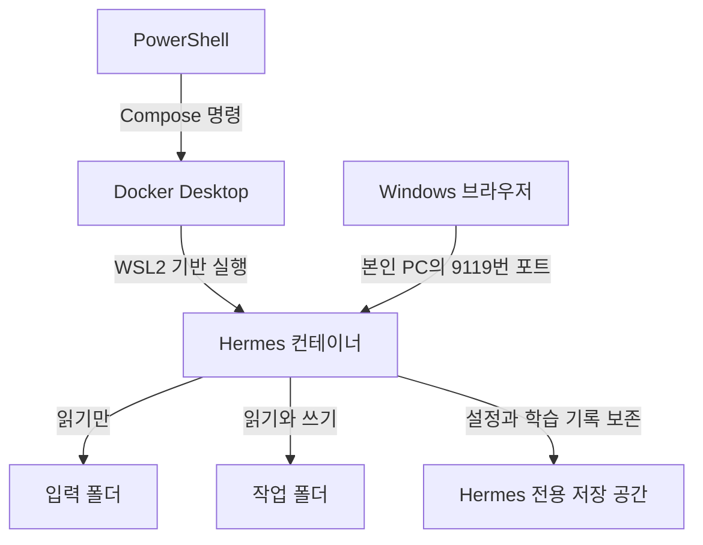
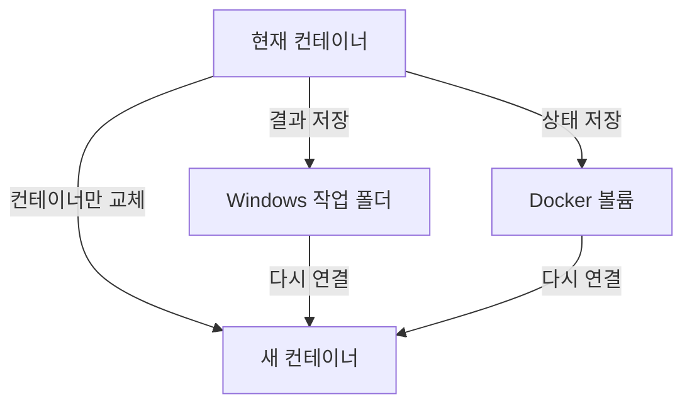
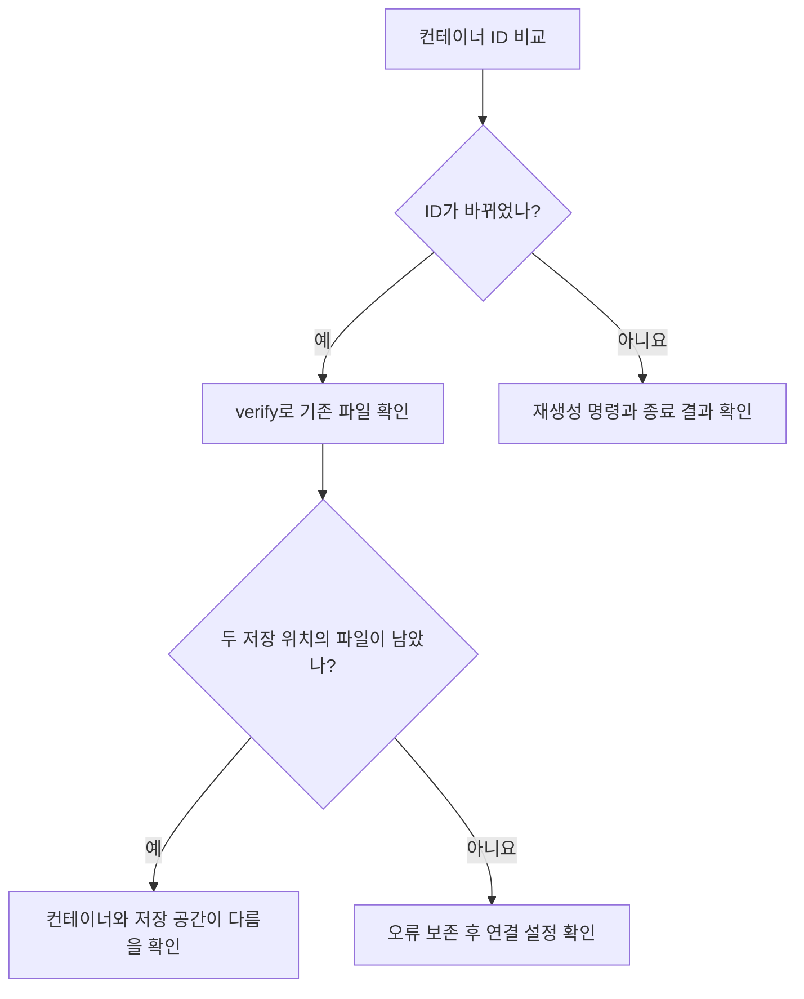

# 2교시. Docker로 Harness Engineering 실습 환경 준비하기

**AI Native 소프트웨어 개발: Harness Engineering — 학습 가이드북**

## 1) 이번 교시에서 해결할 문제

> **“AI에게 작업을 맡기기 전에, 내 PC의 어느 폴더까지 보여 줄지 정할 수 있을까요?”**

Agent는 대답을 만드는 것에 그치지 않고 파일을 읽고, 코드를 실행하고, 결과를 저장합니다. 따라서 사용할 모델을 고르기 전에 **작업할 장소와 접근할 파일**을 준비해야 합니다.

이번 시간에는 공식 Hermes 이미지를 이용해 실행 환경을 만들고, 브라우저로 접속합니다. 이어서 제공된 점검 명령으로 세 가지를 확인합니다. **입력 파일은 읽을 수 있는가? 원본 수정은 막히는가? 결과는 Windows에 남는가?**

필요한 용어를 먼저 익히고, 한 단계씩 실행하며 환경을 준비합니다. Windows에는 **Docker Desktop**을 설치합니다. **Hermes Agent**와 필요한 도구는 컨테이너 안에서 실행하고, 브라우저에서 **Hermes Web Dashboard**에 접속합니다. 이 문서에서는 이를 **Hermes 웹 대시보드**라고 부릅니다.

**이미지**는 Hermes와 실행 도구를 묶은 배포본이고, **컨테이너**는 그 배포본으로 만드는 실행 공간입니다. 아래의 `healthy`는 컨테이너의 상태 점검이 통과했다는 표시입니다. Docker의 `Client`는 내가 입력하는 명령 프로그램, `Server`는 그 요청을 받아 컨테이너를 실행하는 엔진입니다.

## 2) 학습목표와 완료 상태

수업을 마치면 다음을 할 수 있습니다.

- 이미지와 컨테이너를 구분하고, 공식 이미지를 사용하는 이유를 설명합니다.
- 제공된 설정 파일로 Hermes를 실행하고 본인 PC의 브라우저에서 로그인합니다.
- 입력 폴더의 읽기 전용 연결과 작업 폴더의 읽기·쓰기 연결을 구분합니다.
- 컨테이너를 다시 만들어도 결과와 Hermes 저장 공간이 유지되는지 확인합니다.

**이번 시간의 완료 기준**

| 확인할 것 | 완료 상태 |
|---|---|
| Docker 실행 기반 | Client와 Server가 연결되고 Linux 컨테이너 실행 가능 |
| Hermes 실행 | 제공 설정으로 실행한 서비스가 `healthy` |
| 대시보드 | 개인별로 생성된 로그인 정보로 접속 |
| 파일 경계 | 입력 파일 읽기 성공, 입력 폴더 쓰기 차단, 작업 폴더 쓰기 성공 |
| 데이터 보존 | 컨테이너 재생성 후 두 저장 위치의 확인 파일 유지 |
| 기록 | `workspace/evidence/lesson02`에 점검 결과와 자신의 설명 저장 |

이번 실습에는 제공된 환경 확인용 텍스트 파일을 사용합니다.

## 3) 시작 전 준비

### 사용할 PC와 프로그램

- Windows 11 PC와 인터넷을 준비합니다. 원활한 실습을 위해 메모리 16GB와 여유 디스크 공간 10GB 이상을 권장합니다. Docker가 지원하는 Windows 버전과 하드웨어 조건은 아래 공식 설치 페이지에서 확인할 수 있습니다.
- 설치와 재부팅이 필요할 수 있으므로 열어 둔 문서를 저장합니다.
- Docker Desktop이 설치되어 있다면 단계 1의 환경 확인 후 단계 2의 실행 확인으로 진행합니다.

[Docker 공식 Windows 설치·요구사항](https://docs.docker.com/desktop/setup/install/windows-install/)

### 제공 파일

`compose.yaml`의 YAML은 설정 이름과 값을 들여쓰기로 표현하는 형식입니다. `.ps1`은 PowerShell 명령을 담은 스크립트, `.py`는 Python 프로그램입니다. `.md`는 메모장으로 편집하는 Markdown 문서이며, `_preview.html`은 브라우저로 읽는 가이드북입니다.

함께 제공된 **`AN-Harness-Lesson02-Docker.zip` 전체를 다운로드**합니다. Markdown 파일만 받아서는 실행 설정과 점검 파일이 부족합니다. 압축을 푸는 위치는 단계 3에서 안내합니다.

| 파일 또는 폴더 | 용도 | 직접 수정하는가? |
|---|---|---|
| `compose.yaml` | 이미지, 실행 명령, 포트, 연결 폴더, 저장 공간 지정 | 기본 실습에서는 수정하지 않음 |
| `prepare.ps1` | 작업 폴더와 개인 대시보드 로그인 정보 생성 | 실행만 함 |
| `.env.example` | 설정값의 이름과 용도를 보여 주는 예시 | 그대로 `.env`로 복사하지 않음 |
| `inputs/input_marker.txt` | 읽기 확인용 원본 | 수정하지 않음 |
| `course-tools/check_environment.py` | 파일 연결·쓰기 차단·저장 보존을 확인 | 실행만 함 |
| `02_wsl2_docker_environment_preview.html` | 이 가이드북의 도식 포함 미리보기 | 브라우저로 열어 읽음 |
| `examples/environment_check_example.md` | 환경 점검 기록의 전체 작성 예시 | 자신의 기록과 비교 |

### 준비 파일과 점검 프로그램은 어떤 관계일까?

`prepare.ps1`은 **Windows에 필요한 폴더와 개인 설정을 준비**합니다. `check_environment.py`는 **컨테이너 안에서 실제로 읽고 쓸 수 있는지 시험**합니다. 준비를 했다는 사실과 준비가 올바르게 작동한다는 증거를 각각 남기는 것입니다. Windows에 Python을 별도로 설치하지 않고, 제공 이미지에 들어 있는 Python을 사용합니다.

| 사용하는 공간 | 내용과 필요한 이유 | 직접 할 일 |
|---|---|---|
| `harness-engineering` | 수업 파일을 모아 두는 기준 폴더. `compose.yaml`이 있음 | PowerShell을 이 위치로 이동 |
| `inputs/` | 컨테이너에서 읽어 볼 원본 `input_marker.txt` | 읽기 전용 연결 확인 |
| `course-tools/` | 교육용 환경 점검 코드 | 아래 단계의 명령으로 실행 |
| `workspace/` | 컨테이너와 Windows가 함께 보는 작업 파일 | 컨테이너가 쓴 파일을 Windows에서 열기 |
| `workspace/evidence/lesson02/` | 점검 JSON과 `environment_check.md`. evidence는 판단 근거를 뜻함 | 자동 점검 결과와 내 관찰 작성 |
| `.env` | 대시보드 접속 번호와 개인 로그인 설정 | 준비 명령으로 생성하고 로그인할 때 사용 |
| Docker의 `hermes-state` 저장 공간 | Hermes 설정과 대화를 컨테이너 밖에 보관 | 컨테이너 재생성 후 확인 파일이 남는지 점검 |

### 이 교시의 명령을 실행하는 이유

아래 표는 명령의 역할을 미리 보는 안내입니다. 실제 입력은 **6) 단계별 실습**에서 순서대로 진행합니다.

| 명령 또는 프로그램 | 무엇을 위해 실행하는가 | 남는 결과 |
|---|---|---|
| `.prepare.ps1` | 작업 폴더와 개인 로그인 설정 준비 | `workspace`, `.env` 등 |
| `docker compose up -d` | 준비한 설정으로 Hermes 시작 | 브라우저에서 접속할 서비스 |
| `docker compose ps` | 준비가 끝났는지 상태 확인 | `healthy` 등의 상태 표시 |
| `check_environment.py create` | 원본 읽기·쓰기 차단·저장 위치를 시험하고 확인 파일 생성 | 최초 점검 JSON과 확인 파일 |
| `check_environment.py verify` | 컨테이너를 다시 만든 뒤 기존 확인 파일이 남았는지 검사 | 보존 점검 JSON |

Python 프로그램의 `create`와 `verify`는 뒤의 긴 `docker compose exec ...` 명령에 포함됩니다. 위의 짧은 프로그램 이름만 PowerShell에 입력하지 않습니다.

### 명령을 어디에 입력할까?

`powershell`로 표시된 명령 블록은 **Windows PowerShell**에 입력합니다. 출력 예시와 기록 양식은 PowerShell 명령이 아닙니다. 시작 메뉴에서 `PowerShell`을 검색해 엽니다. PowerShell 7과 Windows PowerShell 5.1을 사용할 수 있습니다.

- **일반 PowerShell:** 대부분의 확인과 실행에 사용합니다.
- **관리자 PowerShell:** WSL 설치 등 해당 단계에서 명시한 경우에만 사용합니다.
- **브라우저:** 가이드북 HTML과 Hermes 대시보드를 엽니다.

`PS C:\...>`는 현재 위치와 입력 대기 상태를 보여 주는 표시입니다. 이 표시는 명령에 포함하지 않습니다. `Set-Location`은 작업 폴더를 이동하고, `Test-Path`는 파일이나 폴더가 있으면 `True`, 없으면 `False`를 표시합니다. `Unblock-File`은 내려받은 파일에 붙은 실행 차단 표시를 해제합니다. 이 명령들은 아래에서 필요한 순서대로 사용합니다.

## 4) 실습에 필요한 핵심 이론

### 4.1 왜 공식 이미지를 사용할까?

프로그램을 직접 설치하면 PC마다 이미 설치된 도구와 버전이 달라 오류 원인도 달라질 수 있습니다. **이미지**는 프로그램과 실행에 필요한 구성 요소를 묶어 놓은 배포 단위입니다. 공식 Hermes 이미지를 사용하면 교육생이 같은 배포본에서 시작할 수 있습니다.

**컨테이너**는 그 이미지로 만든 실행 공간입니다. 이미지를 내려받는 것과 컨테이너를 실행하는 것은 다른 단계입니다. 앱 설치 파일을 다운로드했다고 앱이 실행된 것은 아닌 것과 비슷합니다.

| 용어 | 이번 실습에서의 의미 |
|---|---|
| 이미지 | Hermes와 필요한 실행 도구를 담은 바탕 |
| 컨테이너 | 그 바탕으로 만들어 실제 프로그램을 실행하는 공간 |
| Docker Desktop | Windows에서 컨테이너를 관리하는 프로그램 |
| WSL2 | 이번 구성에서 Docker가 Linux 컨테이너를 실행하는 데 사용하는 기반 기능 |
| Hermes Agent | 요청을 받아 도구로 파일을 읽고 작업을 수행하는 프로그램 |
| Hermes 웹 대시보드 | 브라우저에서 Hermes의 상태·대화·설정을 확인하는 화면 |
| Compose | 여러 실행 옵션을 `compose.yaml`에 적어 두고 일관되게 실행하는 도구 |

이번에는 **공식 이미지 `v2026.9.7`의 내용 식별값까지 고정**했습니다. 설정 파일의 `sha256:...`는 이미지 내용을 식별하는 값입니다. 교육생이 외우거나 입력할 필요는 없습니다. 이렇게 실행 프로그램의 버전을 맞추면 PC마다 다른 배포본을 사용해서 생기는 차이를 줄일 수 있습니다.

### 4.2 Windows에서 WSL2를 사용하는 이유

이번 Hermes 이미지는 Linux에서 실행됩니다. Windows에서 이 이미지를 사용하려면 Linux 실행 기반이 필요합니다. Docker Desktop은 WSL2나 Hyper-V 등의 방식을 지원하며, **이번 과정은 기본 방식인 WSL2로 통일합니다.** WSL2가 Windows에서 Docker를 사용하는 유일한 방법은 아닙니다. [Docker Windows 설치 안내](https://docs.docker.com/desktop/setup/install/windows-install/)

**WSL2는 Docker가 뒤에서 사용하는 기반 기능입니다.** Ubuntu를 별도로 설치할 필요는 없습니다. Docker Desktop이 자체 Linux 환경을 관리하며, 교육생은 PowerShell에서 명령을 실행하고 브라우저에서 Hermes 웹 대시보드를 사용합니다. [Docker WSL2 설명](https://docs.docker.com/desktop/features/wsl/)

아래 그림에서 PowerShell은 컨테이너를 관리하는 창이고, 브라우저는 Hermes를 사용하는 창입니다.



이미지에는 Hermes Agent와 웹 대시보드 실행에 필요한 프로그램이 들어 있습니다. 컨테이너를 시작할 때 대시보드도 실행되므로, 브라우저에서 접속할 수 있습니다.

### 4.3 파일을 보존하는 두 가지 방법

컨테이너 안에만 저장한 파일은 컨테이너를 제거하면 잃을 수 있습니다. 그래서 이번에는 두 가지 저장 방법을 지정했습니다.

| 저장 방법 | 이번 연결 | 교육생이 확인하는 방법 |
|---|---|---|
| **Bind mount:** Windows 폴더를 연결 | `inputs` → `/inputs`, `workspace` → `/workspace` | Windows 파일 탐색기에서 직접 확인 |
| **Named volume:** Docker가 관리하는 저장 공간 | `hermes-state` → `/opt/data` | 점검 명령으로 보존 확인 |

`inputs`는 읽기 전용입니다. `workspace`는 코드와 결과를 기록할 수 있습니다. `hermes-state`는 설정·세션·Memory·Skills 등을 보존하기 위한 공간입니다.



저장 공간을 연결하면 결과를 보존할 수 있지만, **쓰기 가능한 연결 폴더의 변경과 삭제도 Windows에 반영**됩니다. Docker를 사용한다고 모든 파일이 자동으로 보호되는 것은 아닙니다. [Bind mount](https://docs.docker.com/engine/storage/bind-mounts/), [Volume](https://docs.docker.com/engine/storage/volumes/)

### 4.4 브라우저는 어떻게 Hermes에 접속할까?

**포트**는 같은 컴퓨터에서 실행 중인 서비스로 연결하기 위한 번호입니다. 이번 주소는 `http://127.0.0.1:9119`입니다. `127.0.0.1`은 **지금 사용하는 본인 PC**, `9119`는 이번 대시보드의 접속 번호입니다.

제공 설정은 본인 PC에서 이 주소로 접속하도록 구성되어 있습니다. 접속할 때는 준비 단계에서 만드는 개인 비밀번호를 입력합니다.

## 5) 전체 작업 흐름

| 순서 | 수행할 일 | 다음 단계로 넘어갈 기준 |
|---:|---|---|
| 1 | Docker 실행 기반 준비 | WSL 버전 확인 가능 |
| 2 | Docker Desktop 실행 확인 | Client·Server, Linux, 시험 컨테이너 확인 |
| 3 | 제공 파일 배치·개인 설정 생성 | `compose.yaml`, `.env`, `workspace` 준비 |
| 4 | 공식 이미지 다운로드·실행 | 서비스 상태 `healthy` |
| 5 | 브라우저 로그인 | 인증 후 대시보드 진입 |
| 6 | 읽기·쓰기 경계 확인 | 환경 점검 통과, Windows 결과 확인 |
| 7 | 컨테이너 재생성·보존 확인 | 확인 파일 유지, 다시 로그인 가능 |
| 8 | 결과 기록·종료 방법 확인 | 실제 결과와 자신의 설명 저장 |

정상적으로 준비된 단계는 재설치하지 않고 확인만 합니다. 재부팅이 필요할 때는 재개 위치를 해당 단계에서 안내합니다.

## 6) 단계별 실습

### 단계 1. Docker 실행에 필요한 기반을 준비한다

**실행 위치: 일반 PowerShell · 어느 폴더에서나 가능**

```powershell
wsl --version
```

**목적:** WSL 프로그램의 버전을 확인합니다. `WSL 버전`이 2.1.5 이상인지 확인합니다. 이어서 아래의 가상화 상태를 확인합니다.

`Ctrl+Shift+Esc`로 작업 관리자를 열고 **성능 → CPU → 가상화**가 사용 상태인지 확인합니다. 사용 안 함이면 PC 제조사의 BIOS/UEFI 안내에 따라 가상화를 활성화합니다.

**WSL이 없거나 처음 설치해야 할 때만 — 관리자 PowerShell**

시작 메뉴에서 PowerShell을 검색하고 **관리자 권한으로 실행**을 선택합니다.

```powershell
wsl --install --no-distribution
```

`--no-distribution`은 Ubuntu 같은 사용자용 배포판을 추가하지 않고 WSL 기반을 설치하는 옵션입니다. 재부팅을 요청받으면 재부팅합니다. 재부팅 후에는 일반 PowerShell을 열고 다음 명령으로 설치 결과를 확인합니다.

```powershell
wsl --version
```

**WSL이 오래됐거나 Docker에서 업데이트를 요구할 때만**

```powershell
wsl --update
```

권한 상승이나 재부팅을 요청하면 화면 안내에 따릅니다. Microsoft Store 경로의 다운로드 오류라면 오류를 기록하고 다음 대체 경로를 한 번 시도할 수 있습니다.

```powershell
wsl --update --web-download
```

**예상 결과:** WSL 버전이 표시됩니다. 다음 단계에서 Docker가 실제로 컨테이너를 실행하는지 확인합니다. [Microsoft WSL 명령 안내](https://learn.microsoft.com/en-us/windows/wsl/basic-commands)

### 단계 2. Docker Desktop을 준비하고 첫 컨테이너를 실행한다

**2-1. 설치가 필요한 경우만 — Windows 브라우저**

1. [Docker 공식 Windows 설치 페이지](https://docs.docker.com/desktop/setup/install/windows-install/)를 엽니다.
2. Windows **설정 → 시스템 → 정보 → 시스템 종류**를 확인합니다. Intel/AMD x64 PC는 x86_64용, ARM PC는 ARM용 설치 파일을 선택합니다.
3. 설치 파일을 실행합니다. 설치 범위를 묻는 경우 **Per-user**를 선택합니다.
4. 실행 기반 선택이 나오면 **Use WSL 2 instead of Hyper-V**를 선택합니다. 시스템에 따라 자동 선택되어 질문이 없을 수 있습니다.
5. 설치를 마치고 요청받은 재부팅 또는 재로그인을 수행합니다. 이후 **바로 아래 2-2부터 재개**합니다.

**2-2. Docker Desktop 실행 — Windows**

시작 메뉴에서 Docker Desktop을 실행하고 이용약관을 확인합니다. Docker 계정 로그인은 공개 이미지를 내려받는 이번 기본 실습의 필수 조건이 아닙니다. 처음 실행할 때 계정 로그인 안내가 나오면 건너뛰고 Docker Desktop을 시작합니다. 로그인은 Docker Hub의 이미지 저장소와 다운로드 한도를 위한 기능입니다. [Docker 계정 로그인 안내](https://docs.docker.com/desktop/setup/sign-in/)

**Settings → General**에서 WSL2 실행 방식을 확인합니다. 화면에 따라 `Use WSL 2 based engine` 또는 실행 방식을 선택하는 항목으로 표시될 수 있습니다. WSL2로 이미 동작하면 항목이 보이지 않을 수도 있습니다.

Docker Desktop이 실행 준비를 마칠 때까지 기다립니다. 이후 **일반 PowerShell을 새로 열어** 아래 명령을 한 줄씩 실행합니다.

```powershell
docker version
docker compose version
docker info --format '{{.OSType}}'
```

| 명령 | 목적 | 정상 판단 기준 |
|---|---|---|
| `docker version` | 명령 프로그램과 실제 실행 엔진 연결 확인 | `Client`와 `Server`가 모두 표시 |
| `docker compose version` | 설정 파일 실행 도구 확인 | Compose 버전 표시 |
| `docker info ...` | 컨테이너 운영체제 확인 | `linux` |

**2-3. 첫 컨테이너 실행 — 같은 PowerShell**

```powershell
docker run --rm hello-world
$LASTEXITCODE
```

`run`은 컨테이너를 새로 실행합니다. `hello-world`는 연결 확인용 작은 이미지입니다. 처음에는 다운로드가 진행됩니다. `--rm`은 이 시험 컨테이너가 종료되면 제거한다는 뜻입니다. 이미지는 남습니다.

**예상 결과:** `Hello from Docker!`가 포함된 메시지와 마지막 값 `0`. `$LASTEXITCODE`는 직전 외부 프로그램의 종료코드이며, 0은 정상 종료를 뜻합니다. Docker Desktop에서 이 컨테이너가 사라져도 `--rm` 때문에 정상입니다.

**문제가 생겼다면 이 단계에서 해결합니다.**

| 증상 | 원인 확인과 복구 |
|---|---|
| `docker` 명령을 찾지 못함 | 설치 완료 여부 확인 → PowerShell을 새로 열어 재확인 |
| Client만 보이고 Server 오류 | Docker Desktop을 실행하고 엔진 준비 후 재확인 |
| 결과가 `windows` | Docker Desktop 메뉴에서 Linux containers로 전환 |
| WSL 업데이트·가상화 오류 | 표시된 원인을 해결하고 Docker Desktop 재시작 |
| 다운로드·DNS 오류 | 네트워크와 오류 원문 확인 → 원인 하나 수정 후 1회 재시도 |

### 단계 3. 제공 파일을 배치하고 개인 설정을 만든다

**실행 위치: Windows 파일 탐색기**

1. 다운로드한 `AN-Harness-Lesson02-Docker.zip`을 찾습니다.
2. 압축 파일을 마우스 오른쪽 버튼으로 눌러 **모두 압축 풀기**를 선택합니다.
3. 대상 폴더를 `C:\AI-Native`로 지정합니다. 압축 안의 `harness-engineering` 폴더가 만들어집니다.
4. `C:\AI-Native\harness-engineering` 폴더를 열어 `compose.yaml`, `prepare.ps1`, `inputs`, `course-tools`가 바로 보이는지 확인합니다.

압축 파일을 연 상태에서 실행하지 않습니다. `harness-engineering\harness-engineering`처럼 폴더가 한 번 더 생겼다면 `compose.yaml`이 들어 있는 폴더를 위의 위치에 맞춥니다.

**실행 위치: 일반 PowerShell**

```powershell
Set-Location 'C:\AI-Native\harness-engineering'
Get-Location
Test-Path '.\compose.yaml'
Test-Path '.\course-tools\check_environment.py'
```

**예상 결과:** 지정 경로와 `True` 두 개. `False`가 나오면 압축을 푼 위치를 바로잡은 뒤 진행합니다.

제공된 `prepare.ps1` 파일의 다운로드 차단 표시를 해제한 뒤 실행합니다.

```powershell
Unblock-File -LiteralPath '.\prepare.ps1'
.\prepare.ps1
```

**무엇을 하는 파일인가?** `workspace`와 결과 폴더를 만들고, 개인 PC에서 사용할 대시보드 비밀번호와 설정 파일 `.env`를 생성합니다. 이미 있는 파일·비밀번호·실습 결과는 덮어쓰지 않습니다.

**“스크립트를 실행할 수 없습니다”가 나온 경우만** 다음 명령으로 현재 PowerShell 창의 실행 정책을 조정한 뒤 한 번 다시 실행합니다.

```powershell
Set-ExecutionPolicy -Scope Process -ExecutionPolicy RemoteSigned
.\prepare.ps1
```

`Process` 범위는 이 창을 닫으면 끝납니다. PC 전체의 실행 정책을 바꾸는 명령이 아닙니다. 정상 실행됐던 학생은 이 명령을 추가로 실행하지 않습니다.

**출력 예시 — 비밀번호는 PC마다 다릅니다.**

```text
Created personal dashboard credentials in .env.
Folders ready. Existing work preserved.
Dashboard URL : http://127.0.0.1:9119
Username      : student
Password      : <이 PC에서 생성된 24자리 값>
```

비밀번호는 로그인할 때 사용합니다. 결과 보고서나 공유 화면에는 넣지 않습니다. 다시 확인해야 할 때는 `prepare.ps1`을 재실행하면 기존 값을 유지한 채 표시합니다. `.env.example`의 예시 문구는 로그인 비밀번호가 아닙니다.

**여기까지 준비된 경로**

| Windows 위치 | 역할 |
|---|---|
| `C:\AI-Native\harness-engineering` | 실행 설정과 가이드북 |
| 그 아래 `inputs` | 읽기 전용으로 연결할 원본 |
| 그 아래 `workspace` | 코드·결과를 기록할 프로젝트 |
| 그 아래 `workspace\evidence\lesson02` | 이번 교시 점검 기록 |

### 단계 4. 공식 Hermes 이미지를 내려받고 실행한다

**실행 위치: 일반 PowerShell · `C:\AI-Native\harness-engineering`**

먼저 설정 파일을 해석할 수 있는지 확인합니다.

```powershell
docker compose config --quiet
$LASTEXITCODE
```

정상이면 상세 출력 없이 `0`이 나옵니다. `--quiet`는 비밀번호가 포함될 수 있는 전체 설정을 화면에 출력하지 않도록 합니다.

이어서 이미지를 내려받습니다.

```powershell
docker compose pull
$LASTEXITCODE
```

이미지 안에 Hermes와 필요한 구성 요소가 들어 있습니다. 다운로드 중 여러 줄과 진행률이 표시되는 것은 정상입니다. 이번 배포의 압축 이미지 크기는 아키텍처에 따라 약 1GB이며, 설치 후 공간은 더 필요합니다. 마지막 종료코드가 `0`일 때 진행합니다.

```powershell
docker compose up -d
$LASTEXITCODE
docker compose ps
```

| 부분 | 의미 |
|---|---|
| `compose` | 현재 폴더의 실행 설정을 사용 |
| `pull` | 설정에 지정한 이미지 다운로드 |
| `up` | 필요한 저장 공간과 컨테이너를 준비하고 시작 |
| `-d` | PowerShell 입력창을 계속 쓸 수 있도록 백그라운드에서 실행 |
| `ps` | 이 설정으로 실행한 서비스의 상태 표시 |

**예상 결과:** `hermes` 서비스가 표시되고, 준비 후 상태에 `healthy`, 포트에 `127.0.0.1:9119->9119/tcp`가 보입니다. 컨테이너 이름에는 접두어나 번호가 붙을 수 있습니다.

`health: starting`은 첫 점검을 기다리는 상태입니다. 잠시 후 `docker compose ps`로 다시 확인합니다. `healthy`는 대시보드가 응답하고 비밀번호 인증 설정이 확인됐다는 뜻입니다.

| 예상과 다른 결과 | 이 단계에서 할 일 |
|---|---|
| `Run prepare.ps1 first` | 단계 3의 준비 파일 실행 여부와 현재 폴더 확인 |
| `bind source path does not exist` | 전체 압축 해제와 `workspace`, `inputs`, `course-tools` 존재 확인 |
| `port is already allocated` | 같은 포트의 다른 프로그램이 있는지 확인. 아래 포트 변경 절차 사용 |
| `Exited` 또는 `unhealthy` | 아래 로그 명령으로 오류 확인. 원인 수정 후 `docker compose up -d`로 1회 재시도 |
| 이미지 다운로드 거부·요청 제한 | 오류에 따라 연결 또는 Docker 로그인을 확인. 임의 이미지로 바꾸지 않음 |

**오류 확인 명령**

```powershell
docker compose logs --tail 80 hermes
```

`logs`는 이 서비스의 실행 기록을 보여 줍니다. 마지막 오류 원문과 발생 단계를 기록합니다. 전체 설정이나 인증 정보가 보이면 공유 전에 가립니다.

**9119번 포트가 이미 사용 중인 경우만**

```powershell
notepad .\.env
```

`DASHBOARD_PORT=9119` 한 줄만 `DASHBOARD_PORT=9120`으로 바꾸고 저장합니다. 비밀번호와 서명 키는 유지합니다. 아래를 실행하고, 이후 브라우저 주소도 `http://127.0.0.1:9120`으로 사용합니다.

```powershell
docker compose up -d
docker compose ps
```

Windows 접속 번호만 바꾸므로 컨테이너 내부 9119 설정은 수정하지 않습니다.

### 단계 5. 브라우저로 로그인한다

**실행 위치: Windows의 Edge 또는 Chrome**

주소창에 직접 입력합니다. 검색창에 검색하는 것이 아닙니다.

`http://127.0.0.1:9119`

단계 4에서 포트를 바꿨다면 변경한 번호를 사용합니다.

1. 아이디·비밀번호 입력 화면을 확인합니다.
2. 준비 파일이 표시한 사용자명 `student`와 개인 비밀번호를 입력합니다.
3. 로그인 버튼을 눌러 대시보드에 들어갑니다.
4. **Status** 메뉴에서 Hermes의 상태를 확인합니다.

**예상 결과:** 로그인 후 Hermes 웹 대시보드가 열립니다. **Status**는 실행 상태, **Chat**은 대화, **Sessions**는 대화 기록, **Config**는 설정을 확인하는 메뉴입니다. 처음 접속하면 대화 기록은 비어 있습니다.

**연결·인증 상태를 명령으로 확인 — 일반 PowerShell · 같은 폴더**

```powershell
$status = Invoke-RestMethod -Uri 'http://127.0.0.1:9119/api/status'
$status | Select-Object auth_required, auth_providers
```

**인증 상태 출력 예시:**

```text
auth_required auth_providers
------------- --------------
         True {basic}
```

포트를 바꿨다면 위 주소도 바꿉니다. **예상 결과:** `auth_required`가 `True`, `auth_providers`에 `basic`이 포함됩니다. `auth_required`는 로그인이 필요한지, `auth_providers`의 `basic`은 사용자명·비밀번호 인증을 사용하는지 보여 줍니다.

로그인 보호도 확인합니다. Edge의 새 InPrivate 창 또는 Chrome의 새 시크릿 창에서 같은 주소를 엽니다. 사용자명과 비밀번호를 요구하면 정상입니다. 로그인 화면이 나오지 않으면 위 명령의 인증 설정값을 확인하고 오류로 기록합니다.

**로그인이 안 될 때:** 현재 포트 확인 → `prepare.ps1`로 기존 로그인 정보 확인 → 입력값의 앞뒤 공백 제거 → 1회 재시도합니다. 로그인 보호를 끄는 설정으로 우회하지 않습니다.

[공식 웹 대시보드와 사용자명·비밀번호 인증](https://hermes-agent.nousresearch.com/docs/user-guide/features/web-dashboard)

### 단계 6. 읽을 수 있는 곳과 쓸 수 있는 곳을 확인한다

**실행 위치: 일반 PowerShell · `C:\AI-Native\harness-engineering`**

이제 Docker에 “이미 실행 중인 Hermes 컨테이너 안에서 점검 프로그램을 실행하라”고 요청합니다.

```powershell
docker compose exec -T --user hermes hermes python /course-tools/check_environment.py create
$LASTEXITCODE
```

| 부분 | 의미 |
|---|---|
| `exec` | 이미 실행 중인 컨테이너 안에서 명령 수행 |
| `-T` | 대화형 터미널 화면 없이 결과를 출력 |
| `--user hermes` | 컨테이너의 일반 실행 사용자로 점검 |
| 그 다음 `hermes` | `compose.yaml`에 적힌 서비스 이름 |
| `python ... create` | 제공 프로그램으로 최초 점검과 확인 파일 생성 |

이미지 안의 Python으로 점검 프로그램을 실행합니다. 이 프로그램은 다음을 수행합니다.

1. 실행 환경이 Linux인지, 모든 권한을 가진 root 계정 대신 일반 사용자로 실행되는지 확인합니다.
2. Windows에서 준비한 파일과 입력 파일을 읽습니다.
3. `inputs`에 시험용 파일 하나를 쓰려 시도해 읽기 전용 연결이 막는지 확인합니다.
4. `workspace`와 Hermes 볼륨에 각각 확인 파일을 만듭니다.
5. `workspace`를 Git 저장소로 준비합니다. Git은 파일의 변경 이력을 관리하는 도구입니다. 작성자 설정이 없으면 실습용 이름과 이메일을 넣습니다.
6. 각 결과를 별도의 JSON 기록으로 저장합니다. JSON은 항목 이름과 값을 짝지어 남기는 형식입니다. 이 프로그램은 `results` 목록 안에 검사 이름 `check`, 통과 여부 `passed`, 설명 `detail`을 저장합니다. 재실행해도 이전 기록은 남습니다.

**출력 예시의 핵심 부분**

```text
PASS linux_runtime: Linux
PASS non_root_user
PASS windows_file_visible: expected marker found
PASS input_file_readable: expected marker found
PASS input_write_blocked: read-only filesystem
PASS workspace_marker: expected marker found
PASS state_volume_marker: expected marker found
...
REPORT /workspace/evidence/lesson02/probe-create-생성시각.json
ENVIRONMENT_PASS
0
```

`REPORT` 뒤는 점검 JSON이 저장된 위치입니다. 위 `생성시각`은 설명용 자리 표시이며 실제 출력에는 시각 문자열이 들어갑니다. `probe-create-…json`은 최초 점검, `probe-verify-…json`은 재생성 후 점검 기록입니다. `0`은 바로 뒤에 실행한 `$LASTEXITCODE`의 결과입니다.

`input_write_blocked`는 **쓰기가 실패했기 때문에 점검을 통과**한 항목입니다. 원본을 보호하려고 설정한 결과가 실제로 나타났기 때문입니다. 예상하지 못한 권한 오류는 같은 결과로 처리하지 않습니다.

Windows에서 결과를 직접 읽습니다.

```powershell
Get-Content '.\workspace\evidence\lesson02\container_marker.txt'
Get-ChildItem '.\workspace\evidence\lesson02\probe-*.json'
```

**예상 결과:** `created-in-container`와 점검 기록 파일 목록. 컨테이너 안에서 만든 파일이 Windows 작업 폴더에 나타났습니다.

목록에서 가장 최근 create 기록을 열어 실제 검사 항목을 확인합니다.

```powershell
$createRecord = Get-ChildItem '.\workspace\evidence\lesson02\probe-create-*.json' | Sort-Object Name | Select-Object -Last 1
Get-Content -Raw -Encoding utf8 -LiteralPath $createRecord.FullName
```

파일이 목록에 없다면 직전 create 오류부터 확인합니다. 아래는 **읽기 전용 점검이 통과했을 때 JSON의 일부 항목 예시**입니다. 실제 `results`에는 다른 검사 항목도 함께 있습니다.

```json
{
  "mode": "create",
  "passed": true,
  "results": [
    {
      "check": "input_write_blocked",
      "passed": true,
      "detail": "read-only filesystem"
    }
  ]
}
```

`results`에서 `check`가 `input_write_blocked`인 묶음을 찾고 그 안의 `passed`와 `detail`을 읽습니다. 맨 바깥의 `passed`는 검사 전체의 통과 여부입니다. **`input_write_blocked` 자체가 true/false 값을 가진 JSON 항목 이름인 것은 아닙니다.** 기록 양식의 ‘create 점검 JSON 파일명’에는 `$createRecord.Name`으로 확인할 수 있는 실제 파일명을 적습니다.


| Windows 위치 | 컨테이너에서 보이는 위치 | 허용된 작업 |
|---|---|---|
| `harness-engineering\inputs` | `/inputs` | 읽기 |
| `harness-engineering\workspace` | `/workspace` | 읽기·쓰기 |
| `harness-engineering\course-tools` | `/course-tools` | 읽기·실행용 파일 참조 |
| Docker 관리 볼륨 `an-harness-course_hermes-state` | `/opt/data` | Hermes 상태 저장 |

**실패 시:** `FAIL` 항목과 JSON 기록을 남깁니다. `input_write_blocked`가 실패하면 `compose.yaml`의 inputs 연결에 `read_only: true`가 있는지 확인하고, 변경 후 `docker compose up -d`로 적용합니다. 이미지 내부를 root로 바꾸거나 전체 권한을 풀어 통과시키지 않습니다. 시험 쓰기가 실제로 성공했다면 남은 `inputs/lesson02_write_probe.tmp`가 증거입니다. 기록 후 Windows에서 **이 시험 파일만** 제거하고 전체 점검을 한 번 다시 실행합니다.

### 단계 7. 컨테이너를 다시 만들어도 파일이 남는지 확인한다

**실행 위치: 일반 PowerShell · 같은 폴더**

먼저 현재 컨테이너의 ID를 기록합니다.

```powershell
docker compose ps -q hermes | Set-Content -Encoding ascii '.\workspace\evidence\lesson02\container_id_before.txt'
```

이어서 **이 수업 서비스의 컨테이너만** 다시 만듭니다. 브라우저 연결은 잠시 끊깁니다.

```powershell
docker compose up -d --force-recreate hermes
docker compose ps
```

`--force-recreate`는 같은 이미지와 설정으로 새 컨테이너를 만들도록 요청합니다. 연결한 Windows 폴더와 named volume은 유지합니다. `healthy`가 되면 다음 명령을 실행합니다.

```powershell
docker compose ps -q hermes | Set-Content -Encoding ascii '.\workspace\evidence\lesson02\container_id_after.txt'
Get-Content '.\workspace\evidence\lesson02\container_id_before.txt'
Get-Content '.\workspace\evidence\lesson02\container_id_after.txt'
docker compose exec -T --user hermes hermes python /course-tools/check_environment.py verify
$LASTEXITCODE
```

**verify 출력에서 찾아볼 부분 — 정상 결과 예시:**

```text
PASS workspace_marker: expected marker found
PASS state_volume_marker: expected marker found
...
REPORT /workspace/evidence/lesson02/probe-verify-생성시각.json
ENVIRONMENT_PASS
0
```

`workspace_marker`는 Windows에 연결한 작업 폴더의 확인 파일이고, `state_volume_marker`는 Hermes 상태 볼륨의 확인 파일입니다. ‘두 저장 위치의 파일 유지’를 기록할 때 이 두 PASS를 확인합니다. 기록 양식의 verify JSON 파일명은 REPORT 뒤의 실제 파일명입니다.

**예상 결과:** 앞뒤 ID가 다르고, `verify`의 마지막 결과는 `ENVIRONMENT_PASS`, 종료코드는 0입니다. `verify`는 확인 파일이 없어졌을 때 다시 만들어 통과시키지 않습니다. 실제로 남아 있는 파일을 읽어 확인합니다.

브라우저를 새로 고침하고 대시보드가 다시 열리는지 확인합니다. 로그인을 다시 요구하면 같은 개인 로그인 정보를 사용합니다.



컨테이너 ID는 바뀌고 확인 파일은 남았다면, **실행 공간과 저장 공간을 분리한 효과**를 직접 확인한 것입니다.

### 단계 8. 결과를 기록하고 종료·재시작 방법을 익힌다

**8-1. 환경 기록 작성 — 일반 PowerShell · 같은 폴더**

```powershell
notepad '.\workspace\evidence\lesson02\environment_check.md'
```

새 파일을 만들겠다는 안내가 나오면 만듭니다. 아래 양식을 채우고 UTF-8로 저장합니다. 파일명이 `.md.txt`가 되지 않도록 확인합니다.

```markdown
# 2교시 환경 점검

## 실제 확인
- WSL 버전:
- Docker Client와 Server 연결:
- Docker Compose 버전 / OSType:
- hello-world 결과 / 종료코드:
- Hermes 서비스 상태:
- 대시보드 주소와 로그인 성공 여부:
- auth_required / auth_providers:
- create 점검 결과 / JSON 파일명:
- 재생성 전후 컨테이너 ID가 다른가:
- verify 점검 결과 / JSON 파일명:

## 내 말로 설명
- 이미지와 컨테이너의 차이:
- 입력 폴더 쓰기가 막힌 것이 성공인 이유:
- 컨테이너가 달라졌는데 파일이 남은 이유:
- Docker Desktop과 Hermes 웹 대시보드의 역할:

## 남은 문제
- 실패 또는 미실행 단계:
- 오류 원문:
- 수정한 원인 하나:
- 1회 재시도와 전체 확인 결과:
- 현재 상태: 환경 확인 완료 / 일부 미확인
```

비밀번호와 서명 키는 기록하지 않습니다. 확인하지 못한 항목은 `미확인`, 실행하지 않은 항목은 `미실행`으로 적습니다.

**8-2. 멈추고 다시 실행하기 — 일반 PowerShell · 같은 폴더**

브라우저를 닫는 것만으로 컨테이너가 종료되지는 않습니다. 다음은 실행을 멈추는 명령입니다.

```powershell
docker compose stop
docker compose ps -a
```

**예상 결과:** `Exited` 또는 종료 상태. 이때는 대시보드가 열리지 않는 것이 정상입니다. 확인 파일과 저장 공간은 남습니다.

다음 교시 준비를 위해 다시 시작합니다.

```powershell
docker compose up -d
docker compose ps
```

`healthy`가 되면 브라우저로 다시 접속합니다. 이후 PC를 재부팅했다면 **Docker Desktop 실행 → 일반 PowerShell 열기 → 아래 명령** 순서로 재개합니다.

```powershell
Set-Location 'C:\AI-Native\harness-engineering'
docker compose up -d
docker compose ps
```

이미지를 다시 다운로드하거나 개인 설정을 다시 만들 필요는 없습니다. 컨테이너는 자동 시작하지 않도록 설정했으므로 수업을 재개할 때 직접 시작합니다.

**종료 명령의 차이**

| 동작 | 컨테이너 | 이번 Windows 폴더·named volume |
|---|---|---|
| 브라우저 닫기 | 계속 실행 | 유지 |
| `docker compose stop` | 멈춤 | 유지 |
| `docker compose up -d` | 기존 것을 시작하거나 필요 시 생성 | 다시 연결 |
| `docker compose down` | 이 Compose의 컨테이너·네트워크 제거 | 기본적으로 유지 |

이 수업에서는 `down`에 볼륨 삭제 옵션 `-v`를 붙이지 않습니다. Docker Desktop의 전체 초기화·볼륨 삭제도 일반적인 복구 방법으로 사용하지 않습니다.

**8-3. 환경 기록 전체 예시**

아래는 2026-09-10 실제 터미널 기록과 브라우저 로그인 화면을 반영한 `environment_check.md` 전체 예시입니다. 버전·파일명·결과는 자신의 관찰에 맞게 작성합니다. 별도 파일 `examples/environment_check_example.md`에도 같은 예시를 제공합니다.

```markdown
# 2교시 환경 점검

## 실제 확인

- 실습 날짜: 2026-09-10
- 작업 폴더: C:\AI-Native\harness-engineering
- PowerShell 버전: 7.6.5
- WSL 버전: 2.7.13.0
- Docker Desktop 버전: 4.90.0
- Docker Client / Server Engine 버전: 29.7.2 / 29.7.2
- Docker Client와 Server 연결: 두 항목 모두 출력되어 연결 확인
- Docker Context: desktop-linux
- Docker Compose 버전 / OSType: v5.5.1 / linux
- hello-world 결과 / 종료 코드: Hello from Docker! / 0
- compose.yaml 구문 확인: docker compose config --quiet 종료 코드 0
- Hermes 이미지 다운로드: 성공, 종료 코드 0
- Hermes 컨테이너 실행: 성공, 종료 코드 0
- Hermes 서비스 최종 상태: healthy

### 브라우저 로그인 확인

- 접속 주소: http://127.0.0.1:9119/sessions
- 로그인 결과: 성공
- 화면 왼쪽 아래 사용자 / 인증 방식: student / via basic
- auth_required / auth_providers: True / basic
- 열린 화면: Sessions
- 세션 현황: Total 0, Active in store 0, Archived 0, Messages 0
- 화면 중앙 안내: No sessions yet
- 화면에 표시된 Hermes 버전: v0.21.1
- Gateway Status 표시: Off
- 새 InPrivate/시크릿 창에서 로그인 요구 확인: 제공된 기록에서는 미확인

### 최초 환경 점검

- create 점검 결과 / 종료 코드: ENVIRONMENT_PASS / 0
- Linux 실행 환경과 점검 명령의 일반 사용자 실행: 통과
- Windows 파일을 컨테이너에서 읽기: 통과
- 입력 파일 읽기: 통과
- 입력 폴더 쓰기 차단: 통과, read-only filesystem 확인
- 작업 폴더와 상태 볼륨의 확인 파일: 통과
- Git 초기화와 사용자 이름·이메일 설정: 통과
- Windows에서 container_marker.txt 확인: created-in-container
- 결과 파일: probe-create-20260910T042939957345Z.json

### 컨테이너 재생성 후 점검

- 실행 명령: docker compose up -d --force-recreate hermes
- 재생성 전 컨테이너 ID:
  b77e43491d342e09bd9c9877065b3fe6f7c532c65b4cd859a864f51afbc7684a
- 재생성 후 컨테이너 ID:
  79f7cdf2a8184a40344f8e593fd715b552f43a242fca7662246d7bdd124c064f
- 전후 ID 비교: 다름, 새 컨테이너 생성 확인
- verify 점검 결과 / 종료 코드: ENVIRONMENT_PASS / 0
- 작업 폴더·상태 볼륨의 확인 파일 유지: 통과
- 입력 폴더 쓰기 차단 유지: 통과
- Git 사용자 설정 유지: 통과
- 결과 파일: probe-verify-20260910T043213014989Z.json

### 중지와 다시 실행

- docker compose stop 결과: 컨테이너 중지
- 중지 후 표시: Exited (137)
- docker compose up -d 결과: 다시 실행됨
- 다시 실행한 직후 상태: health: starting
- 잠시 후 최종 상태: healthy

## 내 말로 설명

- 이미지와 컨테이너의 차이:
  이미지는 프로그램과 실행에 필요한 파일을 담은 바탕이다.
  컨테이너는 그 이미지를 이용해 만든 실행 공간이다.

- compose.yaml의 역할:
  사용할 이미지, 연결할 폴더, 포트와 실행 설정을 담은 파일이다.
  Docker Compose는 이 파일을 읽어 컨테이너를 실행하고 관리한다.

- 입력 폴더 쓰기가 막힌 것이 성공인 이유:
  입력 폴더를 읽기 전용으로 연결했기 때문이다.
  읽기는 가능하고 쓰기는 차단되어 원본 보호 설정이 작동함을 확인했다.

- 컨테이너가 달라졌는데 파일이 남은 이유:
  Windows 작업 폴더와 Docker 볼륨에 데이터를 저장했기 때문이다.
  새 컨테이너에도 같은 저장 공간이 연결되어 파일과 설정이 유지됐다.

- Docker Desktop과 Hermes 웹 대시보드의 역할:
  Docker Desktop은 컨테이너를 실행하고 관리한다.
  Hermes 웹 대시보드는 브라우저에서 Hermes를 사용하는 화면이다.

- 로그인 성공을 판단한 근거:
  Sessions 화면이 열렸고, 왼쪽 아래에 student와 via basic이 표시됐다.

## 남은 문제

- 설정 버전 경고 원문:
  This config predates version 12 (~2 years old) and can no longer be auto-migrated.

- 경고에 대해 확인한 사실:
  설정 자동 변환 경고가 출력됐지만 Dashboard 기동과 로그인은 성공했다.
  설정 파일의 버전 정보와 수업 설정의 적용 상태는 추가 확인이 필요하다.

- 중지 시 종료 코드: Exited (137)
- 종료 코드의 원인: 아직 확인하지 않음
- 경고 해결을 위해 수정한 내용: 없음
- 중지 후 다시 실행한 결과: healthy 확인
- 경고와 종료 코드의 원인이 해결됐는지: 미확인
- 추가 확인: 새 InPrivate/시크릿 창에서 로그인이 요구되는지 확인
- 현재 상태:
  터미널 환경 점검, 컨테이너 재생성 후 데이터 유지와 브라우저 로그인을 확인했다.
  설정 버전 경고와 종료 코드 137의 원인은 추가 확인 항목으로 남긴다.
```

자신의 기록에 빠진 항목이 있는지 확인하고 저장합니다. 경고나 미확인 항목도 관찰한 그대로 남깁니다.

## 7) 최종 완료 및 산출물 확인

- [ ] Docker가 Linux 컨테이너를 실행합니다.
- [ ] 고정된 공식 이미지로 Hermes 서비스가 `healthy` 상태입니다.
- [ ] 개인 비밀번호로 대시보드에 로그인했습니다.
- [ ] 새 InPrivate/시크릿 창에서는 로그인이 필요합니다.
- [ ] `create` 점검이 통과하고 Windows에 결과 파일이 보입니다.
- [ ] 입력 폴더 쓰기가 차단된 이유를 설명할 수 있습니다.
- [ ] 재생성 전후 ID가 다르고 `verify` 점검도 통과했습니다.
- [ ] 종료·재시작 후 대시보드에 다시 접속했습니다.
- [ ] 실제 확인 결과와 자신의 설명을 저장했습니다.

**막힌 경우의 공통 순서:** 오류·현재 상태 보존 → 실행 위치와 서비스 확인 → 원인 하나 수정 → 1회 재시도 → 관련 확인 전체 재수행.

완료하지 못한 항목은 오류와 현재 상태를 기록합니다. 다음 교시에서는 이 환경으로 작업하므로 Docker 실행과 대시보드 접속 문제는 먼저 해결합니다.

환경 점검 기록을 공유할 때는 비밀번호가 들어 있는 `.env`를 첨부하지 않습니다.

## 8) 이번 경험의 의미와 다음 교시 준비

이번 시간에는 Agent에게 요청하기 전에 실행 조건을 만들었습니다. **원본은 읽고, 작업 폴더에는 쓰고, 컨테이너를 바꿔도 결과를 보존하도록 설계했습니다.** 그리고 설정 파일의 설명만 믿지 않고 점검 결과와 실제 파일로 확인했습니다.

이처럼 Agent가 작업할 장소와 권한, 저장 방법을 정하고 확인하는 일이 **Harness Engineering의 출발점**입니다.

다음 3교시에서는 준비한 Hermes 웹 대시보드에 접속해 OpenRouter API Key를 등록하고 GLM을 설정합니다. 이어서 첫 작업을 맡기고, 요청과 결과를 비교 기준인 **Baseline**으로 보존합니다.
