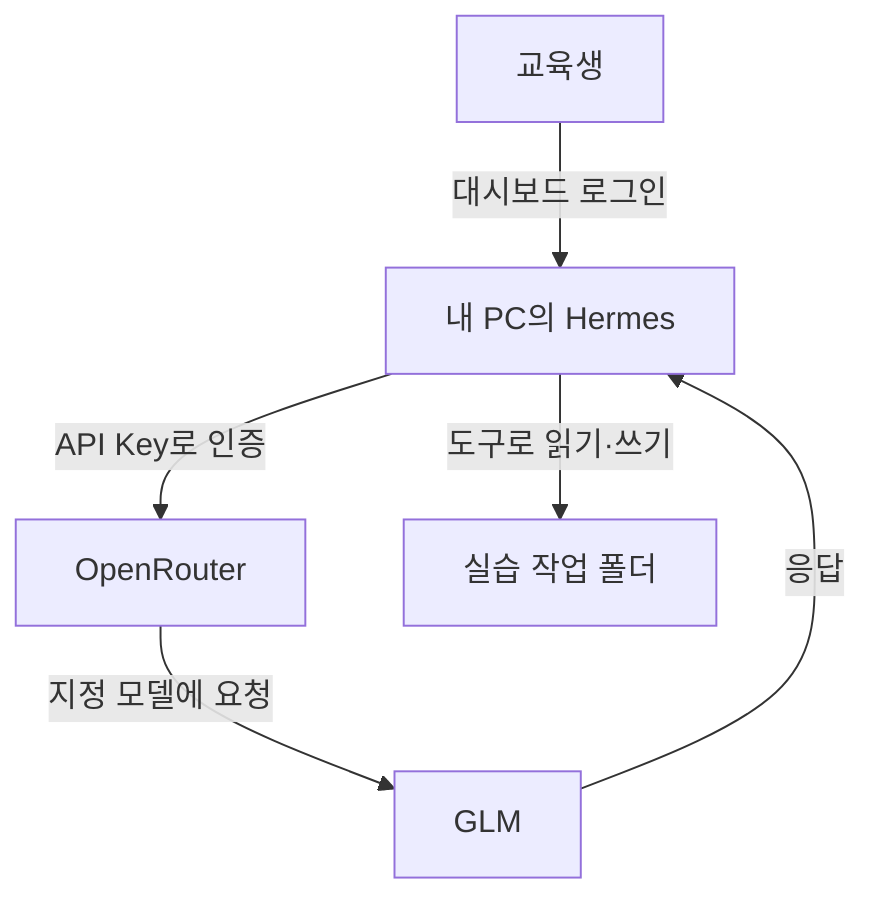
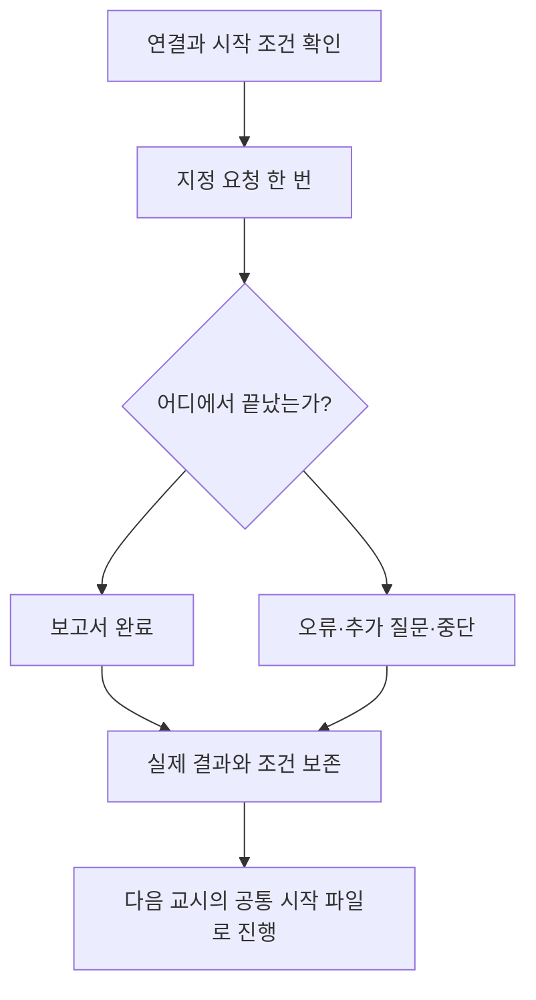
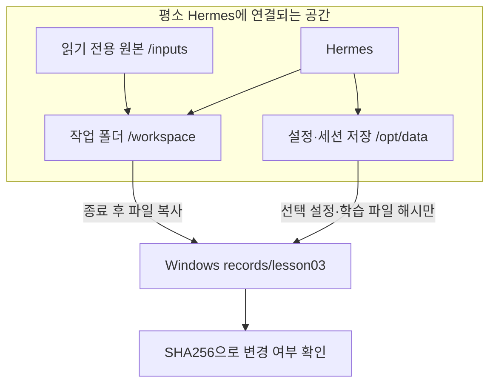

# 3교시. 첫 결과를 고치기 전에, 비교할 기준부터 남기기

**AI Native 소프트웨어 개발: Harness Engineering — 학습 가이드북**

## 1) 이번 교시에서 해결할 문제

> **“AI가 보고서를 만들었습니다. 그런데 나중에 더 좋아졌다는 것을 무엇과 비교할까요?”**

결과가 마음에 들지 않으면 바로 “다시 해 주세요”라고 말하기 쉽습니다. 하지만 요청을 바꾸고 파일까지 고친 뒤에는 처음에 무엇이 부족했는지 정확히 비교하기 어렵습니다.

이번 시간에는 **같은 판매 데이터와 같은 요청으로 처음 맡긴 결과를 그대로 남깁니다.** 잘 만든 보고서뿐 아니라 오류, 미완성 파일, 추가 질문도 관찰할 결과입니다. 이것이 이후 Harness 개선을 살펴볼 **Baseline**, 즉 비교 기준입니다.

2교시에서 준비한 Docker 환경을 그대로 사용합니다. 브라우저에서 Hermes에 OpenRouter API Key를 등록하고, GLM을 선택한 뒤 최초 요청을 한 번 보냅니다. OpenRouter는 모델 연결 서비스이고, API Key는 내 계정으로 서비스를 사용할 때 제시하는 비밀값입니다. 마지막으로 요청·응답·파일·실행 조건을 함께 보존합니다.

## 2) 학습목표와 완료 상태

수업을 마치면 다음을 할 수 있습니다.

- OpenRouter API Key의 역할을 설명하고 Hermes에서 사용할 모델을 설정합니다.
- API Key를 채팅에 노출하지 않고 등록합니다.
- 같은 모델과 요청을 사용해도 결과가 달라질 수 있음을 설명합니다.
- 시작 상태와 실행 결과를 함께 남기고 기록이 바뀌지 않았는지 확인합니다.

| 확인할 것 | 이번 시간의 완료 상태 |
|---|---|
| 연결 준비 | 수업용 API Key 인증 확인, GLM 설정 적용 |
| 시작 조건 | 원본과 같은 CSV, 새 세션, 지정 모델·추론 설정 확인 |
| 최초 실행 | 지정된 두 문장만 한 번 전송 |
| 관찰 | 완료·실패·추가 질문 대기·중단 중 실제 상태 기록 |
| 보존 | `records/lesson03`에 실행 전후 파일과 기록 저장 |
| 무결성 확인: 보관한 파일이 그대로인지 검사 | `BASELINE_INTEGRITY_PASS` 확인 |

**보고서가 완성되어야만 이번 시간을 마칠 수 있는 것은 아닙니다.** 결과가 달라도 기록을 남기면 다음 교시로 넘어갑니다. 다만 Docker나 모델 연결 자체가 막혔다면 이후 실행을 위해 해당 문제를 해결해야 합니다.

## 3) 시작 전 준비

### 준비되어 있어야 하는 것

- 2교시에서 만든 `C:\AI-Native\harness-engineering` 폴더와 실행 설정
- 실행 중인 Docker Desktop, 접속 가능한 Hermes 웹 대시보드
- 사전에 만든 OpenRouter 계정과 충전한 $5 크레딧
- **`AN-Harness-Lesson03-Baseline.zip` 전체** — 3교시 가이드북·준비 도구와 3~12교시 공통 데이터를 함께 제공합니다.

이번 실습은 2교시에서 접속한 **Hermes 웹 대시보드**에서 이어집니다.

### 이번에 제공하는 파일

폴더 이름 뒤의 `/`는 그 안에 여러 파일이 들어 있다는 표시입니다. `workspace`는 Agent의 작업 공간, `records`는 교육생이 관찰과 검사 결과를 보관하는 곳입니다. `.md`는 메모장으로 읽고 쓰는 Markdown 문서이고, `.json`은 항목 이름과 값을 짝지어 저장하는 기록 형식입니다.

| 파일 | 역할 |
|---|---|
| `inputs/lesson03/sales.csv` | 이번 시간에 사용할 판매 데이터 200행. 읽기 전용 원본 |
| `inputs/sales/` | 이후 교시에도 함께 사용할 정상·경계·오류·모델 비교용 입력 |
| `context/`, `spec/` | 이후 교시에서 제공할 업무 설명과 명세 |
| `SHARED_DATA_GUIDE.md` | 공통 데이터의 파일 위치와 사용 안내 |
| `lesson03.ps1` | Windows에서 준비·설정·보존 작업 실행 |
| `course-tools/lesson03_baseline.py` | 연결 확인, 시작 상태 복사, 결과 보존. 파일 내용의 지문인 해시로 변경 여부 검사 |
| `03_hermes_openrouter_baseline_preview.html` | 도식이 포함된 가이드북 미리보기 |
| `examples/baseline_record_example.md` | 응답과 실행 기록의 전체 작성 예시 |

공통 데이터는 한 번 준비한 뒤 12교시까지 같은 폴더에서 사용합니다. 이번 시간에는 `inputs/lesson03/sales.csv`의 작업용 사본만 분석합니다. 업무 설명과 상세 명세는 아직 Agent에게 제공하지 않습니다.

### 원본·작업 파일·기록을 구분하기

| 위치 | 담긴 내용과 목적 | 이번에 할 일 |
|---|---|---|
| `inputs/lesson03/sales.csv` | 바뀌면 안 되는 200행 공통 원본 | 준비 도구가 같은 데이터인지 확인 |
| `workspace/data/sales.csv` | 원본에서 복사한 분석용 입력. Agent에게는 `/workspace/data/sales.csv`로 보임 | 이 사본에 대한 분석 요청 전송 |
| `workspace/` | Agent가 만든 코드와 보고서 | 실제 생성 파일과 응답 대조 |
| `records/lesson03/request.md` | 모든 교육생이 사용할 최초 요청 두 문장 | 그대로 복사해 한 번 전송 |
| `records/lesson03/response.md` | Agent가 마지막에 답한 내용 | 최종 응답을 그대로 보관 |
| `records/lesson03/metadata.md` | 모델·실행 시각·종료 상태·파일명에 대한 내 관찰 | 본인의 실행 조건과 결과 작성 |
| `records/lesson03/before-files`, `after-files` | 실행 전과 후의 작업 파일 사본 | 처음에 무엇이 달라졌는지 비교할 자료로 보관 |
| `records/lesson03/SHA256.json` | 보존 파일별 해시 목록 | 동결 후 `verify`가 비교할 기준으로 유지 |

`session-…json`은 한 대화의 요청·응답·도구 사용을 담은 내보내기 파일입니다. 세션은 요청과 응답이 이어지는 한 대화를 뜻합니다. 파일명은 내보낼 때 달라지므로 본인의 파일명을 그대로 기록합니다.

### `lesson03.ps1`과 Python 도구가 하는 일

`lesson03.ps1`은 Windows에서 받는 실행 창구입니다. 뒤에 붙인 `prepare`, `before` 같은 단어에 맞춰 Docker 안의 `lesson03_baseline.py`를 실행합니다. Python 도구는 파일을 복사하거나 설정·해시를 검사하고, 결과를 `records/lesson03`에 남깁니다. 이 점검은 교육용 도구가 수행하며 Chat에 분석 요청을 보내는 작업과 구분됩니다.

| 명령의 마지막 단어 | 실행 목적 | 다음에 확인할 것 |
|---|---|---|
| `prepare` | 공통 원본 확인, 분석용 사본과 빈 기록 준비 | `PREPARE_PASS`와 작업용 CSV |
| `configure` | API Key 인증·모델 목록 확인, 공통 실행 설정 저장 | `CONFIGURE_PASS`. 실제 모델 응답은 뒤의 Chat에서 확인 |
| `before` | 요청을 보내기 직전의 파일과 설정 보관 | `BEFORE_PASS`를 확인한 뒤 최초 요청 전송 |
| `freeze` | Hermes를 멈추고 실행 후 파일·작성한 기록의 해시 저장 | `FREEZE_PASS` |
| `verify` | 동결한 기록의 현재 해시를 보존 목록과 대조 | `BASELINE_INTEGRITY_PASS` |

예를 들어 `.lesson03.ps1 before`의 `.`는 **현재 폴더에 있는 스크립트**를 지정합니다. 명령은 아래 실습 순서에서 실행합니다. 기록을 동결한 뒤에는 `verify`로 보존 여부를 확인합니다.

**검사 결과 읽기:** `PASS`는 그 명령이 검사한 조건을 통과했다는 표시이고, `RECORDED` 뒤의 경로는 자동 저장된 기록 파일입니다. `true`와 `false`는 각 항목의 참·거짓, `[]`는 빈 목록, `null`은 값이 지정되지 않았거나 해당 단계에서 평가하지 않았음을 뜻합니다. 예를 들어 시작 전에 “파일이 존재한다”가 `false`인 것은 정상일 수 있습니다. 바로 아래 단계별 예상 상태와 함께 읽습니다.

### 입력 장소를 먼저 구분한다

| 문서의 표시 | 입력하거나 확인할 장소 |
|---|---|
| **PowerShell** | Windows의 일반 PowerShell 창 |
| **OpenRouter 웹** | OpenRouter 사이트 |
| **Hermes 웹 대시보드** | 본인 PC의 `http://127.0.0.1:9119` 대시보드 |
| **Hermes Chat** | 대시보드의 Chat 안에 있는 터미널형 대화 화면 |
| **메모장** | Windows에서 기록 파일 편집 |

별도 안내가 없으면 PowerShell 작업 위치는 `C:\AI-Native\harness-engineering`입니다. 명령 앞의 `PS C:\...>` 표시는 입력하지 않습니다.

## 4) 실습에 필요한 핵심 이론

### 4.1 API Key로 모델을 연결한다

**API Key**는 프로그램이 서비스를 사용할 때 제시하는 비밀값입니다. Hermes에 OpenRouter API Key를 등록하면 내 계정의 크레딧과 키의 사용 한도 안에서 모델을 호출할 수 있습니다.



모델은 OpenRouter를 통해 원격으로 호출합니다. 파일 읽기와 프로그램 실행은 Hermes가 컨테이너 안의 도구로 수행합니다.

### 4.2 무엇을 비교 기준으로 남길까?

이번에는 2교시에서 준비한 환경에서 판매 분석을 처음 맡깁니다. **상세한 업무 정보, 보고서 작성 기준, 작업 계획을 추가하기 전의 결과**를 Baseline으로 남깁니다.

이번 시간에는 정답, 보고서 양식, 검증 코드를 미리 Agent에게 주지 않습니다. 무엇을 어떻게 분석할지 스스로 결정했을 때 생기는 차이를 먼저 봅니다. 이후에는 부족한 정보를 하나씩 보완하면서 결과가 어떻게 달라지는지 살펴봅니다.

| 이번에 맞출 조건 | 맞추는 이유 |
|---|---|
| Hermes 이미지·실행 환경 | Agent와 도구 버전 차이를 줄임 |
| GLM 모델·추론 설정 | Harness와 모델 변경의 효과를 섞지 않음 |
| 원본 CSV·시작 파일 | 다른 입력이나 이미 고친 코드를 물려받지 않음 |
| 최초 요청 두 문장 | 요청을 더 자세히 바꾼 효과와 구분 |
| 새 세션·Memory 설정 | 이전 대화에서 배운 정보가 끼어드는 것을 줄임 |

Hermes는 정보를 다음 작업에 재사용할 수 있습니다. **Memory**는 기억해 둔 정보이고, **Skill**은 재사용할 수 있도록 정리한 작업 방법입니다. 새 대화를 열어도 저장된 정보가 남을 수 있어, 비교 실험에서는 이 상태도 관리해야 합니다.

이번 공통 설정은 Memory 사용과 과거 대화 검색, 자동 학습 검토를 끕니다. Skill을 새로 저장하거나 수정하는 작업은 승인하지 않습니다. 기본 제공 Skill을 읽는 동작은 관찰해서 기록합니다. 이렇게 **재사용 상태를 관리하는 것도 Harness의 역할**입니다. [Hermes Memory 공식 설명](https://hermes-agent.nousresearch.com/docs/user-guide/features/memory)

### 4.3 결과가 같지 않아도 실험은 진행할 수 있다

같은 모델과 요청에서도 표현, 코드, 도구 선택이 달라질 수 있습니다. 그래서 이번에는 **자신의 출발점을 남기는 것**에 집중합니다.

이후에는 GLM을 유지하면서 업무 정보·작업 방법·검증 절차를 보강합니다. 12교시 모델 비교에서는 Harness·데이터·요청을 고정하고 GLM과 Qwen을 비교합니다. **무엇을 바꾸었는지 분명히 해야 결과의 차이를 해석할 수 있습니다.**

### 4.4 Baseline 동결: 처음 결과를 비교 기준으로 남긴다

**Baseline은 앞으로 달라진 결과와 비교할 출발점입니다.** 이번에는 상세한 업무 정보와 검증 절차를 추가하기 전에, Hermes가 만든 첫 결과를 출발점으로 삼습니다. 보고서뿐 아니라 사용한 데이터, 요청, 모델 설정, 실행 과정도 함께 남깁니다.

**동결은 이 첫 기록을 그대로 보존하는 일입니다.** 사진을 찍어 두듯이 실행 전후 파일을 복사하고, 나중에 내용이 바뀌었는지 확인할 수 있는 값을 저장합니다.

예를 들어 첫 보고서의 매출 합계는 맞지만 작성일이나 제품에 대한 설명이 틀렸다고 생각해 봅시다. 이때 틀린 부분까지 그대로 남겨야, 이후 업무 정보와 검증 절차를 보강했을 때 무엇이 달라졌는지 살펴볼 수 있습니다. 첫 보고서를 미리 고쳐 버리면 개선 전의 모습을 잃게 됩니다.

| 궁금한 점 | 이번 실습에서의 의미 |
|---|---|
| 잘못된 결과도 동결하나요? | 네. 오류와 실패도 처음 실행에서 일어난 일이므로 함께 보존합니다. |
| 파일을 아예 수정할 수 없게 잠그나요? | Windows의 편집 기능을 잠그지는 않습니다. 보존 폴더를 직접 수정하지 않고 이후 작업과 구분해서 관리합니다. |
| 기록이 바뀌었는지 어떻게 확인하나요? | 저장 당시와 현재 파일의 해시를 비교합니다. 해시는 파일 내용으로 계산하는 지문 같은 값입니다. |
| 검사에 통과하면 보고서도 정확한가요? | 기록이 보존됐는지 확인한 것입니다. 계산과 해석의 정확성은 별도로 검증합니다. |

따라서 이번 시간의 완료 기준은 **완벽한 보고서를 만드는 것보다, 첫 실행에서 실제로 일어난 일을 빠짐없이 남기는 것**입니다. 단계 7에서 기록을 완성하고, 단계 8에서 그 기록을 동결합니다.

## 5) 이번 시간의 흐름

| 순서 | 할 일 | 확인할 결과 |
|---:|---|---|
| 1 | 환경 확인·패키지 추가·CSV 준비 | 작업용 CSV와 빈 기록 파일 생성 |
| 2 | API Key 생성·등록·연결 확인 | 키 인증과 GLM 설정 확인 |
| 3 | 새 세션·시작 상태 기록 | `BEFORE_PASS` |
| 4 | 최초 요청 한 번·결과 관찰 | 완료·실패·추가 질문·중단 중 종료 상태 확인 |
| 5 | 응답과 실행 조건 기록 | 기록 파일 작성 완료 |
| 6 | Baseline 동결·무결성 확인 | `FREEZE_PASS`, `BASELINE_INTEGRITY_PASS` |

실행이 길어져 기록할 시간이 부족해지면 작업을 중단하고 그 상태를 남깁니다. 중단 방법은 요청을 실행하는 단계에서 안내합니다.



## 6) 단계별 실습

### 단계 1. 2교시 환경에 이번 파일을 추가한다

**Windows 파일 탐색기**에서 이번 ZIP을 엽니다. 압축 안의 `harness-engineering` 폴더가 2교시의 같은 이름 폴더에 추가되도록 **`C:\AI-Native`에 압축을 풉니다.**

정상 위치는 `C:\AI-Native\harness-engineering\lesson03.ps1`입니다. `harness-engineering\harness-engineering`처럼 같은 폴더가 두 번 겹치면 안 됩니다. 패키지에는 가이드북·준비 도구와 공통 데이터가 함께 들어 있습니다. `compose.yaml`과 개인 로그인 정보는 2교시에서 준비한 것을 사용합니다. 별도의 데이터 ZIP을 추가로 받을 필요는 없습니다.

**PowerShell — 목적: 실행 위치와 Hermes 상태 확인**

```powershell
Set-Location C:\AI-Native\harness-engineering
Test-Path .\compose.yaml
Test-Path .\lesson03.ps1
Test-Path .\inputs\lesson03\sales.csv
Test-Path .\inputs\sales\sales_practice.csv
docker compose up -d
docker compose ps
```

**예상 결과:** 네 경로 확인이 모두 `True`이고 Hermes가 잠시 후 `healthy`로 표시됩니다. `starting`이면 초기화를 기다린 뒤 `docker compose ps`를 다시 확인합니다. Docker Server 연결 오류라면 Docker Desktop 실행 상태부터 확인합니다.

브라우저에서 `http://127.0.0.1:9119`를 열고 2교시의 개인 로그인 정보로 들어갑니다. 2교시에서 포트를 바꾸었다면 그 포트를 사용합니다. 아직 Chat에 인사나 시험 질문을 보내지 않습니다.

### 단계 2. CSV와 빈 기록 양식을 준비한다

**PowerShell — 목적: 내려받은 스크립트 실행 허용과 실습 파일 준비**

```powershell
Unblock-File .\lesson03.ps1
.\lesson03.ps1 prepare
```

`스크립트를 실행할 수 없습니다`라는 실행 정책 오류가 나면 **현재 PowerShell 창에만** 다음 설정을 적용한 뒤 준비 명령을 다시 실행합니다.

```powershell
Set-ExecutionPolicy -Scope Process -ExecutionPolicy RemoteSigned
.\lesson03.ps1 prepare
```

**예상 결과:** `PREPARE_PASS`가 표시됩니다. 원본 CSV를 작업 폴더에 복사하고 `request.md`, `response.md`, `metadata.md`를 만듭니다. 파일 준비에는 Docker 안의 Python을 사용하며, 작업을 마치면 점검용 컨테이너는 종료됩니다.

| Windows 위치 | Hermes에서의 위치·역할 |
|---|---|
| `inputs\lesson03\sales.csv` | `/inputs/lesson03/sales.csv` — 읽기 전용 원본 |
| `workspace\data\sales.csv` | `/workspace/data/sales.csv` — Agent가 분석할 작업용 사본 |
| `records\lesson03` | 평소 Hermes에 연결하지 않는 보존 폴더 |

CSV는 `date, order_id, category, product, quantity, unit_price, region` 열과 데이터 200행으로 이루어져 있습니다. **엑셀로 다시 저장하거나 값을 정리하지 않습니다.** 준비 도구가 제공 원본의 해시를 확인하므로 줄바꿈만 바뀌어도 차이를 감지합니다.

`Existing working data differs` 또는 `Provided sales.csv differs`가 나오면 기존 파일을 덮어쓰지 않습니다. 해당 파일을 보존하고 수업용 원본과 압축 해제 위치를 확인합니다.

### 단계 3. OpenRouter에서 수업용 API Key를 만든다

**OpenRouter 웹**에서 [API Keys 페이지](https://openrouter.ai/settings/keys)에 접속하고 로그인합니다. 키 생성 기능을 열어 아래 기준으로 만듭니다.

| 항목 | 입력·선택할 내용 |
|---|---|
| 이름(Name) | `harness-course` |
| 사용 한도(Credit limit) | `5` USD |
| 한도 초기화(Reset) | 초기화 없음. 일·주·월 단위 갱신을 선택하지 않음 |

**사용 한도**는 이 키로 쓸 수 있는 누적 금액의 상한입니다. 실제 사용에는 계정의 남은 크레딧도 필요합니다. [OpenRouter 인증 안내](https://openrouter.ai/docs/api_reference/authentication)

생성된 키를 복사합니다. 이어지는 단계에서 바로 Hermes의 비밀값 입력란에 붙여 넣습니다. 키를 채팅, 실습 보고서, 화면 캡처에 넣지 않습니다. 잘못 노출했다면 OpenRouter에서 해당 키를 삭제하고 새 키로 교체합니다.

### 단계 4. Hermes에 키를 등록하고 수업 설정을 적용한다

**Hermes 웹 대시보드**의 메뉴에서 **API Keys**를 엽니다. LLM은 대규모 언어 모델, Providers는 모델을 연결하는 서비스 목록을 뜻합니다. **LLM Providers** 그룹의 **OpenRouter** 항목에 방금 복사한 키를 붙여 넣고 저장합니다. 화면에 저장 여부나 가려진 키 표시가 나오는지 확인합니다.

저장한 키는 컨테이너의 Hermes 저장 공간에 보관됩니다. [Hermes 웹 대시보드 공식 안내](https://hermes-agent.nousresearch.com/docs/user-guide/features/web-dashboard)

**PowerShell — 목적: 키 인증과 모델 제공 여부를 확인하고 공통 설정 적용**

```powershell
.\lesson03.ps1 configure
```

**예상 결과:** `CONFIGURE_PASS`가 표시됩니다. 이 단계는 OpenRouter의 모델 목록과 키 상태를 조회하고 수업 설정을 적용합니다. [OpenRouter 키 상태 조회](https://openrouter.ai/docs/api_reference/limits)

보조 도구는 설정을 백업한 뒤 아래 값을 적용합니다. 교육생들이 같은 조건에서 시작하도록 준비한 설정입니다.

| 설정 | 적용값 | 이유 |
|---|---|---|
| 공급자·모델 | OpenRouter / `z-ai/glm-5.3-flash` | Day 1 기본 모델 고정 |
| 추론 수준 | `low` | 추론에 사용하는 노력 수준을 낮게 맞춤 |
| 도구 실행 방식 | `local` | Hermes가 있는 컨테이너 안에서 실행 |
| 도구 작업 폴더 | `/workspace` | Windows의 수업 작업 폴더와 연결 |
| Memory·사용자 프로필 주입 | 끔 | 저장된 정보의 개입을 줄임 |
| Memory 도구·세션 검색 | 끔 | 과거 작업 정보 재사용을 막음 |
| 자동 학습 검토·제목 생성 | 끔 | Baseline 밖의 자동 작업을 줄임 |
| Skill 저장 | 승인 필요 | 이번 시간에는 생성·수정 승인을 하지 않음 |
| 위험 작업 승인 | 수동 확인 | 승인 요청의 내용을 보고 판단 |
| 다른 모델로 자동 대체 | 사용하지 않음 | 모델 조건을 유지 |

`local`은 Hermes가 실행 중인 장소에서 도구를 사용한다는 뜻입니다. 이번 구성에서는 **컨테이너 내부**가 도구 실행 장소입니다.

**오류가 나오면 해당 원인을 확인한 뒤 설정 명령을 다시 실행합니다.**

| 표시 | 의미와 조치 |
|---|---|
| 키가 없다는 안내 / HTTP 401 | Hermes API Keys에 OpenRouter 키가 저장됐는지 확인 |
| 키 한도 관련 안내 | 총 한도 5 USD 이하, 초기화 없음, 남은 한도가 양수인지 확인 |
| HTTP 429 / 네트워크 오류 | 잠시 후 같은 `configure`만 다시 실행. 모델 변경 안 함 |
| 모델·설정 지원 여부 확인 필요 | 오류 원문과 `docker compose ps` 결과를 기록하고 수업용 이미지·모델 설정 확인 |

설정이 성공하면 **PowerShell**에서 Hermes를 다시 시작합니다.

```powershell
docker compose restart hermes
docker compose ps
```

`healthy`를 확인한 뒤 브라우저를 새로 고칩니다. 왼쪽 **CONFIG**를 클릭합니다.

1. **General → MODEL**에서 `z-ai/glm-5.3-flash`를 확인합니다.
2. 오른쪽 위 **`<> YAML`** 버튼을 클릭합니다. YAML은 설정 이름과 값을 들여쓰기로 나타내는 형식입니다.
3. `agent` 아래의 `reasoning_effort`가 `low`인지 확인합니다.
4. `terminal` 아래의 `cwd`가 `/workspace`인지 확인합니다.

설정 내용에서 확인할 부분은 다음과 같습니다. 다른 항목이 사이에 있어도 괜찮습니다.

```yaml
agent:
  reasoning_effort: low

terminal:
  backend: local
  cwd: /workspace
```

`cwd`는 명령을 실행할 기본 작업 폴더입니다. `reasoning_effort`는 보조 모델 설정에도 있을 수 있으므로 `agent` 아래의 값을 확인합니다.

**값이 이미 맞으면 다음 단계로 진행합니다. 값을 수정했다면 SAVE를 눌러 저장합니다.** 위 YAML은 확인할 항목만 발췌한 예시이므로, 전체 설정을 이 짧은 예시로 교체하지 말고 해당 값만 수정합니다. 저장 후에는 앞의 `docker compose restart hermes`와 `docker compose ps`로 재시작과 `healthy` 상태를 확인하고, 브라우저를 새로 고쳐 저장한 값을 확인합니다. 이 설정 확인은 단계 5에서 시작 상태를 기록하기 전에 마칩니다. 설정의 상세 원리는 [Hermes 공식 Configuration](https://hermes-agent.nousresearch.com/docs/user-guide/configuration)에 설명되어 있습니다.

### 단계 5. 새 세션을 열고 시작 상태를 기록한다

**Hermes 웹 대시보드 → Chat**을 엽니다. 이 화면은 브라우저 안에서 사용하는 터미널형 대화 화면(TUI)입니다. 일반 채팅 문장과 `/`로 시작하는 제어 명령을 같은 입력란에서 사용합니다.

**Hermes Chat 입력란**에 다음 제어 명령을 한 줄씩 입력합니다.

```text
/new baseline-lesson03
/model z-ai/glm-5.3-flash
/reasoning low
/status
```

`/new`에서 새 세션 확인을 요청하면 진행합니다. 모델 지정 후 `model → z-ai/glm-5.3-flash`, 추론 설정 후 `reasoning: low`가 표시되는지 확인합니다.

모델을 목록에서 고르고 싶다면 `/model`만 입력합니다. 모델 선택 화면에서 `z-ai/glm-5.3-flash`를 선택하면 됩니다. 위의 직접 지정 명령이 성공했다면 다시 선택할 필요는 없습니다.

`/reasoning`은 세션의 추론 조건을 지정합니다. `/status`는 현재 세션 상태를 확인하는 명령입니다. 화면 아래 상태 줄에 `glm 5.3 flash low`가 표시되는지도 확인합니다. [Hermes 슬래시 명령 안내](https://hermes-agent.nousresearch.com/docs/reference/slash-commands)

**확인할 것:** 새 세션이고, 모델이 GLM 5.3 Flash이며, 추론 설정이 low입니다. 세션의 작업 위치가 표시된다면 `/workspace`인지 확인합니다. 명령 오류가 나면 오류 문구를 기록하고 Config의 모델·추론 설정을 확인합니다.

**PowerShell — 목적: 실행 전 파일과 학습 상태를 기록**

```powershell
.\lesson03.ps1 before
```

**예상 결과:** `BEFORE_PASS`가 표시됩니다. `records\lesson03\before-files`와 시작 조건 기록이 생깁니다. 예상하지 않은 코드나 명세 파일이 작업 폴더에 있으면 도구가 멈춥니다. 오류에 표시된 파일을 보존하고, 수업에서 준비한 폴더가 맞는지 확인합니다.

이후에는 설정·CSV·시작 파일을 바꾸지 않습니다. 이미 기록됐다는 오류가 나오면 `before`를 반복하지 않고 현재 기록을 이어 사용합니다.

### 단계 6. 최초 요청을 한 번 보낸다

**Hermes Chat**에 아래 두 문장을 그대로 한 번 전송합니다. 머리말, 보고서 양식, 합계 정답, “정확하게 검증해 줘” 등의 추가 문장을 넣지 않습니다.

```text
현재 작업 폴더의 data/sales.csv를 분석하고 업무 보고서를 만들어 주세요.
필요한 파일은 직접 만들고, 완료되면 무엇을 만들었는지 알려 주세요.
```

**예상 결과는 하나로 정해져 있지 않습니다.** Hermes가 파일을 읽고 도구를 실행한 뒤 보고서를 만들 수도 있고, 질문하거나 오류에서 멈출 수도 있습니다.

실행 중 다음을 관찰합니다.

- 실제로 `/workspace/data/sales.csv`를 읽었는가?
- 요청한 CSV 외에 `/inputs/sales`의 다른 시험 파일까지 읽었는가? 읽었다면 파일명과 도구 기록을 남긴다.
- 무엇을 계산하거나 실행했는가?
- 어떤 파일을 어디에 만들었는가?
- 실패나 내부 재시도가 있었는가?
- Skill을 읽거나 저장하려 했는가?

승인 요청이 나오면 표시된 작업과 경로를 읽습니다. 수업 작업 폴더 안에서 분석 파일을 만드는 작업인지 확인하고 판단을 기록합니다. 자격 증명 열람, 무관한 외부 전송, 수업 범위 밖의 변경은 허용하지 않습니다. **Skill 생성·수정은 이번 시간에 승인하지 않습니다.** 모든 일반 도구 호출마다 승인 화면이 나오는 것은 아닙니다.

| 관찰한 결과 | 이번 시간에 할 일 |
|---|---|
| 보고서를 만들고 완료했다고 함 | 응답과 생성 파일을 그대로 기록 |
| 분석 기준을 추가로 질문함 | 질문에 답하지 않고 `추가 질문 대기`로 기록 |
| 오류에서 종료함 | 오류와 남은 파일을 보존. 재시도 요청 안 함 |
| 시간이 너무 길거나 반복됨 | Chat의 `/stop`으로 중단하고 중단 시각·이유 기록 |

모델이 내부에서 여러 차례 도구를 사용하거나 다시 시도하는 것과 교육생이 사용자 요청을 다시 보내는 것은 다릅니다. **교육생의 분석 요청은 한 번**이고, 내부 호출 횟수는 실제 기록을 따릅니다.

### 단계 7. 응답·실행 조건·세션 파일을 기록한다

기록할 때 `Get-Item`은 지정한 파일의 존재·크기·수정 시각을, `Get-ChildItem`은 폴더 안 파일 목록을 보여 줍니다. `session*.json`의 `*`는 중간 이름이 달라도 찾겠다는 표시입니다. `notepad`로 연 문서에는 해당 단계가 안내하는 응답 또는 관찰을 적고 `Ctrl+S`로 저장합니다.

Agent의 실행이 완료·실패·추가 질문 대기·중단 중 어느 상태에서 끝났는지 확인합니다. 다음 작업은 Windows에서 사람이 기록을 정리하는 절차입니다. Hermes Chat에 추가 분석 요청을 보내지 않습니다.

> **예시는 본인의 결과에 맞게 작성합니다.** 아래 응답·시각·세션 ID·생성 파일명·토큰·비용·오류는 한 번의 실제 실행 사례입니다. 본인의 결과가 다르면 실제 관찰로 바꾸고, 확인하지 못한 값은 `미확인`으로 적습니다. 예시의 성공·오류·검토 의견을 자신의 결과인 것처럼 옮기지 않습니다.
>
> **파일명도 구분합니다.** `response.md`, `metadata.md`, `request.md`는 준비·동결 도구가 사용하는 고정 파일명이므로 유지합니다. Agent가 만든 보고서·요약 파일명과 내보낸 `session-…json` 파일명은 본인 PC에 실제로 있는 이름을 사용합니다. 예시와 맞추려고 생성 파일 이름을 바꾸지 않습니다.

**7-1. 최종 응답을 저장한다**

Hermes Chat의 최종 응답을 확인합니다. 응답 아래 **copy last response** 버튼으로 복사하거나 해당 응답의 텍스트를 선택해 복사합니다. 오류·추가 질문으로 끝났다면 그 문구를 복사합니다.

**PowerShell — 목적: 실제 응답을 보존할 문서 열기**

```powershell
notepad .\records\lesson03\response.md
```

메모장에 본인의 실제 최종 응답을 붙여 넣고 **Ctrl+S**로 저장합니다. 응답이 없었다면 `응답 없음`과 관찰한 오류·시각을 적습니다. `.md.txt`로 다른 이름 저장하지 않습니다.

**7-2. 세션을 JSON으로 내보내 보존한다**

1. Hermes 웹 대시보드의 **SESSIONS**에서 방금 실행한 세션을 엽니다. 세션 제목·입력한 요청을 확인합니다.
2. 세션 내보내기 기능으로 JSON 파일을 저장합니다.
3. Windows 파일 탐색기에서 다운로드한 JSON을 찾습니다. 이 사례의 이름은 `session-20260910_071729_a3d13f.json`이지만 본인의 파일명은 다를 수 있습니다.
4. 아래 명령으로 보존 폴더를 열고, 본인의 JSON 파일을 복사해 붙여 넣습니다.

**PowerShell — 목적: 세션 파일을 보관할 폴더 열기**

```powershell
explorer .\records\lesson03
```

목적지는 `C:\AI-Native\harness-engineering\records\lesson03`입니다. 다운로드한 JSON의 내용은 편집하지 않습니다. 비밀번호나 API Key가 들어 있는 화면·파일을 기록에 추가하지 않습니다.

**PowerShell — 목적: 실제로 복사한 JSON의 존재 확인**

```powershell
$sessionFileName = Read-Host '복사한 세션 JSON의 파일명을 확장자까지 입력하세요'
Test-Path -LiteralPath (Join-Path '.\records\lesson03' $sessionFileName) -PathType Leaf
```

**예상 결과:** `True`. `False`이면 파일 탐색기에서 실제 파일명과 복사 위치를 확인합니다. 입력할 때 파일명 앞뒤에 따옴표를 붙이지 않습니다.

**7-3. 실행 조건과 관찰 내용을 작성한다**

Sessions의 메시지·도구 기록과 내보낸 JSON을 참고합니다. 아래 표의 필드를 찾으면 수치를 옮기기 쉽습니다.

| 기록할 내용 | 세션 JSON에서 확인할 항목 |
|---|---|
| 세션 ID·제목 | id, title |
| 모델·추론 | model, model_config 안의 reasoning_config.effort |
| 작업 폴더 | cwd |
| API·도구 호출 수 | api_call_count, tool_call_count |
| 토큰 | input_tokens, output_tokens, cache_read_tokens, reasoning_tokens |
| 비용과 근거 | estimated_cost_usd, actual_cost_usd, cost_status |
| 요청·응답·오류·사용 도구 | messages |

**세션 JSON에서 찾을 항목 예시:** 아래는 실제 Baseline 세션에서 해당 필드만 발췌한 것입니다. 본인의 값이 다르면 본인 세션 값을 기록합니다.

```json
{
  "id": "20260910_071729_a3d13f",
  "title": "baseline-lesson03",
  "model": "z-ai/glm-5.3-flash",
  "cwd": "/workspace",
  "api_call_count": 7,
  "tool_call_count": 6,
  "input_tokens": 48386,
  "output_tokens": 5148,
  "cache_read_tokens": 80960,
  "reasoning_tokens": 961,
  "estimated_cost_usd": 0.0061303500000000006,
  "actual_cost_usd": null,
  "cost_status": "estimated"
}
```

`actual_cost_usd: null`은 실제 비용 숫자가 이 필드에 없다는 뜻입니다. 0달러로 옮겨 적지 않습니다. `cost_status: estimated`인 예시에서는 `estimated_cost_usd`를 추정 비용으로 기록합니다.

세션 파일을 메모장으로 열어 위 항목을 찾습니다. `$sessionFileName`은 7-2에서 입력한 파일명입니다.

```powershell
notepad (Join-Path '.\records\lesson03' $sessionFileName)
```

이 예시의 `model_config`는 JSON 내용을 담은 문자열이므로 따옴표와 역슬래시가 보여 바로 읽기 어려울 수 있습니다. 추론 설정만 확인하려면 다음 명령을 사용합니다. 전체 설정을 출력하지 않고 필요한 항목만 표시합니다.

```powershell
$baselineSession = Get-Content -Raw -Encoding utf8 -LiteralPath (Join-Path '.\records\lesson03' $sessionFileName) | ConvertFrom-Json
$sessionConfig = $baselineSession.model_config
if ($sessionConfig -is [string]) {
    $sessionConfig = $sessionConfig | ConvertFrom-Json
}
$sessionConfig.reasoning_config | ConvertTo-Json
```

**위 세션의 추론 설정 출력:**

```json
{
  "enabled": true,
  "effort": "low"
}
```

`effort`가 Hermes 세션에 기록된 추론 설정입니다. 이 값만으로 공급자가 실제 적용한 추론량까지 확정하지 않습니다.

사용자 역할 메시지에는 모델 변경 안내가 포함될 수 있습니다. 분석 요청 횟수는 역할 메시지 수가 아니라 본인이 보낸 실제 분석 요청을 셉니다. 소요 시간은 분석 요청부터 최종 응답까지이며, 세션을 열어 둔 전체 시간과 구분합니다. JSON의 숫자 timestamp는 Unix 시각이므로 변환하지 못했다면 화면에서 확인한 시각을 쓰거나 `미확인`으로 남깁니다.

**PowerShell — 목적: 실행 기록 문서 열기**

```powershell
notepad .\records\lesson03\metadata.md
```

준비된 양식의 `[기록]`을 자신의 관찰로 채웁니다. 항목을 더 자세히 나누어 작성해도 됩니다. 모르는 값을 `0`으로 적지 않습니다. `estimated` 비용은 추정값으로 적으며 실제 결제액으로 표시하지 않습니다. 캐시·추론 토큰은 JSON의 항목별 값을 그대로 기록하고 임의로 합산하지 않습니다.

[OpenRouter Activity](https://openrouter.ai/activity)에서 같은 실행 시간대의 실제 사용량·비용을 대조할 수 있습니다. 여러 API 호출이 한 작업에 포함되므로 마지막 한 행만 전체 비용으로 적지 않습니다. 해당 실행의 호출을 구분하지 못하면 실제 청구 비용과 처리 제공업체는 `미확인`으로 둡니다.

다음 전체 예시를 참고해 작성한 뒤 **Ctrl+S**로 저장합니다. 같은 예시는 `examples/baseline_record_example.md`에도 있습니다.

**response.md 전체 예시 — 실제 최종 응답 보존**

```markdown
완료했습니다. `data/sales.csv`(주문 200건, 2026년 8–9월)를 분석해 보고서와 요약 파일을 만들었습니다.

**생성된 파일**
- `reports/매출_업무보고서_2026-08~09.md` — 업무 보고서 본문
- `reports/sales_summary_2026H2.csv` — 월별·카테고리·지역·제품별 매출 집계표

**핵심 결과**
- 총 매출 **56,715,000원** (200건 / 수량 708개 / 평균 주문 283,575원)
- 월별: 8월 31,332,000원 → 9월 25,383,000원 (**-19.0%**)
- 카테고리: Accessory 31.8% > Monitor 27.1% > Office 23.5% > Storage 17.5%
- 지역: **Seoul 27.1%**로 압도적 1위 (2위 Busan 14.0%의 2배)
- 최고 매출 제품: Portable SSD 1TB (8,381,000원)

**주요 이슈 (보고서 7장에 액션 아이템 포함)**
- ⚠️ 9월 Monitor 매출 -49.5% 급감 — 고단가 제품이라 전체 감소의 주 원인
- ✅ 9월 Storage만 +13.2% 성장 (Portable SSD 대량 주문 증가)

보고서에는 월별·카테고리·지역·제품 표와 인사이트, 액션 아이템 4건이 정리되어 있습니다.
```

**metadata.md 전체 예시 — 본인의 결과로 바꾸어 작성**

아래 계산·해석 검토는 이 사례에서 별도로 대조한 내용입니다. 본인의 보고서에 같은 문제가 있는지 확인하지 않았다면 그대로 옮기지 않습니다.

```markdown
# Baseline 실행 기록

- 실행 시각·시간대: 2026-09-10 16:37:19~16:43:24 KST
- 소요 시간: 약 6분 6초
- 세션 ID 또는 제목: 20260910_071729_a3d13f / baseline-lesson03
- 요청 모델: z-ai/glm-5.3-flash
- 세션에 기록된 모델·연결 공급자: z-ai/glm-5.3-flash / openrouter
- 실제 모델·공급자(Activity): Activity 대조 전, 실제 처리 제공업체 미확인
- 추론 설정: low
- 작업 폴더: /workspace
- 사용자 요청 횟수: 분석 요청 1회. 모델 변경 안내 메시지 2개는 분석 요청에 포함하지 않음
- 종료 상태(완료/실패/추가 질문 대기/중단): 완료

## 실제 읽은 데이터·생성 파일

- 입력: /workspace/data/sales.csv, 전체 200행 읽기 확인
- 생성 파일:
  - /workspace/reports/매출_업무보고서_2026-08~09.md
  - /workspace/reports/sales_summary_2026H2.csv
- 다른 공통 시험 데이터 읽기: 도구 실행 기록에서 관찰되지 않음

## 내부 재시도·승인·중단

- API 호출: 7회
- 도구 호출: 6회 (read_file 2회, execute_code 3회, write_file 1회)
- 내부 오류: CSV 작성 중 AttributeError: 'list' object has no attribute 'writerow'
- 복구: Agent가 CSV 작성 코드를 수정하고 다시 실행하여 성공
- 사용자 추가 수정 요청: 없음
- 승인 요청·사용자 중단: 세션 기록에서 관찰되지 않음
- 최종 확인: 요약 CSV의 처음 10줄 읽기. 전체 CSV·보고서 해석의 대조 검증은 관찰되지 않음

## 사용량과 비용

- input_tokens: 48,386
- output_tokens: 5,148
- cache_read_tokens: 80,960
- reasoning_tokens: 961
- estimated_cost_usd: 0.00613035
- cost_status: estimated
- 실제 청구 비용: 미확인
- 기록 기준: 세션 JSON의 값을 그대로 기록. 캐시·추론 토큰을 다른 토큰 수에 임의로 더하지 않음

## 통제 상태

- 실행 전 확인: BEFORE_PASS
- 지정 분석 요청: 원문 그대로 1회 전송
- 모델·추론·작업 폴더: 세션 기록에서 확인
- Skill 조회·Memory 변경·과거 세션 검색 관찰: 해당 도구 실행은 세션 기록에서 관찰되지 않음
- 파일과 설정의 실행 전후 변경: 동결 후 changes.json에서 추가 확인 필요

## 제한사항과 결과 관찰

- 원본과 별도 대조한 주요 집계: 주문 200건, 수량 708개, 총매출 56,715,000원 일치. 월별·카테고리별 합계도 일치
- 보고서 작성일: 2026-10-07로 기재되어 실행일 2026-09-10과 다름
- 제품 해석: 32인치 모니터는 8월 0건 → 9월 1건인데, 보고서는 27인치와 함께 급감했다고 설명
- 감소 기여도: Monitor 감소의 8.9%p 영향이라는 설명은 분모가 불명확. 전월 대비 감소율 기여도라면 약 16.2%p
- 표현: Office를 '보조배터리성 카테고리'로 설명
- 종합: 기본 집계는 정확하고 실행 오류를 스스로 복구했지만 일부 해석에 오류가 있고 검증 범위가 제한적임
- 처리: 추가 수정 요청 없이 최초 결과를 보존
```

**7-4. 동결 전에 저장을 확인한다**

```powershell
Get-Item .\records\lesson03\response.md, .\records\lesson03\metadata.md
Get-ChildItem .\records\lesson03 -Filter 'session*.json'
```

두 Markdown 파일의 크기가 0보다 크고, 본인이 복사한 JSON이 목록에 있는지 확인합니다. 세션 파일명을 직접 바꾸어 `session`으로 시작하지 않는다면 앞서 실행한 `Test-Path` 결과로 확인합니다. 응답과 실행 기록을 모두 저장한 다음 아래 동결 단계로 진행합니다.

### 단계 8. 실행 결과를 동결하고 확인한다

단계 7에서 저장한 응답·실행 조건·세션 JSON을 이제 **개선 전의 비교 기준으로 보존**합니다. 보고서에 틀린 부분이 있어도 그대로 둡니다. 이번에 남기는 것은 첫 실행의 실제 모습입니다.

**8-1. 첫 실행 기록을 보존한다**

**PowerShell — 작업 위치: `C:\AI-Native\harness-engineering`**

```powershell
Unblock-File -LiteralPath .\lesson03.ps1
.\lesson03.ps1 freeze
```

`Unblock-File`은 다운로드한 이 스크립트의 실행 차단을 해제합니다. 이미 해제했다면 다시 실행해도 괜찮습니다. `freeze`는 Hermes 서비스를 멈춘 뒤 실행 후 파일을 복사하고, 단계 7의 기록과 함께 파일별 해시를 저장합니다. 컨테이너가 `Stopped`로 표시된 다음 기록용 컨테이너가 `Creating`, `Created`로 표시될 수 있습니다.

**성공했을 때 표시되는 문구:**

```text
BASELINE_INTEGRITY_PASS
FREEZE_PASS: preserve this folder. Result quality was not graded.
```

“디지털 서명이 없어 실행할 수 없다”는 오류가 나오면 위의 `Unblock-File`을 실행하고 `freeze`를 다시 실행합니다. 이 오류는 스크립트가 시작되기 전에 발생하므로, 분석 요청이나 `before`를 다시 실행할 필요가 없습니다.

**8-2. 보존한 기록이 바뀌지 않았는지 확인한다**

```powershell
.\lesson03.ps1 verify
```

**예상 결과:** `BASELINE_INTEGRITY_PASS`가 표시됩니다. 무결성이란 여기서는 **보존한 기록의 내용이 그대로 유지된 상태**를 뜻합니다.

| 명령 또는 표시 | 쉽게 풀어 쓴 의미 |
|---|---|
| `freeze` | 첫 실행의 결과와 기록을 비교 기준으로 저장합니다. |
| `verify` | 저장 당시의 해시와 대조해 보존 기록의 변경 여부를 검사합니다. |
| `FREEZE_PASS` | 비교 기준을 저장하는 작업이 완료됐습니다. 이 폴더를 보존합니다. |
| `BASELINE_INTEGRITY_PASS` | 도구가 검사한 보존 기록의 무결성 확인을 통과했습니다. |
| `Result quality was not graded.` | 보고서의 계산과 해석이 맞는지는 이번 도구에서 평가하지 않았습니다. |

`freeze`도 마지막에 무결성을 검사하므로, 두 명령을 순서대로 실행하면 `BASELINE_INTEGRITY_PASS`를 두 번 볼 수 있습니다. **이미 동결을 마쳤다면 이후에는 `verify`로 확인합니다.** `freeze`를 다시 실행하면 기존 기록을 덮어쓰지 않고 멈춥니다.

**8-3. 무엇을 보존했는지 살펴본다**



보존 폴더는 평소 Hermes에 연결하지 않고 기록할 때만 사용합니다. **동결 후에는 이 폴더의 파일을 직접 수정하거나 추가하지 않습니다.** 이후 검토 의견은 `records\lesson03_review.md`처럼 동결 폴더 밖에 작성합니다.

| 보존 파일 | 확인할 내용 |
|---|---|
| `request.md`, `response.md`, `metadata.md` | 요청·실제 응답·사람이 기록한 실행 조건 |
| 본인의 세션 JSON | 모델·사용량·메시지·도구 실행이 포함된 내보내기 기록 |
| `before-files`, `after-files` | 실행 전후 작업 폴더의 보존 대상 파일 |
| `before.json`, `changes.json` | 시작 해시와 생성·수정·삭제 목록 |
| `learning_before.json`, `learning_after.json` | 선택 설정과 Skill·Memory 파일 해시 |
| `model_catalog.json`, `connection_check.json` | 모델 목록 조회 결과와 키 인증 확인 결과. 키 값은 제외 |
| `SHA256.json` | 보존 기록의 해시 목록 |

변경 내역을 읽기 위해 `changes.json`을 메모장으로 엽니다. 내용은 수정하지 않습니다.

```powershell
notepad .\records\lesson03\changes.json
```

**changes.json에서 확인할 항목 — 입력과 비교 대상 상태가 유지된 경우의 일부 예시:**

```json
{
  "learning_state_changed": false,
  "selected_settings_changed": false,
  "input_unchanged": true
}
```

| JSON 항목 | 대상 | 읽는 방법 |
|---|---|---|
| `input_unchanged` | 작업용 `data/sales.csv` | true이면 준비한 데이터 내용과 같음 |
| `learning_state_changed` | 도구가 수집한 Skill·Memory 파일 해시 | false이면 비교 대상 파일 상태가 같음 |
| `selected_settings_changed` | 도구가 기록한 선택 설정 | false이면 실행 전후 선택 설정이 같음 |

같은 JSON의 `created`, `modified`, `deleted` 목록에는 생성·수정·삭제된 보존 대상 경로가 들어 있습니다. 위 세 항목의 값은 프로그램 품질 점수가 아니므로 예시와 다르더라도 실제 결과를 보존합니다.

`input_unchanged`가 `false`라면 작업용 CSV가 달라졌거나 없어졌다는 뜻입니다. `learning_state_changed`나 `selected_settings_changed`가 `true`라면 해당 상태에 변화가 있었다는 뜻입니다. **그 결과도 삭제하지 않습니다.** 동결한 기록은 유지하고, 비교할 때 통제 조건이 달라졌다는 제한을 함께 설명합니다. Skill을 실제로 읽었는지는 단계 7에서 기록한 도구 사용 내역과 함께 확인합니다.

보존 대상은 작업 파일과 실행 기록입니다. 비밀 파일과 설치 의존성 폴더는 제외합니다. 자동 수집을 할 수 없는 파일이 있다는 오류가 나오면 파일명과 오류를 기록하고 해당 파일을 별도로 보존합니다.

확인이 끝나면 다음 교시를 위해 서비스를 다시 실행합니다.

```powershell
docker compose up -d
```

## 7) 완료 점검과 오류 복구

### 완료 점검

- [ ] 수업용 API Key를 등록했고 채팅·기록에 노출하지 않았다.
- [ ] 지정 CSV·GLM·low·새 세션으로 시작 조건을 기록했다.
- [ ] 지정 요청을 한 번 보내고 결과를 고치라는 추가 요청을 하지 않았다.
- [ ] 성공·실패·질문·중단 중 실제 종료 상태를 기록했다.
- [ ] 실제 응답과 생성 파일을 보존했고 모르는 수치는 미확인으로 적었다.
- [ ] 내보낸 세션 JSON을 실제 파일명으로 보존 폴더에 복사했다.
- [ ] `BASELINE_INTEGRITY_PASS`를 확인했다.

### 문제가 생겼을 때

| 상황 | 바로 할 일 | 이어가는 방법 |
|---|---|---|
| 대시보드 접속 실패 | Docker Desktop과 `docker compose ps` 확인 | 서비스가 정상화된 뒤 요청 전에 준비 계속 |
| 실제 요청에서 HTTP 401·402 | 오류·시각·남은 파일 기록 | 이번 시도는 실패로 보존. 다음 실습 전에 키·잔액·한도 확인 |
| 모델이 질문하거나 잘못된 보고서 생성 | 응답 그대로 기록 | 품질을 고치지 않고 동결 후 다음 교시 진행 |
| before에서 agent.reasoning_overrides만 다르다고 함 | 실제 추론값 low와 override 미설정 여부 확인 | 이 패키지의 점검 도구는 미설정 None과 빈 사전을 동일하게 처리. 다른 모델별 값이 있으면 오류 기록 후 확인 |
| PowerShell에서 디지털 서명이 없다는 오류 | `Unblock-File -LiteralPath .\lesson03.ps1` 실행 | 차단됐던 명령만 다시 실행. 분석 요청은 반복하지 않음 |
| 기록 양식이 비었다는 오류 | `response.md`와 미작성 `[기록]` 확인 | 사람의 관찰 기록만 채우고 `freeze` 재실행 |
| 부분 수집 폴더가 이미 존재 | 현재 `records/lesson03`과 오류 보존 | 삭제·덮어쓰기 금지. 해당 수집 오류를 별도 기록하고 복구 지원 요청 |
| 무결성 검사 실패 | 변경 파일 이름 확인, 현재 폴더 별도 보존 | 새 해시를 만들어 통과시키지 말고 변경 사실 기록 |
| 시작 폴더에 예상하지 않은 코드·명세가 있음 | 자동 삭제하지 않고 별도 보존 | 최초 요청 전 공통 시작 상태부터 맞춤 |

일반적인 환경 오류는 **증거 보존 → 원인 분류 → 한 변수 수정 → 1회 재시도 → 전체 확인** 순서를 따릅니다. 다만 **이미 보낸 Baseline 분석 요청을 잘될 때까지 다시 보내는 복구는 하지 않습니다.** 실패한 실행을 남긴 뒤 연결 문제를 고치는 작업과 분석 결과 개선을 구분합니다.

## 8) 이번 실습의 의미와 다음 교시

이번 시간에 남긴 것은 보고서 한 장만이 아닙니다. **어떤 입력과 조건에서, 어떤 요청을 했고, 실제로 무엇이 일어났는지**를 묶은 비교 기준입니다.

결과가 좋았다면 어떤 조건이 도움을 주었는지 살펴볼 수 있습니다. 결과가 부족했다면 다음 Harness 개선의 근거가 됩니다. 실패 기록을 지우지 않는 것도 Harness Engineering의 중요한 습관입니다.

다음 4교시에서는 실행 경계와 통제를 더 자세히 다룹니다. **이 교시에서 보고서를 완성하지 못해도 다음 교시의 공통 시작 파일로 진행합니다.** 개인 Baseline 기록은 보존하고, 이후 통제된 비교에서는 같은 시작 상태·Agent·모델·요청을 맞춥니다.

