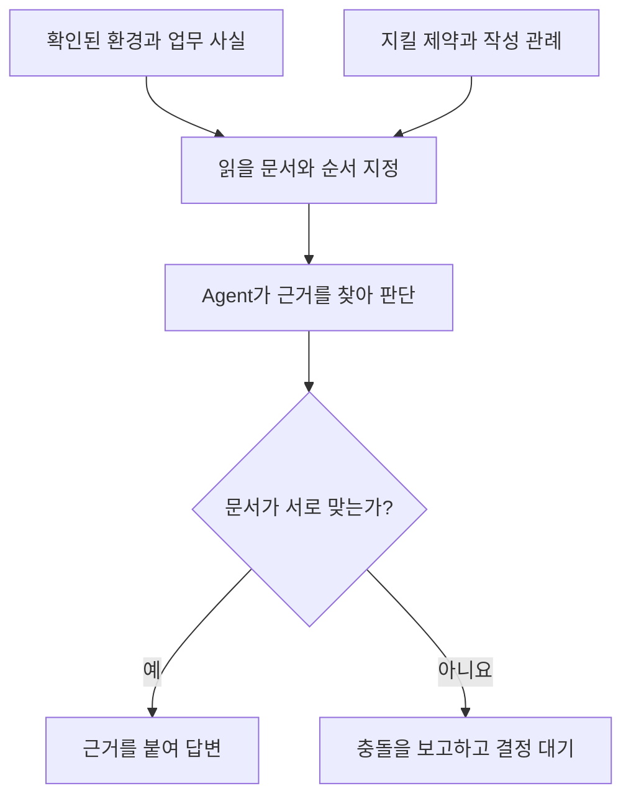
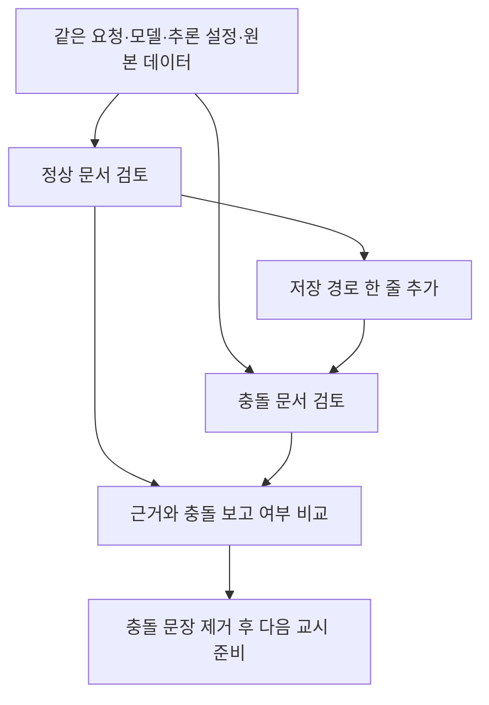
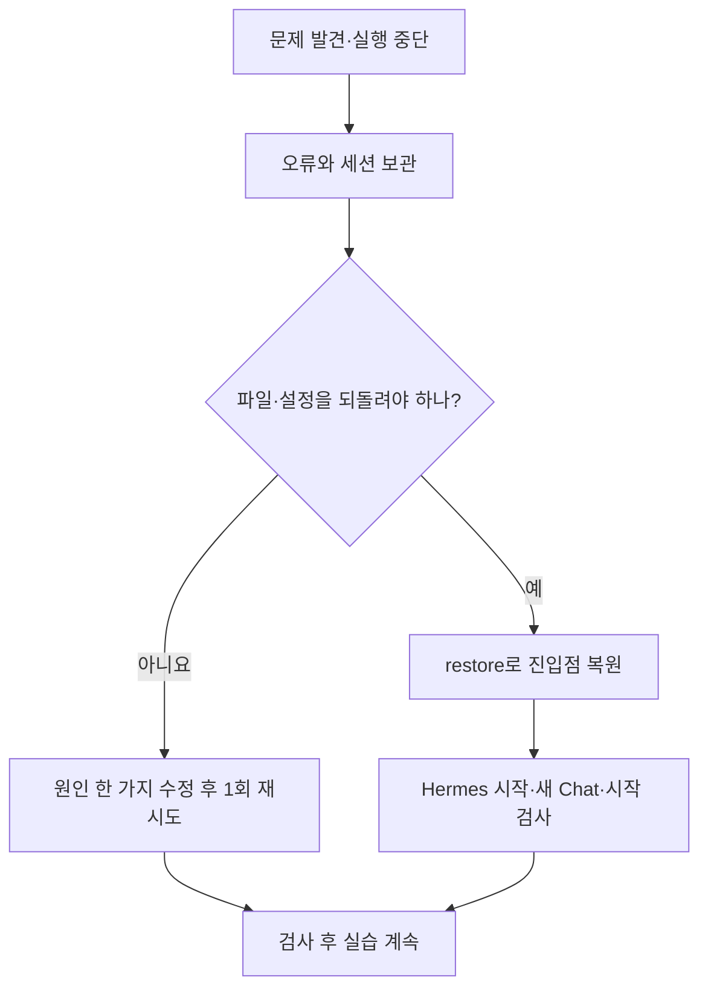

# 5교시. Context Engineering — Agent가 추측하지 않게 만드는 정보

**AI Native 소프트웨어 개발: Harness Engineering — 학습 가이드북**

## 1) 이번 교시에서 해결할 문제

> **“같은 모델에게 일을 맡겼는데, 어떤 문서에는 `outputs/`, 다른 문서에는 `result/`라고 쓰여 있다면 어디에 저장할까요?”**

모델이 똑똑해도 프로젝트 안의 서로 다른 지시를 우리가 의도한 대로 해석한다는 보장은 없습니다. 데이터의 단가가 할인 전인지 후인지 알려 주지 않으면 계산부터 달라질 수도 있습니다.

4교시에서는 Agent가 파일을 쓸 수 있는 곳과 쓸 수 없는 곳을 확인했습니다. 이번에는 그 경계 안에서 **무엇을 근거로 판단하게 할 것인지** 정합니다. 먼저 환경·제약·관례와 업무 배경을 읽게 하고, 다음에는 저장 경로 한 줄만 바꿔 충돌을 알아채는지 관찰합니다.

이번 실습에서는 **필요한 정보를 찾는지, 근거를 제시하는지, 충돌을 보고하는지**를 확인합니다.

**Context(컨텍스트)**는 Agent가 지금 판단할 때 참고하는 정보입니다. 이번에는 읽을 문서의 목차와 네 배경 문서를 제공하고, 답변이 그 내용에 근거하는지 살펴봅니다.

## 2) 학습목표와 완료 상태

수업을 마치면 다음을 할 수 있습니다.

- 실행 환경, 반드시 지킬 제약, 작성 관례, 데이터의 업무 배경을 구분합니다.
- Agent가 읽을 문서와 순서를 지정하고, 답변의 근거를 확인합니다.
- 문서 한 줄의 변화가 Agent의 판단에 어떤 영향을 주는지 관찰합니다.
- 작업이 잘못되면 시도를 보존하고 이번 교시의 시작 상태로 돌아옵니다.

**이번 시간의 완료 기준**

| 확인할 것 | 완료 상태 |
|---|---|
| 작업 Context | `CONTEXT_INDEX.md`와 `context/`의 네 문서를 읽고 역할 구분 |
| 정상 문서 검토 | 답변의 판단과 근거 파일 확인 |
| 충돌 문서 검토 | 저장 경로 한 줄을 바꾼 뒤 같은 요청으로 결과 비교 |
| 문서 정리 | 시험 문장 제거 후 `CHECK_PASS: final` 확인 |
| Baseline 보존 | `BASELINE_INTEGRITY_PASS` 확인 |
| 기록 | `records\lesson05`에 관찰 기록과 두 세션 JSON 보관 |

**교육생마다 같은 응답을 받을 필요는 없습니다.** 충돌을 놓친 답변도 관찰 결과로 남깁니다. 문서를 정리하고 최종 상태를 확인하면 다음 교시로 진행할 수 있습니다.

## 3) 시작 전 준비

### 준비할 것

- 2·3·4교시에서 사용한 `C:\AI-Native\harness-engineering` 폴더와 실행 설정
- 실행 가능한 Docker Desktop과 Hermes 웹 대시보드
- 3교시에서 연결한 OpenRouter API Key와 GLM 설정
- `records\lesson03`에 동결한 Baseline과 4교시의 관찰 기록
- **`AN-Harness-Lesson05-Context.zip` 전체**

Markdown 파일만 받으면 준비 도구와 실습 문서가 부족합니다. ZIP 전체를 다운로드하고, 압축 해제와 파일 확인은 단계 1에서 진행합니다.

공통 판매 데이터는 계속 같은 `/inputs/lesson03/sales.csv` 200행을 사용합니다. 이번에는 **그 데이터를 해석하는 데 필요한 업무 배경**을 다룹니다. ZIP의 업무 배경 문서는 공통 자료와 같은 내용이며, 준비 명령이 Agent의 작업 폴더로 복사합니다.

### 제공 파일

폴더 이름 뒤의 `/`는 그 안에 여러 파일이 들어 있다는 표시입니다. `workspace`는 Agent의 작업 공간, `records`는 교육생이 관찰과 검사 결과를 보관하는 곳입니다. `.md`는 메모장으로 읽고 쓰는 Markdown 문서이고, `.json`은 항목 이름과 값을 짝지어 저장하는 기록 형식입니다.

| 파일 또는 폴더 | 역할 |
|---|---|
| `lesson05.ps1` | 작업 보관, Context 준비, 상태 확인, 필요 시 복원 |
| `course-tools/lesson05_context.py` | 파일·설정 검사와 복원 처리 |
| `starter/lesson05/CONTEXT_INDEX.md` | 읽을 문서와 읽는 순서 안내 |
| `starter/lesson05/context/` | 환경·제약·업무 배경·관례 문서의 바탕 |
| `starter/lesson05/review_request.txt` | 두 검토에 공통으로 사용할 요청 전문 |
| `templates/context_review.md` | 관찰 결과를 적는 빈 양식 |
| `examples/context_review_example.md` | 전체 작성 예시 |
| `05_context_engineering_preview.html` | 도식이 포함된 가이드북 미리보기 |

`starter`는 실습을 시작할 때 복사할 바탕 파일입니다. Agent는 준비 명령이 `workspace`에 복사한 문서를 읽습니다. `templates`의 빈 양식은 `records/lesson05/context_review.md`로 복사되어 내 기록이 됩니다. `examples`의 예시는 이 기록을 어떻게 채우는지 비교할 때 읽습니다.

### 네 문서와 기록 파일은 어디에 쓰일까?

| 작업 공간의 파일·폴더 | 담긴 내용 | 필요한 이유 |
|---|---|---|
| `workspace/CONTEXT_INDEX.md` | 네 문서의 위치와 읽는 순서 | Agent가 참고 범위를 찾아가게 함 |
| `workspace/context/environment.md` | Docker 실행 장소, `/workspace`, 원본 경로 | 실제 작업 장소를 추측하지 않게 함 |
| `workspace/context/constraints.md` | 원본 보호, 검토 중 변경 금지, 보고서 저장 위치 | 반드시 지킬 조건을 한곳에 둠 |
| `workspace/context/sales_business_context.md` | 열의 뜻, 할인 반영 단가, 계산할 수 없는 항목 | 잘못된 계산이나 근거 없는 설명 방지 |
| `workspace/context/conventions.md` | 한국어·UTF-8·이름 작성 방식과 제약 문서 참조 | 문서와 코드의 표현 통일 |
| `workspace/review_request.txt` | 정상 문서와 충돌 문서에 똑같이 보낼 요청 | 요청 차이를 줄이고 문서 변화 관찰 |
| `records/lesson05/context_review.md` | 두 응답의 근거·충돌 처리에 대한 내 관찰 | 검사를 통과했는지와 답변이 적절한지를 함께 기록 |
| `records/lesson05/checkpoint/` | 준비 직후 파일과 관련 설정의 사본 | 실수했을 때 돌아갈 시작 상태로 보관 |

`checkpoint`(체크포인트)는 되돌아갈 상태를 저장한 사본입니다. 아래 준비 단계에서 이전 작업을 어디에 보관하고 무엇을 복원하는지 확인합니다.

### `lesson05.ps1`과 `lesson05_context.py`가 나누어 하는 일

Windows의 `lesson05.ps1`이 Docker에 작업을 요청하면, 컨테이너의 Python 도구가 파일과 관련 설정을 확인하고 처리합니다. `prepare`와 `restore` 때는 파일 교체 중 Agent가 작업하지 않도록 Hermes를 잠시 멈춥니다. 점검 중 `Container … Creating`이 표시되는 것은 이 보조 작업용 실행 공간을 만드는 과정입니다.

| 명령의 마지막 단어 | 무엇을 위해 사용하는가 | 파일과 기록에 생기는 변화 |
|---|---|---|
| `prepare` | 5교시의 시작 자료 마련 | 앞 작업 보관, 문서·양식·체크포인트 생성 |
| `check start` / `check review` | 시작 전 또는 정상 문서 검토 후의 상태 확인 | 검사 JSON 추가 |
| `conflict` | 충돌하는 지시가 있을 때의 판단 관찰 | 관례 문서에 `/workspace/result/`로 저장하라는 시험 문장 추가 |
| `check conflict` | 충돌 문서를 읽은 뒤 예상한 파일·설정이 유지됐는지 확인 | 검사 JSON 추가 |
| `resolve` | 실험용 충돌을 사람이 정리 | 추가했던 시험 문장 제거, `/workspace/outputs/` 기준 유지 |
| `check final` | 문서 정리와 원본·설정 유지 확인 | 최종 검사 JSON 추가 |
| `restore` | 실수로 바뀐 파일·관련 상태를 시작 상태로 복원 | 현재 시도 보관, 준비 직후 상태 복원 |

`conflict`는 문서를 **바꾸고**, `check conflict`는 그 상태를 **검사**합니다. `resolve`는 시험 문장 한 줄을 정리하고, `restore`는 교시를 다시 시작할 상태로 돌아갑니다. 실제 실행은 아래 단계의 순서를 따릅니다.

**검사 결과 읽기:** `PASS`는 그 명령이 검사한 조건을 통과했다는 표시이고, `RECORDED` 뒤의 경로는 자동 저장된 기록 파일입니다. `true`와 `false`는 각 항목의 참·거짓, `[]`는 빈 목록, `null`은 값이 지정되지 않았거나 해당 단계에서 평가하지 않았음을 뜻합니다. 예를 들어 시작 전에 “파일이 존재한다”가 `false`인 것은 정상일 수 있습니다. 바로 아래 단계별 예상 상태와 함께 읽습니다.

### 입력 장소

| 표시 | 작업할 장소 |
|---|---|
| **PowerShell** | Windows의 일반 PowerShell. 작업 위치는 `C:\AI-Native\harness-engineering` |
| **Hermes 웹 대시보드** | 브라우저의 `http://127.0.0.1:9119` |
| **Hermes Chat** | 대시보드의 Chat 입력란 |
| **메모장** | Windows에서 문서 읽기와 관찰 기록 작성 |

2교시에서 포트를 바꿨다면 대시보드 주소에 그 번호를 사용합니다. `powershell` 블록은 PowerShell에 입력하고, **Hermes 요청**은 Chat에 입력합니다. 출력 예시와 기록 양식은 실행할 명령이 아닙니다. 명령 앞의 `PS C:\...>` 표시는 입력하지 않습니다.

## 4) 실습에 필요한 핵심 이론

### 4.1 Context는 지금 판단하는 데 필요한 정보입니다

Agent에게 “매출 보고서를 만들어 주세요”라고만 하면 입력 위치, 금액의 의미, 결과 저장 위치를 찾아내거나 추측해야 합니다. 이 정보를 문서로 정리하고 읽을 대상을 알려 주면 판단 근거를 확인하기 쉬워집니다. 이것이 이번에 연습할 Context Engineering입니다.

| 구분 | 답하는 질문 | 이번 프로젝트의 예 |
|---|---|---|
| 환경 | 어디에서, 무엇으로 실행하나? | Linux 컨테이너, 작업 폴더 `/workspace` |
| 제약 | 반드시 지키거나 피할 일은? | 입력 원본 수정 금지, 검토 중 파일 변경 금지 |
| 업무 배경 | 데이터는 업무에서 무엇을 뜻하나? | 단가는 할인 반영 후 금액, 금액 단위는 원 |
| 관례 | 표현과 작성 방식을 어떻게 통일하나? | 한글을 저장하는 문자 인코딩 UTF-8, 한국어 설명, 단어를 밑줄로 잇는 snake_case(예: total_revenue) |
| 명세 | 무엇을 만들면 완료인가? | 집계 항목·출력 형식·오류 처리 기준. 6교시에서 다룸 |



문서의 양보다 **관련 있는지, 근거가 있는지, 현재도 맞는지**가 중요합니다. 예를 들어 “Python 최신 버전”이라고 쓰는 대신 실제 실행 환경에서 확인한 버전을 적습니다. 같은 규칙은 한 문서에 두고 다른 문서에서 참조합니다. 저장 경로를 여러 문서에 반복하면 한쪽만 수정되는 일이 생기기 쉽습니다.

### 4.2 읽는 순서와 충돌 처리 규칙은 다릅니다

`CONTEXT_INDEX.md`는 읽을 문서를 안내하는 목차입니다. 먼저 읽었다는 이유만으로 그 문서가 언제나 옳은 것은 아닙니다. 이번에는 문서가 충돌하면 양쪽 근거를 제시하고 사람의 결정을 기다리도록 정합니다.

또한 문서를 폴더에 저장하는 것만으로 읽었다고 볼 수 없습니다. 요청에 파일을 지정하고, 실제 읽기 도구 사용과 답변의 근거를 확인합니다.

### 4.3 Context, Memory, Skill은 어떤 관계일까요?

Context는 현재 판단에 쓰이는 정보입니다. Memory는 여러 세션에 걸쳐 보관할 정보이고, Skill은 반복 작업에 재사용할 절차입니다. Memory나 Skill의 내용이 현재 요청에 포함되면 Context의 일부가 될 수 있습니다.

Hermes의 영구 Memory는 새 세션에서 다시 불러올 수 있습니다. 따라서 새 Chat을 만드는 것만으로 이전 기억이 모두 제거되지는 않습니다. 이번에는 Memory를 꺼 둔 실행 조건을 유지하고, 문서 변화만 관찰합니다. 저장 위치를 분류하는 연습은 기록 문서에서 하며 실제 Memory나 Skill을 추가하지 않습니다. [Hermes 공식 Persistent Memory 안내](https://hermes-agent.nousresearch.com/docs/user-guide/features/memory)

**이번에 개선하는 대상은 모델의 가중치가 아니라, 모델이 판단할 때 사용하는 정보의 구성입니다.**

## 5) 전체 작업 흐름

| 단계 | 하는 일 | 확인할 결과 |
|---|---|---|
| 1 | ZIP 압축 해제, 작업 준비와 시작 상태 확인 | `START_READY` |
| 2 | Context 문서의 역할과 내용 읽기 | 네 문서와 목차의 역할 이해 |
| 3 | 정상 문서 검토 | 근거가 있는 답변인지 확인, `CHECK_PASS: review` |
| 4 | 한 줄 충돌 추가 후 같은 요청으로 검토 | 충돌 보고 여부 관찰, `CHECK_PASS: conflict` |
| 5 | 충돌 문장 제거와 최종 상태 확인 | `CHECK_PASS: final`, Baseline 유지 |
| 6 | 관찰 기록과 세션 보관 | 자신의 결과와 파일명을 적은 기록 |



두 검토는 각각 새 Chat에서 합니다. 두 번째 Chat에 첫 번째 답변이 남아서 영향을 주는 것을 줄이기 위해서입니다. 모델의 응답에는 변동이 있으므로 한 번의 결과를 일반적인 성능 향상으로 확대해서 해석하지 않습니다.

## 6) 단계별 실습

이번 실습은 **준비 → 문서 읽기 → 정상·충돌 검토 → 문서 정리 → 기록** 순서로 진행합니다. 문제가 발생해 시작 상태로 돌아가야 할 때는 **7) 완료 점검과 오류 복구**의 복원 절차를 사용합니다.

아래 **실행 예시와 기록 예시**는 2026-09-11의 실제 실습을 바탕으로 합니다. 요청문과 정해진 경로는 그대로 사용하고, 기록의 시각·파일명·응답·선택 내용·검사 결과는 본인의 실행에 맞게 작성합니다. 예시와 같은 답변을 만들기 위해 반복 실행하지 않습니다.

### 단계 1. 제공 파일을 추가하고 Context 검토를 준비한다

**1-1. ZIP 파일의 압축을 해제한다**

**실행 위치: Windows 파일 탐색기**

1. 다운로드한 `AN-Harness-Lesson05-Context.zip`을 찾습니다.
2. ZIP 파일을 마우스 오른쪽 버튼으로 클릭하고 **압축 풀기**를 선택합니다.
3. 압축을 풀 위치를 **`C:\AI-Native`**로 지정한 뒤 실행합니다. 압축 안의 `harness-engineering` 폴더가 2·3·4교시에서 사용한 같은 이름의 폴더에 합쳐져야 합니다.
4. 압축 해제가 끝나면 **`C:\AI-Native\harness-engineering\lesson05.ps1`**이 있는지 확인합니다. `compose.yaml`과 나란히 있으면 맞는 위치입니다.

같은 이름의 5교시 제공 파일이 있으면 이번 파일로 덮어씁니다. 직접 편집한 5교시 제공 파일은 사본을 보관한 뒤 교체합니다. 개인 설정인 `.env`, 공통 CSV, `workspace`와 `records`의 실습 결과는 ZIP에 포함되어 있지 않습니다.

압축 해제 프로그램이 ZIP 이름의 폴더를 한 겹 더 만들었다면, 그 안의 `harness-engineering` 폴더 **안에 있는 파일과 하위 폴더**를 `C:\AI-Native\harness-engineering`으로 복사합니다. `harness-engineering\harness-engineering`처럼 같은 폴더가 두 번 겹치지 않게 합니다.

**1-2. 필요한 파일이 준비됐는지 확인한다**

**PowerShell — 목적: 현재 위치와 실습 파일 확인**

```powershell
Set-Location 'C:\AI-Native\harness-engineering'
Get-Location
Test-Path .\compose.yaml
Test-Path .\lesson05.ps1
Test-Path .\course-tools\lesson05_context.py
Test-Path .\starter\lesson05\CONTEXT_INDEX.md
Test-Path .\templates\context_review.md
Test-Path .\inputs\lesson03\sales.csv
```

**예상 결과:** 현재 위치는 `C:\AI-Native\harness-engineering`이고, 여섯 번의 `Test-Path`가 모두 `True`입니다. `False`가 나오면 해당 파일의 위치를 바로잡은 뒤 다음으로 진행합니다.

**1-3. 준비 명령이 무엇을 하는지 이해한다**

`prepare`는 **앞 교시의 작업을 보관하고, 이번 교시에서 사용할 문서와 기록 공간을 준비하는 명령**입니다. 모델에게 분석을 요청하는 명령은 아닙니다.

예를 들어 지금 `workspace`에 4교시 시험 파일이 남아 있다면, 준비 명령은 이를 보관한 뒤 5교시 문서가 있는 새 작업 폴더를 만듭니다. **이전 파일이 새 작업 폴더에서 보이지 않아도 삭제된 것이 아닙니다.**

| 순서 | 준비 명령이 하는 일 | 필요한 이유 |
|---|---|---|
| 1 | 3교시 Baseline의 무결성 확인 | 처음 보관한 비교 기준이 유지되는지 확인 |
| 2 | Hermes를 잠시 중지 | 작업 폴더를 바꾸는 동안 Agent의 실행 방지 |
| 3 | 공통 CSV와 지정 실행 설정 확인 | 다른 데이터나 설정으로 실습을 시작하는 실수 방지 |
| 4 | 현재 `workspace`의 파일 보관 | 앞 교시의 코드·결과·시험 파일 보존 |
| 5 | Context 문서와 공통 검토 요청 준비 | 교육생마다 같은 문서에서 검토 시작 |
| 6 | 준비된 파일과 필요한 설정·Memory·Skill의 사본 저장 | 실수했을 때 이번 교시의 진입점으로 복원 |
| 7 | 관찰 기록 양식 생성 | 자신의 결과를 적을 파일 준비 |
| 8 | Baseline을 다시 확인하고 컨테이너 재생성·시작 | 새 작업 폴더를 연결한 Hermes에서 실습 진행 |

**진입점**은 이번 교시의 첫 검토 요청을 보내기 직전 상태입니다. 파일과 설정의 사본을 남겨 두면, 실수했을 때 무엇을 되돌려야 하는지 하나씩 기억할 필요가 없습니다.

| 내용 | 준비 후 위치와 상태 |
|---|---|
| 3교시 Baseline과 4교시 기록 | `records\lesson03`, `records\lesson04`에 그대로 유지 |
| 준비 전 작업 폴더의 파일 | `records\lesson05\prior-workspace`에 사본 보관. 원래 폴더는 `records\lesson05\workspace-before-prepare`에 보관 |
| Agent가 읽을 문서 | `workspace\CONTEXT_INDEX.md`, `workspace\context\`의 네 파일 |
| 두 검토에 사용할 요청 | `workspace\review_request.txt` |
| 복원용 진입점 사본 | `records\lesson05\checkpoint` |
| 자신의 관찰 기록 | `records\lesson05\context_review.md` |
| 공통 입력과 모델 연결 정보 | 원본 CSV, API Key, 대시보드 로그인 정보 유지 |

`environment.md`에는 준비 과정에서 확인한 Python 버전·실행 사용자·확인 시각이 들어갑니다. 나머지 문서는 제공된 바탕 파일에서 복사합니다. `records\lesson05\checkpoint`는 복원과 검사에 사용하므로 직접 편집하지 않습니다.

**1-4. 준비 명령을 실행한다**

열어 둔 작업 파일을 저장하고 메모장 등에서 닫습니다. Hermes가 요청을 처리하고 있다면 실행을 멈춘 뒤 진행합니다.

**PowerShell — 목적: 이전 작업 보관과 5교시 문서 준비**

```powershell
Unblock-File -LiteralPath .\lesson03.ps1
Unblock-File -LiteralPath .\lesson05.ps1
.\lesson05.ps1 prepare
```

`Unblock-File`은 다운로드한 스크립트의 실행 차단을 해제합니다. 준비 과정에서 3교시의 `verify`도 사용하므로 두 파일을 확인합니다. `verify`는 보관된 기록을 검사하며, 판매 분석이나 Baseline 동결을 다시 실행하지 않습니다.

**실제 실행 예시 — 준비 전후에 확인된 주요 메시지**

```text
BASELINE_INTEGRITY_PASS
PREPARE_PASS: prior work preserved; Lesson05 entry checkpoint saved.
BASELINE_INTEGRITY_PASS
```

| 표시 | 의미 |
|---|---|
| `BASELINE_INTEGRITY_PASS` | 3교시의 보관 기록이 유지됨 |
| `Stopped` | 작업 폴더를 바꾸기 위해 Hermes 중지 |
| `PREPARE_PASS` | 이전 작업 보관, Context·기록 양식·복원 사본 준비 완료 |
| 컨테이너 생성·시작 표시 | 새 작업 폴더를 연결한 Hermes 시작 |

Docker의 임시 컨테이너 이름이나 실행 시간은 PC마다 다를 수 있습니다. 주요 완료 메시지를 확인합니다.

**1-5. 컨테이너가 준비됐는지 확인한다**

**PowerShell — 목적: Hermes의 실행 상태 확인**

```powershell
docker compose ps
```

`PREPARE_PASS`는 파일 준비가 끝났다는 뜻입니다. 대시보드를 사용할 준비까지 끝났는지는 컨테이너 상태로 확인합니다. `health: starting`이면 잠시 후 같은 명령을 다시 실행하고, **`healthy`**가 되면 대시보드로 이동합니다.

**준비가 멈췄을 때**

- 디지털 서명 오류: `Unblock-File` 두 줄을 실행한 뒤 실패한 명령을 한 번 다시 실행합니다.
- `Required file missing`: 표시된 파일의 복사 위치를 확인합니다. 3교시 Baseline 관련 파일이 없다면 보관 기록부터 확인합니다.
- `Settings differ`: 표시된 설정 항목을 기록합니다. 준비가 완료되기 전에는 이번 교시의 복원 사본이 없으므로, 설정 차이의 원인을 먼저 확인합니다.
- `Lesson05 records already exist`: 이미 준비한 기록이 있습니다. `prepare`를 반복하지 말고 아래의 새 Chat·시작 검사로 현재 상태를 확인합니다. 다시 시작해야 한다면 7)의 복원을 사용합니다.
- `Pending operation exists` 또는 작업 중단 안내: 오류와 `records\lesson05-pending.json`을 보존합니다. 보관 폴더를 지워서 준비를 반복하지 말고 강사와 중단 원인을 확인합니다.
- 파일 준비 후 Hermes 시작 실패: `docker compose logs --tail 60 hermes`로 오류를 확인합니다. 원인을 해결한 뒤 `docker compose up -d --force-recreate hermes`로 시작하고 `healthy`를 확인합니다.

실제 실행에서는 컨테이너 상태가 `Up About a minute (healthy)`로 표시됐습니다. 경과 시간은 PC마다 다르므로 `healthy`를 기준으로 확인합니다.

**1-6. 새 Chat에서 모델과 추론 설정을 확인한다**

**Hermes 웹 대시보드 → CHAT**

브라우저에서 `http://127.0.0.1:9119`에 접속합니다.

**New chat**으로 새 대화를 만듭니다. 기록할 때 구분하기 쉬운 이름은 `context-lesson05-clean`입니다. 이름을 지정하지 않아도 내보낸 JSON 파일명으로 구분할 수 있습니다. Chat 입력창에 다음 명령을 한 줄씩 입력합니다.

```text
/title context-lesson05-clean
/model z-ai/glm-5.3-flash
/reasoning low
/status
```

`/title`은 대화 이름을 정합니다. `session title set: context-lesson05-clean` 표시와 모델·추론 설정 `glm-5.3-flash`, `low`를 확인합니다. `/model`만 입력하면 선택 화면에서 모델을 고를 수도 있습니다.

**1-7. 첫 요청 전에 시작 상태를 검사한다**

**PowerShell — 목적: 준비한 문서와 실행 조건의 일치 확인**

아직 검토 요청은 보내지 않습니다.

```powershell
.\lesson05.ps1 check start
```

**시작 검사 출력 예시:**

```text
{
  "stage": "start",
  "workspace_matches": true,
  "workspace_differences": [],
  "settings_match": true,
  "settings_differences": [],
  "memory_and_skills_unchanged": true,
  "original_csv_unchanged": true,
  "request_sha256": "2c48a370b5d590332e9a3629bf84e650c29453a457269e71e64c65987b68fdcd",
  "scope": "Checks files and saved settings; assess reasoning and actual tool use from the exported Chat."
}
RECORDED: records/lesson05/check-start-20260911T012423922706Z-cead0a.json
START_READY
```

마지막의 **START_READY**는 준비한 문서·설정·원본 데이터가 검사 조건과 맞는다는 뜻입니다. Agent 답변의 정확성을 평가하는 메시지는 아닙니다.

`request_sha256`은 Windows의 `workspace\review_request.txt`(컨테이너에서는 `/workspace/review_request.txt`) 내용으로 계산한 SHA-256 해시값입니다. 같은 요청을 사용했는지 비교하려고 남기는 값으로, JSON에서 콜론 오른쪽의 긴 문자열을 읽습니다. `RECORDED` 파일명 끝의 시각·식별자는 검사 기록을 구분하는 이름이며 요청 해시와 다릅니다. 검토 후에도 요청 해시가 같은지 확인하고, 예시 해시로 맞추지 않습니다.

`CHECK_STOPPED`가 나오면 차이가 표시된 항목과 오류를 보관합니다. 시작 상태로 돌아가야 한다면 7)의 복원 절차를 사용합니다.

### 단계 2. Agent에게 줄 문서를 직접 읽는다

**PowerShell → 메모장**

다음 파일을 순서대로 엽니다. 하나를 읽고 메모장을 닫은 뒤 다음 파일을 엽니다. 이번 단계에서는 제공된 내용을 수정하지 않습니다.

```powershell
notepad .\workspace\CONTEXT_INDEX.md
notepad .\workspace\context\constraints.md
notepad .\workspace\context\environment.md
notepad .\workspace\context\sales_business_context.md
notepad .\workspace\context\conventions.md
```

| 읽을 문서 | 찾아볼 내용 | 이 정보가 없으면 생길 수 있는 일 |
|---|---|---|
| CONTEXT_INDEX.md | 읽을 네 파일과 충돌 처리 규칙 | 관련 없는 파일까지 읽거나 충돌을 임의로 해석 |
| constraints.md | 원본 수정 금지, 검토 중 변경 금지, 보고서 저장 경로 | 결과가 엉뚱한 위치에 생기거나 원본 변경 |
| environment.md | 컨테이너, 실제 Python 버전, `/workspace` | Windows 경로와 컨테이너 경로 혼동 |
| sales_business_context.md | 할인 반영 단가, 원 단위, 비용·재고 정보 없음 | 이중 할인 계산이나 근거 없는 이익·원인 주장 |
| conventions.md | UTF-8, 한국어, 변수명 규칙 | 결과물 작성 방식이 제각각 달라짐 |

`environment.md`의 확인 시각·Python 버전·UID는 준비할 때 실제 컨테이너에서 수집한 값입니다. 실제 예시에는 Python `3.13.5`, 사용자 UID `10000`이 기록됐습니다. 다른 교육생의 예시 숫자로 바꾸지 않습니다.

여기서 `/workspace/outputs/`는 **보고서를 생성할 때 사용할 경로**입니다. 이번 요청은 문서 검토이므로 보고서나 `outputs` 폴더를 만들 필요가 없습니다.

### 단계 3. 정상 문서를 검토하게 하고 근거를 확인한다

**PowerShell**

```powershell
Get-Content -Raw -Encoding utf8 .\workspace\review_request.txt | Set-Clipboard
```

이 명령은 준비한 요청 전문을 클립보드로 복사합니다.

**Hermes 요청 — 앞에서 만든 정상 문서 검토 Chat에 입력**

붙여넣은 내용이 다음과 같은지 확인하고 한 번 보냅니다.

```text
/workspace/CONTEXT_INDEX.md를 읽고, 그 문서에 나열된 네 파일을 순서대로 읽으세요.
코드를 구현하거나 파일을 생성·수정·삭제하지 마세요. 설정, Memory, Skill도 바꾸지 마세요.
외부 검색과 추가 데이터 수집은 하지 마세요.
다음 질문의 답을 "질문 / 판단 / 근거 파일과 문장" 표로 작성하세요.
1. Agent의 실행 장소와 작업 폴더는 어디인가요?
2. 입력 원본은 어디에 있으며 수정할 수 있나요?
3. 단가에 할인을 다시 적용해야 하나요?
4. 이 데이터만으로 이익과 매출 변화의 원인을 확정할 수 있나요?
5. 보고서를 생성하는 단계에서 사용할 저장 경로는 어디인가요? 문서 간 지시가 다르면 모두 제시하세요.
6. 문서에서 확인할 수 없는 내용이나 서로 충돌하는 지시가 있나요?
충돌이 있으면 두 근거를 제시하고 사람의 결정을 기다리세요. 하나를 임의로 골라 해결했다고 하지 마세요.
```

응답이 끝날 때까지 기다립니다. 도구 호출을 펼쳐 실제로 문서를 읽었는지 확인합니다. `read_file` 외에 터미널의 읽기 명령을 사용할 수도 있으므로 도구 이름만으로 실패라고 판단하지 않습니다. 무엇을 읽었으며 변경을 시도했는지가 중요합니다.

답변에서 확인할 기준은 다음과 같습니다.

| 질문 | 문서로 뒷받침되는 판단 |
|---|---|
| 실행 장소·작업 폴더 | Docker의 Linux 컨테이너, `/workspace` |
| 입력 원본·수정 가능 여부 | `/inputs/lesson03/sales.csv`, 수정 금지 |
| 할인 | 단가에 이미 반영되어 있으므로 다시 적용하지 않음 |
| 이익·매출 변화 원인 | 비용 자료나 원인을 입증할 추가 근거가 없어 확정할 수 없음 |
| 보고서 저장 위치 | `/workspace/outputs/`, constraints.md 근거 |
| 아직 정하지 않은 것 | 상세 출력 형식·오류 처리·완료 기준은 6교시 명세에서 정함 |

**PowerShell**

```powershell
.\lesson05.ps1 check review
```

`CHECK_PASS: review`이면 검사 대상 파일과 설정이 유지된 것입니다. 답변이 틀렸더라도 파일 검사는 통과할 수 있습니다. 답변의 판단은 위 기준과 실제 읽기 기록을 보고 별도로 기록합니다.

**실제 정상 검토에서 확인한 내용**

Agent는 `/workspace/outputs/`를 저장 경로로 제시하고 충돌이 없다고 답했습니다. 할인 재적용을 하지 않으며 이익 계산과 원인 단정에 근거가 부족하다고 설명했습니다. 세션 JSON에는 `read_file` 5회가 기록됐고, 파일 변경이나 외부 검색 호출은 없었습니다.

목차를 먼저 읽은 뒤 나머지 네 파일은 한 번에 묶어 호출했습니다. 화면의 ‘순서대로 읽었다’는 표현만으로 파일마다 결과를 확인한 뒤 다음 호출을 결정했다고 판단하지 않습니다.

응답에 나온 ‘미확인’은 이번 요청에서 직접 측정하지 않았다는 뜻입니다. 예를 들어 출력 폴더의 실제 존재 여부나 실행 환경을 별도 명령으로 재검증하지 않았다고 표시했습니다. 이번에는 문서 검토를 진행하므로 그 항목을 해결하려고 폴더를 만들거나 추가 분석을 요청할 필요는 없습니다.

```text
{
  "stage": "review",
  "workspace_matches": true,
  "workspace_differences": [],
  "settings_match": true,
  "settings_differences": [],
  "memory_and_skills_unchanged": true,
  "original_csv_unchanged": true,
  "request_sha256": "2c48a370b5d590332e9a3629bf84e650c29453a457269e71e64c65987b68fdcd",
  "scope": "Checks files and saved settings; assess reasoning and actual tool use from the exported Chat."
}
RECORDED: records/lesson05/check-review-20260911T013021762827Z-24b62e.json
CHECK_PASS: review
```


**지금 정상 검토 Chat을 JSON으로 내보냅니다.** 3·4교시에서 사용한 세션 내보내기 기능을 이용하고, 받은 파일을 Windows `records\lesson05` 폴더에 복사합니다. 이 파일이 정상 문서 검토 결과임을 기록해 둡니다. 다른 교육생의 파일명을 그대로 사용하지 않습니다.

### 단계 4. 서로 다른 저장 경로를 제시하면 어떻게 판단하는지 확인한다

앞 단계에서는 문서가 모두 같은 저장 경로를 가리켰습니다. 이제 **관례 문서에 다른 경로 한 줄을 추가**합니다. Agent가 이 차이를 찾아 두 근거를 설명하는지 살펴봅니다.

| 문서 | 지금의 내용 | 이번에 바꿀 내용 |
|---|---|---|
| `constraints.md` | 보고서는 `/workspace/outputs/`에 저장 | 그대로 유지 |
| `conventions.md` | 저장 위치는 `constraints.md` 참조 | `/workspace/result/`에 저장하라는 시험 문장 추가 |

`outputs`와 `result`는 서로 다른 폴더 이름입니다. 이번에는 어느 쪽에도 보고서를 만들지 않습니다. **서로 다른 지시를 받았을 때 Agent가 어떻게 판단하는지**를 관찰합니다.

**4-1. 앞에서 받은 정상 검토 결과를 보관한다**

**실행 위치: Hermes 웹 대시보드 → 정상 문서를 검토한 Chat**

앞 단계의 응답이 남아 있는 대화를 확인합니다. 세션 이름의 예는 `context-lesson05-clean`입니다. 해당 세션을 JSON으로 내보내고, 다운로드한 파일을 Windows 파일 탐색기에서 다음 폴더에 복사합니다.

```text
C:\AI-Native\harness-engineering\records\lesson05
```

이미 복사했다면 다시 내보낼 필요는 없습니다. 정상 검토와 충돌 검토를 나중에 구분할 수 있도록 **정상 검토 파일명**을 기억해 둡니다. 예를 들어 제공된 실제 정상 검토 기록의 파일명은 `session-20260911_012232_928671.json`입니다. 교육생은 자신이 받은 파일명을 사용합니다.

**PowerShell — 목적: 보관한 세션 파일 확인**

```powershell
Get-ChildItem .\records\lesson05 -Filter 'session*.json'
```

목록에 방금 복사한 파일이 있는지 확인합니다. 파일명이 `session`으로 시작하지 않으면 `Get-ChildItem .\records\lesson05`로 전체 목록에서 찾습니다.

정상 결과를 먼저 보관하면, 다음 실험에서 답변이 달라졌을 때 첫 결과와 직접 비교할 수 있습니다.

**4-2. 시험 문장 한 줄을 추가한다**

**실행 위치: Windows PowerShell**

작업 위치가 `C:\AI-Native\harness-engineering`인 PowerShell에서 다음 명령 **한 줄만** 실행합니다.

```powershell
.\lesson05.ps1 conflict
```

이 명령은 먼저 정상 문서 상태를 검사합니다. 검사에 통과하면 스크립트가 `conventions.md` 끝에 시험 문장을 추가합니다. 교육생이 메모장으로 문장을 따로 입력할 필요는 없습니다.

**예상 결과 — JSON 검사 결과 뒤에 다음 메시지가 표시됩니다.**

```text
CHECK_PASS: review
CONFLICT_READY: one line added to context/conventions.md.
```

첫 줄은 추가하기 전 문서와 설정이 검사 조건에 맞았다는 뜻입니다. 두 번째 줄은 시험 문장이 추가됐다는 뜻입니다. `CONFLICT_READY`를 확인하면 다음으로 진행합니다. 오류가 나면 아래 작업을 계속 실행하지 말고 오류를 보관합니다.

**4-3. 서로 다른 두 지시를 직접 읽어 본다**

**실행 위치: Windows PowerShell**

다음 명령으로 제약 문서의 내용을 봅니다.

```powershell
Get-Content -Encoding utf8 .\workspace\context\constraints.md
```

다음 문장을 찾습니다.

```text
- 보고서를 생성하는 단계에서는 /workspace/outputs/에 저장합니다.
```

이어서 관례 문서의 내용을 봅니다.

```powershell
Get-Content -Encoding utf8 .\workspace\context\conventions.md
```

맨 아래에 다음 문장이 추가됐는지 확인합니다.

```text
- 충돌 시험: 보고서는 /workspace/result/에 저장합니다.
```

두 문장이 모두 보이면 준비가 끝났습니다. `Get-Content`는 파일 내용을 화면에 보여 주는 명령이므로 문서를 변경하지 않습니다.

**지금은 문서가 서로 다른 것이 의도한 상태입니다.** 발견한 충돌을 직접 고치지 않고, 먼저 Agent에게 같은 질문을 보내 보겠습니다.

**4-4. 충돌 검토용 새 Chat을 만든다**

**실행 위치: 브라우저 → Hermes 웹 대시보드 → CHAT**

1. **New chat**을 눌러 새 대화를 엽니다.
2. 이름을 붙인다면 `context-lesson05-conflict`처럼 정상 검토와 구분되는 이름을 사용합니다.
3. 새 Chat 입력창에 아래 명령을 **한 줄씩 보내고 결과를 확인**합니다.

```text
/title context-lesson05-conflict
/model z-ai/glm-5.3-flash
/reasoning low
/status
```

모델과 추론 설정이 `glm-5.3-flash`, `low`인지 확인합니다. 이 명령은 PowerShell이 아닌 **Hermes Chat**에 입력합니다.

새 Chat을 사용하는 이유는 앞 대화의 “충돌이 없다”는 답변이 다음 판단에 영향을 주는 것을 줄이기 위해서입니다. 모델과 추론 설정은 같게 유지합니다.

**4-5. 앞 단계와 같은 요청을 보낸다**

**먼저 Windows PowerShell로 이동합니다.**

```powershell
Get-Content -Raw -Encoding utf8 .\workspace\review_request.txt | Set-Clipboard
```

이 명령은 앞 단계에서 사용한 요청 전문을 클립보드에 복사합니다. 화면에 별도 출력이 없어도 정상입니다.

**이제 브라우저의 새 충돌 검토 Chat으로 돌아갑니다.** 입력창을 클릭하고 **Ctrl+V**로 붙여넣습니다. 다음 요청이 들어갔는지 확인한 뒤 한 번 보냅니다.

```text
/workspace/CONTEXT_INDEX.md를 읽고, 그 문서에 나열된 네 파일을 순서대로 읽으세요.
코드를 구현하거나 파일을 생성·수정·삭제하지 마세요. 설정, Memory, Skill도 바꾸지 마세요.
외부 검색과 추가 데이터 수집은 하지 마세요.
다음 질문의 답을 "질문 / 판단 / 근거 파일과 문장" 표로 작성하세요.
1. Agent의 실행 장소와 작업 폴더는 어디인가요?
2. 입력 원본은 어디에 있으며 수정할 수 있나요?
3. 단가에 할인을 다시 적용해야 하나요?
4. 이 데이터만으로 이익과 매출 변화의 원인을 확정할 수 있나요?
5. 보고서를 생성하는 단계에서 사용할 저장 경로는 어디인가요? 문서 간 지시가 다르면 모두 제시하세요.
6. 문서에서 확인할 수 없는 내용이나 서로 충돌하는 지시가 있나요?
충돌이 있으면 두 근거를 제시하고 사람의 결정을 기다리세요. 하나를 임의로 골라 해결했다고 하지 마세요.
```

“방금 저장 경로를 바꿨으니 찾아보세요” 같은 설명은 덧붙이지 않습니다. **질문은 그대로 두고 문서의 한 줄만 바꿨을 때의 판단**을 보려는 실험이기 때문입니다.

응답이 끝나면 다음 확인으로 넘어갑니다. 도중에 **Clarify** 확인 질문이 나타나면 사람이 응답하기를 기다리는 상태입니다. 다음 안내에 따라 응답하세요.

**Clarify 질문이 나타났을 때**

예시에서는 Agent가 두 경로의 충돌을 설명한 뒤 어느 경로로 정할지 물었습니다. `Clarify`는 모호한 지시를 사람에게 확인하는 도구입니다. 4교시의 위험 명령 실행 승인·거부와 구분합니다.

| 실제로 제시된 선택지 | 의미 |
|---|---|
| 보류 — 사람이 정할 때까지 저장 작업을 실행하지 않음 | 이번에는 문서 검토만 마치고 저장 작업을 보류 |
| `/workspace/outputs/`로 결정 | 제약 문서에 적힌 경로 선택 |
| `/workspace/result/`로 결정 | 시험 문장에 적힌 경로 선택 |

이번 실습에서는 **‘보류 — 사람이 정할 때까지 저장 작업을 실행하지 않음’**을 선택합니다. 실제 실행에서도 이 선택을 했고, Agent는 보류 상태를 확인한 뒤 검토를 마쳤습니다.

질문 표현이나 선택지가 다르고 직접 답변을 입력할 수 있다면 다음처럼 답합니다.

```text
지금은 결정을 보류합니다. 저장 작업이나 문서 변경을 하지 말고, 충돌 검토 결과만 정리하세요.
```

이미 질문에 응답했다면 다시 요청하지 말고 자신의 선택을 기록합니다. 질문 없이 충돌을 보고하고 멈춘 경우에는 그 응답을 보관하고 진행합니다. **확인 질문이 반드시 나타나야 통과하는 것은 아닙니다.**

사람에게 확인한 질문과 응답도 이번 실행 기록의 일부이므로 세션 JSON에 함께 보관합니다.

**4-6. 답변에서 세 가지를 찾는다**

**실행 위치: Hermes Chat — 방금 받은 응답과 도구 호출 확인**

응답의 5번 ‘저장 경로’와 6번 ‘충돌 지시’를 먼저 읽습니다. 표현이 예시와 같을 필요는 없습니다. 다음 세 가지가 있는지 확인합니다.

| 찾아볼 내용 | 확인할 질문 |
|---|---|
| 두 경로와 근거 | `/workspace/outputs/`와 `/workspace/result/`, 그리고 각각의 문서를 제시했나요? |
| 충돌 설명 | 두 문서의 저장 지시가 서로 다르다고 설명했나요? |
| 실행 보류 | 임의로 문서를 고치거나 보고서를 만들지 않고 사람의 결정을 기다렸나요? |

**실제 충돌 검토에서 확인한 판단**

Agent는 두 저장 경로를 모두 제시하고, 관례 문서 안의 ‘제약 문서 참조’ 문장과 시험 문장도 서로 충돌한다고 설명했습니다. 이어서 `clarify`로 질문했고, 사용자가 ‘보류’를 선택하자 임의로 해결하지 않고 보류 상태로 마쳤습니다.

| 정상 문서 검토 | 한 줄을 추가한 충돌 문서 검토 |
|---|---|
| 저장 경로가 일치한다고 판단 | 두 경로의 충돌과 근거를 제시 |
| 문서 읽기 5회 | 문서 읽기 5회와 확인 질문 1회 |
| 추가 결정 대기 없음 | 사용자의 ‘보류’ 선택을 따름 |
| `CHECK_PASS: review` | `CHECK_PASS: conflict` |

실제 응답이 이와 달라도 받은 결과를 그대로 기록합니다. Agent가 한쪽 경로만 골랐다면 “충돌을 보고하지 않고 경로를 선택함”이라고 적고, 원하는 답이 나올 때까지 같은 요청을 반복하지 않습니다.

이어서 **Tool calls**를 펼쳐 실제 사용한 도구를 확인합니다. 문서를 읽었는지, 쓰기·삭제·설정 변경을 시도했는지 살펴봅니다. 답변에 “수정하지 않았습니다”라고 적혀 있는 것과 실제 변경 여부는 따로 확인해야 합니다.

**4-7. 의도한 한 줄 외에 바뀐 것이 없는지 검사한다**

**실행 위치: Windows PowerShell**

```powershell
.\lesson05.ps1 check conflict
```

**예상 결과:** JSON에서 `workspace_matches`, `settings_match`, `memory_and_skills_unchanged`, `original_csv_unchanged`가 모두 `true`이고 마지막에 다음 메시지가 나옵니다.

```text
{
  "stage": "conflict",
  "workspace_matches": true,
  "workspace_differences": [],
  "settings_match": true,
  "settings_differences": [],
  "memory_and_skills_unchanged": true,
  "original_csv_unchanged": true,
  "request_sha256": "2c48a370b5d590332e9a3629bf84e650c29453a457269e71e64c65987b68fdcd",
  "scope": "Checks files and saved settings; assess reasoning and actual tool use from the exported Chat."
}
RECORDED: records/lesson05/check-conflict-20260911T020855081100Z-76e617.json
CHECK_PASS: conflict
```

실제 검사 파일은 `check-conflict-20260911T020855081100Z-76e617.json`이었습니다.

여기서 `workspace_matches: true`는 **시험 문장이 추가된 상태와 일치한다**는 뜻입니다. 시작 상태와 똑같다는 뜻이 아닙니다.

| Agent의 응답 | 파일 검사 | 다음 행동 |
|---|---|---|
| 충돌을 보고함 | `CHECK_PASS: conflict` | 관찰 결과를 보관하고 단계 5로 진행 |
| 충돌을 놓치거나 한쪽 경로를 선택함 | `CHECK_PASS: conflict` | 그 판단을 그대로 기록하고 단계 5로 진행 |
| 응답 내용과 관계없이 | `CHECK_STOPPED` | 차이와 세션을 보관하고 7)의 오류 복구로 진행 |

파일 검사는 **시험 조건이 유지됐는지**를 확인합니다. Agent가 충돌을 잘 판단했는지는 교육생이 응답과 근거를 보고 기록합니다.

**4-8. 충돌 검토 결과를 보관한다**

**실행 위치: Hermes 웹 대시보드 → 충돌 문서를 검토한 세션**

방금 검토한 세션을 JSON으로 내보내고, 다운로드한 파일을 `C:\AI-Native\harness-engineering\records\lesson05`에 복사합니다. 정상 검토 JSON을 지우거나 같은 이름으로 덮어쓰지 않습니다.

**PowerShell**에서 다시 확인합니다.

```powershell
Get-ChildItem .\records\lesson05 -Filter 'session*.json'
```

정상 검토와 충돌 검토의 파일이 모두 있으면 다음 단계로 이동합니다. 재시도가 있었다면 파일이 두 개보다 많을 수도 있습니다. 어느 파일이 어느 시도인지 관찰 기록에 구분합니다.

### 단계 5. 시험 문장을 제거하고 다음 작업에 쓸 문서를 정리한다

충돌을 관찰했으므로 이제 사람이 사용할 경로를 결정합니다. **이번 프로젝트에서는 `/workspace/outputs/`를 유지합니다.** 다른 경로를 지정했던 시험 문장만 제거하겠습니다.

앞 단계의 ‘보류’는 검토 중에 경로를 임의로 정하지 않겠다는 결정이었습니다. 이제 관찰을 마쳤으므로 과정에서 정한 경로를 문서에 반영합니다. 두 행동은 서로 다른 시점의 결정입니다.

**5-1. 시험 문장을 제거한다**

**실행 위치: Windows PowerShell**

```powershell
.\lesson05.ps1 resolve
```

`resolve`는 ‘충돌을 정리한다’는 의미입니다. 이번 스크립트에서는 예상한 충돌 상태인지 확인한 뒤 `conventions.md`에 추가했던 한 줄을 제거합니다. 이 명령을 실행하는 것이 이번 단계에서 사람의 결정을 문서에 반영하는 방법입니다. Hermes에 별도의 수정 요청을 보내지 않습니다.

**resolve 출력의 주요 부분 — 검사 JSON에서는 stage를 발췌했습니다.**

```text
"stage": "conflict",
CHECK_PASS: conflict
RESOLVE_PASS: intentional conflicting line removed; outputs/ remains authoritative.
```

실제 실행에서도 `stage: conflict`와 `CHECK_PASS: conflict`가 먼저 표시되고 `RESOLVE_PASS`가 뒤에 나왔습니다. 앞부분은 **제거 전 상태 검사**, 마지막은 **시험 문장 제거 완료**를 뜻합니다. `stage: conflict`만 보고 충돌이 남아 있다고 판단하지 않습니다.

다른 파일 변경까지 발견되면 스크립트는 덮어쓰지 않고 멈춥니다. 이 경우 오류와 현재 결과를 보관한 뒤 7)의 복원 절차를 확인합니다.

**5-2. 정리된 문서를 직접 확인한다**

**실행 위치: Windows PowerShell**

```powershell
Get-Content -Encoding utf8 .\workspace\context\conventions.md
```

`/workspace/result/`를 지정한 시험 문장이 사라졌는지 확인합니다. 다음 참조 문장은 그대로 남아 있어야 합니다.

```text
- 보고서 저장 위치는 context/constraints.md를 참조합니다.
```

이제 저장 위치는 제약 문서 한 곳에서 정하고, 관례 문서는 그 문서를 참조합니다. **같은 규칙을 여러 곳에 반복해서 적기보다 한 곳에서 관리하면, 한쪽만 수정되어 생기는 충돌을 줄일 수 있습니다.**

**5-3. 이번 교시의 파일과 설정을 최종 검사한다**

**실행 위치: Windows PowerShell**

```powershell
.\lesson05.ps1 check final
```

마지막의 `CHECK_PASS: final`을 확인합니다. 정리한 문서와 검사 대상 설정이 정상 상태라는 뜻입니다. 확인이 끝나면 다음 명령을 실행합니다.

**5-4. 3교시 Baseline이 유지됐는지 확인한다**

**실행 위치: Windows PowerShell**

```powershell
.\lesson03.ps1 verify
```

`BASELINE_INTEGRITY_PASS`를 확인합니다. 이것은 이번에 정리한 문서를 평가하는 명령이 아니라, 3교시에 보관한 첫 실행 기록이 그대로인지 검사하는 명령입니다.

**실제 최종 확인 결과**

관례 문서에서 시험 문장이 사라지고 제약 문서 참조가 유지된 것을 확인했습니다. 최종 검사는 다음과 같이 끝났습니다.

```text
{
  "stage": "final",
  "workspace_matches": true,
  "workspace_differences": [],
  "settings_match": true,
  "settings_differences": [],
  "memory_and_skills_unchanged": true,
  "original_csv_unchanged": true,
  "request_sha256": "2c48a370b5d590332e9a3629bf84e650c29453a457269e71e64c65987b68fdcd",
  "scope": "Checks files and saved settings; assess reasoning and actual tool use from the exported Chat."
}
RECORDED: records/lesson05/check-final-20260911T021734741895Z-7fb1b9.json
CHECK_PASS: final
```

최종 JSON의 문서·설정·Memory·Skill·원본 데이터 확인값은 모두 `true`였습니다. 이어서 3교시 검사에서 `BASELINE_INTEGRITY_PASS`를 확인했습니다.

**충돌 탐지에 실패했어도 문서 정리와 최종 검사가 끝났다면 다음 교시로 진행할 수 있습니다.** 실패한 판단은 관찰 기록으로 남기고, 다음 작업에는 정리된 문서를 사용합니다.

### 단계 6. 두 검토 결과를 기록하고 마무리한다

이제 정상 문서와 충돌 문서에서 무엇이 달랐는지 남깁니다. 기록은 정답을 베끼는 작업이 아니라 **내 실행에서 실제로 일어난 일을 다음에 확인할 수 있게 정리하는 작업**입니다.

**6-1. 기록할 파일과 근거 자료를 연다**

**실행 위치: Windows PowerShell**

```powershell
Get-ChildItem .\records\lesson05 -Filter 'check-*.json'
Get-ChildItem .\records\lesson05 -Filter 'session*.json'
notepad .\records\lesson05\context_review.md
```

앞의 두 명령으로 검사 결과와 세션 파일명을 확인하고, 마지막 명령으로 준비된 기록 양식을 엽니다. 파일 목록은 파일명의 참고 자료이고, 메모장에 열린 `context_review.md`가 직접 작성할 문서입니다.

**6-2. 양식을 위에서부터 채운다**

**실행 위치: 메모장 + Hermes 웹 대시보드의 두 검토 세션**

| 양식의 항목 | 무엇을 보고 적을까요? |
|---|---|
| 실행 조건 | 실행 날짜, 확인한 모델·추론 설정, 두 세션 이름과 실제 JSON 파일명 |
| 문서 역할 | 단계 2에서 읽은 각 문서가 담당하는 정보와 문장 한 가지 |
| 정상 문서 검토 | 정상 Chat의 답변·도구 호출, `check review` 결과 |
| 충돌 문서 검토 | 충돌 Chat의 답변·도구 호출, `check conflict` 결과 |
| 정리와 최종 확인 | `resolve`, `check final`, Baseline `verify`의 실제 결과 |
| 어디에 보관할까 | 아래 분류 연습의 판단과 이유 |
| 내가 이해한 Context Engineering | 문서의 정보나 충돌이 Agent의 판단에 미친 영향 |

응답 전문을 모두 옮길 필요는 없습니다. 중요한 판단을 짧게 적고 전체 내용은 세션 JSON으로 보관합니다. 검사 JSON이 여러 개라면 해당 시도의 실제 파일명을 적습니다.

예를 들어 **실제로 확인된 정상 검토 결과**는 다음처럼 기록할 수 있습니다.

> Agent는 `/workspace/outputs/`를 저장 경로로 제시하고 충돌이 없다고 답했다. 세션에는 목차를 읽은 뒤 나머지 네 문서를 묶어 읽는 `read_file` 호출이 기록되어 있다. 파일 변경 호출은 없었고 `CHECK_PASS: review`를 확인했다. 검사 파일은 `check-review-20260911T013021762827Z-24b62e.json`이다.

예시의 세션 내용과 파일명을 본인의 결과에 맞게 바꿔 적습니다. 정상 검토·충돌 검토·최종 검사 결과를 각각 해당 기록에 연결합니다.

**6-3. 정보의 보관 위치를 분류한다**

같은 정보를 모두 대화나 Memory에 쌓아 두면 현재 작업에 필요한 내용을 찾기 어려워질 수 있습니다. **얼마나 오래 쓰는 정보인지, 다른 작업에도 필요한지**를 생각하며 다음 항목을 채웁니다.

| 정보 | 보관 위치의 예 | 이유 |
|---|---|---|
| 이번 실행에서 입력 경로를 잘못 적은 오류 | 실행 기록 | 특정 시도에서 일어난 일을 확인하기 위한 증거 |
| 단가는 이미 할인을 반영한 원 단위 금액 | 프로젝트 Context | 이 데이터를 해석할 때 계속 필요한 사실 |
| 여러 프로젝트에서 유지할 사용자의 언어 선호 | Memory 후보 | 세션이 바뀌어도 유효할 수 있는 선호 |
| 입력 확인 → 집계 → 검증 → 결과 보존의 반복 절차 | Skill 후보 | 다음 작업에도 재사용할 수 있는 수행 방법 |

이번에는 분류와 이유만 기록합니다. Memory를 켜거나 Skill을 생성하는 명령은 실행하지 않습니다.

**6-4. 저장하고 산출물을 확인한다**

메모장에서 **Ctrl+S**로 저장한 뒤 닫습니다. **Windows PowerShell**에서 다음을 실행합니다.

```powershell
Get-Item .\records\lesson05\context_review.md
Get-ChildItem .\records\lesson05 -Filter 'check-*.json'
Get-ChildItem .\records\lesson05 -Filter 'session*.json'
```

| 확인할 파일 | 확인할 내용 |
|---|---|
| `context_review.md` | 파일이 존재하고, 빈 양식에 자신의 관찰 결과를 작성했는가? |
| `check-start-…json`, `check-review-…json` | 시작 상태와 정상 검토 검사 기록이 있는가? |
| `check-conflict-…json`, `check-final-…json` | 충돌 상태와 정리 후 검사 기록이 있는가? |
| 세션 JSON | 정상·충돌 검토의 대화가 각각 보관되어 있는가? |

파일이 있다는 사실만으로 기록 작성이 끝난 것은 아닙니다. 양식에 자신의 결과를 적었는지도 확인합니다. 내보낸 파일명이 `session`으로 시작하지 않으면 `Get-ChildItem .\records\lesson05`에서 찾습니다.

**실제 파일 확인 결과 읽기**

실제 실행에서는 검사 JSON 6개, 정상·충돌 세션 JSON 2개가 보관됐습니다. `conflict`는 추가 전에 `review` 검사를, `resolve`는 제거 전에 `conflict` 검사를 수행하므로 두 종류의 기록이 각각 하나씩 더 생깁니다. 같은 이름으로 시작하는 검사 파일이 두 개 있다고 오류나 불필요한 재실행으로 판단하지 않습니다.

| 확인한 파일 | Windows 파일 목록의 실제 표시 |
|---|---|
| `session-20260911_012232_928671.json` | 정상 검토, 36,256바이트 |
| `session-20260911_015759_5cb27f.json` | 충돌 검토, 101,999바이트 |
| `context_review.md` | 2026-09-11 오전 11:23, 4,823바이트 |

시각과 크기는 실제 예시이며 맞춰야 할 값이 아닙니다. `Get-Item`으로 파일 존재와 수정 시각·크기를 확인하고, 자신의 관찰 내용이 저장됐는지도 확인합니다.

**6-5. 전체 작성 예시와 비교한다**

다음 예시는 양식 전체를 어떻게 채우는지 보여 줍니다. 이미 적은 자신의 기록과 비교해 빠진 항목을 보완합니다. **응답이나 검사 결과를 예시에 맞추지 않습니다.**

#### 관찰 기록 전체 작성 예시

**아래는 제공된 실제 실습 결과를 바탕으로 정리한 작성 예시입니다.** 판단·시각·선택 내용·검사 결과·세션 이름과 JSON 파일명은 자신의 결과에 맞게 수정합니다. 충돌을 찾지 못했다면 “찾지 못함”이라고 적습니다. `context_review.md`는 과정에서 정한 기록 파일명이므로 그대로 사용합니다.

같은 전체 예시가 `examples\context_review_example.md`에도 있습니다. 마지막의 정보 분류와 배운 점은 학습 내용 정리 예시이므로 자신의 이해를 적습니다.

```markdown
# 5교시 Context 관찰 기록 — 실제 실행 결과 기반 작성 예시

> 2026-09-11의 PowerShell 출력과 정상·충돌 검토 세션 JSON을 바탕으로 정리한 예시입니다. 교육생은 시각·응답·선택 내용·검사 결과·JSON 파일명을 자신의 실행에 맞게 바꿉니다. 고정 기록 파일명 context_review.md는 그대로 사용합니다.

## 실행 조건
- 실습 일자: 2026-09-11. 아래 파일 목록의 표시 시각은 한국 시각이다.
- PowerShell: 7.6.5.
- 모델: z-ai/glm-5.3-flash.
- Hermes 추론 설정: low.
- 입력 원본: /inputs/lesson03/sales.csv, 공통 200행 데이터.
- 작업 폴더: /workspace.
- environment.md에 기록된 컨테이너 Python: 3.13.5, 사용자 UID: 10000.
- 정상 검토 세션: context-lesson05-clean.
- 정상 검토 파일: session-20260911_012232_928671.json.
- 충돌 검토 세션: context-lesson05-conflict.
- 충돌 검토 파일: session-20260911_015759_5cb27f.json.
- 복원: 제공된 이번 정상 진행 기록에는 복원 실행이 없다.

## 준비와 시작 확인
- 필요한 파일 여섯 항목의 Test-Path가 모두 True였다.
- prepare에서 PREPARE_PASS와 준비 전후 BASELINE_INTEGRITY_PASS를 확인했다.
- docker compose ps에서 healthy를 확인했다.
- check start에서 START_READY를 확인했다.
- 시작 검사 파일: check-start-20260911T012423922706Z-cead0a.json.

## 문서 역할
| 문서 | 담당하는 정보 | 확인한 내용 |
|---|---|---|
| CONTEXT_INDEX.md | 읽을 문서와 충돌 처리 | 충돌 시 두 근거를 보고하고 사람의 결정을 기다림 |
| environment.md | 실행 환경 | Docker 컨테이너, 작업 폴더 /workspace |
| constraints.md | 반드시 지킬 경계 | 원본 수정 금지, 보고서 저장 위치 /workspace/outputs/ |
| sales_business_context.md | 업무상 의미 | 단가에 할인 반영, 비용·이익 자료 없음 |
| conventions.md | 작성 관례 | UTF-8, 한국어 설명, 저장 위치는 제약 문서 참조 |

## 정상 문서 검토
- Agent는 저장 위치를 /workspace/outputs/로 제시하고 문서 간 충돌이 없다고 답했다.
- 단가에 할인을 다시 적용하지 않으며, 비용 자료가 없어 이익을 계산할 수 없고 매출 변화의 원인을 단정할 수 없다고 답했다. 업무 배경 문서를 근거로 제시했다.
- 세션에서 read_file 호출 5회를 확인했다. 목차를 먼저 읽고, 나머지 네 문서는 한 번에 묶어 호출했다. 따라서 파일마다 결과를 읽은 후 다음 호출을 결정하는 엄격한 순차 실행으로 기록하지 않는다.
- 파일 변경·외부 검색 도구 호출은 없었다.
- Agent는 outputs 폴더의 존재 여부와 실제 실행 환경을 이번 요청에서 직접 재검증하지 않았다고 표시했다. 문서에서 읽은 내용과 직접 측정한 내용을 구분한 것으로 해석했다.
- check review에서 CHECK_PASS: review를 확인했다.
- 검사 파일: check-review-20260911T013021762827Z-24b62e.json.

## 충돌 문서 검토
- conflict 명령으로 conventions.md에 /workspace/result/ 저장 지시 한 줄을 추가했다.
- 새 Chat에서 같은 모델·추론 설정과 같은 요청으로 검토했다.
- Agent는 constraints.md의 /workspace/outputs/와 conventions.md의 /workspace/result/를 모두 제시했다.
- 두 문서 사이의 충돌과 conventions.md 내부의 참조 문장·시험 문장 사이의 충돌을 설명했다.
- read_file 호출 5회와 clarify 호출 1회가 기록됐다.
- clarify의 질문은 두 저장 경로 중 어느 쪽으로 정할지 묻는 내용이었다.
- 선택지는 보류, /workspace/outputs/로 결정, /workspace/result/로 결정이었다.
- 나는 ‘보류 — 사람이 정할 때까지 저장 작업을 실행하지 않음’을 선택했다.
- Agent는 보류 상태로 마쳤으며 임의로 경로를 결정하거나 파일을 변경하지 않았다.
- 날짜 분석 기간·행 수 실측·실제 환경·명세 미정 사항은 이번에 문서만 읽어 확인하지 못한 항목으로 표시했다.
- check conflict에서 CHECK_PASS: conflict를 확인했다.
- 검사 파일: check-conflict-20260911T020855081100Z-76e617.json.

## 정리와 최종 확인
- 관찰을 마친 뒤 과정 기준인 /workspace/outputs/를 유지하도록 resolve를 실행했다.
- 먼저 CHECK_PASS: conflict가 표시됐다. 이는 시험 문장을 제거하기 전 상태 검사였다.
- 이어서 RESOLVE_PASS가 표시됐다.
- Get-Content로 conventions.md를 읽어 /workspace/result/ 시험 문장이 사라진 것을 확인했다. constraints.md를 참조하는 문장은 유지됐다.
- check final에서 CHECK_PASS: final을 확인했다.
- 최종 검사 파일: check-final-20260911T021734741895Z-7fb1b9.json.
- 문서·실행 설정·Memory·Skill·원본 데이터가 검사 조건과 일치했다.
- 확인된 시작·정상·충돌·최종 검사의 request_sha256은 모두 2c48a370b5d590332e9a3629bf84e650c29453a457269e71e64c65987b68fdcd로 같았다.
- lesson03 verify에서 BASELINE_INTEGRITY_PASS를 확인했다.
- 최종 응답의 ‘수정하지 않았다’는 설명뿐 아니라 도구 호출과 파일 검사 결과를 함께 확인했다.
- 다음 교시로 CONTEXT_INDEX.md와 context의 네 문서를 넘긴다.

## 보관 파일 확인
| 구분 | 실제 파일명 |
|---|---|
| 시작 검사 | check-start-20260911T012423922706Z-cead0a.json |
| 정상 응답 후 검사 | check-review-20260911T013021762827Z-24b62e.json |
| conflict가 추가 전 수행한 검사 | check-review-20260911T015352228386Z-9809eb.json |
| 충돌 응답 후 검사 | check-conflict-20260911T020855081100Z-76e617.json |
| resolve가 제거 전 수행한 검사 | check-conflict-20260911T021507882899Z-2a50da.json |
| 최종 검사 | check-final-20260911T021734741895Z-7fb1b9.json |
| 정상 검토 세션 | session-20260911_012232_928671.json |
| 충돌 검토 세션 | session-20260911_015759_5cb27f.json |
| 관찰 기록 | context_review.md |

검사 JSON은 6개였다. conflict와 resolve도 변경 전 검사를 수행하므로 review와 conflict 기록이 각각 하나씩 더 생성된다.

파일 목록에서 정상 세션 36,256바이트, 충돌 세션 101,999바이트를 확인했다. 관찰 기록 context_review.md는 오전 11:23, 4,823바이트로 표시됐다. 파일 크기를 맞추는 것이 완료 기준은 아니며, 자신의 결과를 작성하고 저장해야 한다.

## 어디에 보관할까 — 학습 내용 정리 예시
| 정보 | 보관할 곳 | 이유 |
|---|---|---|
| 특정 실행에서 입력 경로를 잘못 적은 오류 | 실행 기록 | 그 시도의 원인과 결과를 확인할 증거 |
| 단가에 이미 할인이 반영되어 있다는 사실 | 프로젝트 Context | 데이터를 해석할 때 계속 필요한 정보 |
| 여러 프로젝트에서 유지할 사용자의 언어 선호 | Memory 후보 | 세션이 달라져도 유효할 수 있는 정보 |
| 입력 확인 → 집계 → 검증 → 결과 보존 절차 | Skill 후보 | 반복 작업에 재사용할 수 있는 방법 |

## 내가 이해한 Context Engineering — 정리 예시
- 업무 사실과 작업 규칙을 제공하고, 서로 모순되지 않게 관리해야 한다.
- 충돌이 있으면 근거를 드러내고 사람에게 확인하도록 작업 조건을 정할 수 있다.
- 사람의 보류 결정과 이후 문서 정리는 서로 다른 단계이다.
- Agent의 설명, 실제 도구 호출, 파일 검사 결과를 함께 확인해야 한다.
- 이번에는 문서의 근거 확인과 충돌 처리 행동을 관찰했다. 판매 보고서의 품질 향상이나 비용 절감까지 검증한 것은 아니다.
```

## 7) 완료 점검과 오류 복구

### 완료 확인

- [ ] 정상 문서와 충돌 문서를 각각 새 Chat에서 같은 요청으로 검토했습니다.
- [ ] Agent의 판단과 실제 문서 읽기·변경 여부를 구분해 기록했습니다.
- [ ] 의도한 충돌 문장을 제거하고 `CHECK_PASS: final`을 확인했습니다.
- [ ] `BASELINE_INTEGRITY_PASS`를 확인했습니다.
- [ ] 자신의 결과를 적은 `context_review.md`와 두 세션 JSON을 보관했습니다.

### 문제가 생겼을 때 먼저 할 일

Agent가 작업 중이면 멈추고, 현재 세션을 내보내 Windows `records\lesson05`에 보관합니다. PowerShell 오류도 기록에 붙여 둡니다. 오류가 가리킨 파일이나 설정을 확인합니다.

| 상황 | 진행 방법 |
|---|---|
| 스크립트가 서명되지 않았다는 오류 | `Unblock-File -LiteralPath .\lesson05.ps1` 후 실패한 명령을 한 번 다시 실행 |
| `health: starting` | 준비 중입니다. 잠시 뒤 `docker compose ps`로 확인 |
| Agent의 답변만 틀렸고 파일 검사는 통과 | 답변을 그대로 기록하고 다음 단계 진행 |
| 시작 검사에서 작업 파일 차이 발생, 의도하지 않은 파일·설정 변경 | 아래 복원 절차로 진입점 복원 |
| `Original 200-row CSV differs` | 원본 차이를 기록하고, 3교시에서 제공한 공통 원본 사본으로 확인·복구. 5교시 복원은 CSV를 덮어쓰지 않음 |
| `Checkpoint integrity failed` 또는 `Pending operation exists` | 반복 실행하지 말고 오류·pending 파일·백업 폴더를 보존한 채 강사와 확인 |

### 진입점으로 돌아가는 절차 — 복원이 필요할 때만 실행



**복원 1. 현재 시도를 보관하고 진입점으로 되돌린다**

**PowerShell**

```powershell
Set-Location 'C:\AI-Native\harness-engineering'
Unblock-File -LiteralPath .\lesson03.ps1
Unblock-File -LiteralPath .\lesson05.ps1
.\lesson05.ps1 restore
```

`restore`는 지금까지의 작업과 기록을 `records\lesson05-attempt-날짜시각…` 형식의 별도 폴더에 보관합니다. 화면에 표시된 실제 `BACKUP` 경로를 기록합니다. 복원되는 범위는 다음과 같습니다.

| 복원되는 것 | 유지되는 것 |
|---|---|
| 5교시 첫 요청 직전의 작업 문서 | 3교시 Baseline과 공통 입력 원본 |
| 기록된 모델·추론·실행 경로·승인·Memory 관련 설정 등 비교 조건 | API Key, 대시보드 로그인 정보, 기록 대상 외 설정 |
| 진입점의 Memory·Skill 파일 | 기존 세션 기록. 대화 내용은 새 Chat으로 분리 |

설정 전체를 초기화하지 않고 진입점에 기록한 항목만 되돌립니다. 새로운 Memory·Skill이 생겼다면 시도 백업에 보관한 뒤 진입점 사본으로 복원합니다. API Key나 입력 원본을 잘못 바꾼 경우에는 별도 복구가 필요합니다.

정상 복원이 끝나면 다음 메시지가 나옵니다.

```text
RESTORE_PASS: Lesson05 entry files and recorded Harness state restored.
BACKUP: records/lesson05-attempt-...
```

**복원 2. Hermes를 시작하고 새 Chat을 연다**

**복원 직후에는 `prepare`를 다시 실행하지 않습니다.** 이미 5교시 진입점의 문서가 준비되어 있습니다. 다음 명령으로 연결된 작업 폴더를 새 컨테이너에서 열도록 합니다.

```powershell
docker compose up -d --force-recreate hermes
docker compose ps
```

`healthy`가 되면 브라우저의 Hermes 웹 대시보드에서 **New chat**으로 새 대화를 만듭니다. 이전 Chat을 이어 쓰면 복원 전 대화 내용이 남아 있으므로 새 대화에서 시작합니다.

**Hermes Chat**에 한 줄씩 입력합니다.

```text
/model z-ai/glm-5.3-flash
/reasoning low
/status
```

모델과 `low` 설정을 확인합니다.

**복원 3. 시작 상태를 확인한다**

**Windows PowerShell**로 돌아와 시작 상태를 확인합니다.

```powershell
.\lesson05.ps1 check start
```

`START_READY`를 확인하면 단계 2의 문서 읽기부터 진행합니다. 기록 양식도 새로 준비되므로 이번 시도의 결과를 작성합니다. 복원 전에 받았던 결과는 시도 백업에 남으며, 좋아진 결과만 골라 최초 결과로 기록하지 않습니다.

## 8) 핵심 내용과 다음 교시 준비

이번에는 문서에 있는 사실과 규칙을 근거로 판단하도록 Agent의 작업 조건을 만들었습니다. 문서가 충돌할 때 숨기지 않고 보고하게 하는 것도 그 조건의 일부입니다. 읽으라는 지시, 실제 도구 사용, 파일 검사를 함께 확인해야 판단의 근거와 실행 결과를 구분할 수 있습니다.

다음 교시에서는 정리된 Context를 사용하면서 **무엇을 만들어야 완료인지**를 명세와 인수조건으로 정합니다. 공통 판매 데이터는 그대로 사용합니다. `workspace\context`, `workspace\CONTEXT_INDEX.md`, `records\lesson05`를 보관합니다.
